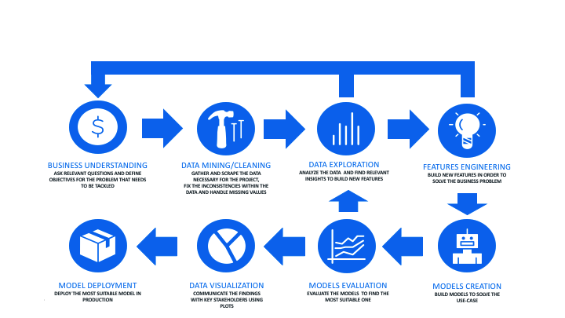

<i>"Science knows no country, because knowledge belongs to humanity, and is the torch which illuminates the world."</i>

<b> Louis Pasteur</b>

The 'Big Data' (Tb of data) is now one of the main topics in the Data Science World. Data Scientists are now very important for any organisation. Becoming Data-Driven is mandatory to survive. Vertica is the first real analytic columnar Database and is still the fastest in the market. However, SQL is not enough flexible to be very popular for Data Scientists. Python flexibility is priceless and provides to any user a very nice experience. The level of abstraction is so high that it is enough to think about a function to notice that it already exists. Many Data Science APIs were created during the last 15 years and were directly adopted by the Data Science community (examples: pandas and scikit-learn). 

However, Python is only working in-memory for a single node process. Even if some famous highly distributed programming languages exist to face this challenge, they are still in-memory and most of the time they can not process on all the data. Besides, moving the data can become very expensive. Data Scientists must also find a way to deploy their data preparation and their models. We are far away from easiness and the entire process can become time expensive. The idea behind VERTICA ML PYTHON is simple: Combining the Scalability of VERTICA with the Flexibility of Python to give to the community what they need *Bringing the logic to the data and not the opposite*. This version 1.0 is the work of 3 years of new ideas and improvement.

In this document the functions are placed in different categories to help the user to find the appropriate one for each problematic. A column 'Importance' was created to guide the user to the most useful functions (the one, he should consider often). The 'Importance' is going from  <i>&#11088;</i> (not really important) to <i>&#11088;&#11088;&#11088;&#11088;&#11088;</i> (very important). For example, it is preferable to use the method <b>.describe(...)</b> or <b>.statistics(...)</b> to print all the descriptive statistics at the same moment rather than using the methods <b>.max(...)</b>, <b>.min(...)</b>, <b>.median(...)</b>...

Any Data Scientist will need to follow a part or the entire Data Science cycle to consider solving a data problem. Data Exploration and Business Understanding are very important to realise the most important step which is Data preparation. I decided to group the methods and functions using the Data Science cycle thematics to help any Data Scientist to find fast the proper function. If a function is missing, I'll be very happy to help you code it.

# Data Exploration and Understanding

## Computation / Descriptive Stats

|Function / Method|Library|Definition|Importance|
| - | - | - | - |
|vDataframe.aggregate(...) | vdataframe | Aggregate the vdf | <i>&#11088;&#11088;&#11088;&#11088;&#11088;</i>|
|vDataframe[].aggregate(...) | vdataframe | Aggregate the column | <i>&#11088;&#11088;&#11088;</i>|
|vDataframe.all(...) | vdataframe | Compute the bool and aggregation | <i>&#11088;</i>|
|vDataframe.any(...) | vdataframe | Compute the bool or aggregation | <i>&#11088;</i>|
|vDataframe.beta(...) | vdataframe | Compute the beta matrix | <i>&#11088;&#11088;&#11088;</i>|
|vDataframe.corr(...) | vdataframe | Compute the correlation matrix | <i>&#11088;&#11088;&#11088;&#11088;&#11088;</i>|
|vDataframe.cov(...) | vdataframe | Compute the covariance matrix | <i>&#11088;&#11088;&#11088;</i>|
|vDataframe.count(...) | vdataframe | Compute the count | <i>&#11088;&#11088;&#11088;</i>|
|vDataframe[].count(...) | vdataframe |  Compute the count | <i>&#11088;&#11088;</i>|
|vDataframe.describe(...) | vdataframe | Descriptive Statistics | <i>&#11088;&#11088;&#11088;&#11088;&#11088;</i>|
|vDataframe[].describe(...) | vdataframe | Descriptive Statistics | <i>&#11088;&#11088;&#11088;&#11088;</i>|
|vDataframe.kurtosis(...) | vdataframe | Compute the kurtosis | <i>&#11088;&#11088;&#11088;</i>|
|vDataframe[].kurtosis(...) | vdataframe |  Compute the kurtosis | <i>&#11088;&#11088;</i>|
|vDataframe.mad(...) | vdataframe | Compute the median absolute deviation | <i>&#11088;&#11088;&#11088;</i>|
|vDataframe[].mad(...) | vdataframe |  Compute the median absolute deviation | <i>&#11088;&#11088;</i>|
|vDataframe.mae(...) | vdataframe | Compute the mean absolute deviation | <i>&#11088;&#11088;&#11088;</i>|
|vDataframe[].mae(...) | vdataframe |  Compute the mean absolute deviation | <i>&#11088;&#11088;</i>|
|vDataframe.max(...) | vdataframe | Compute the max | <i>&#11088;&#11088;&#11088;</i>|
|vDataframe[].max(...) | vdataframe |  Compute the max | <i>&#11088;&#11088;</i>|
|vDataframe[].mode(...) | vdataframe |  Compute the mode | <i>&#11088;&#11088;</i>|
|vDataframe.median(...) | vdataframe | Compute the median | <i>&#11088;&#11088;&#11088;</i>|
|vDataframe[].median(...) | vdataframe |  Compute the median | <i>&#11088;&#11088;</i>|
|vDataframe.min(...) | vdataframe | Compute the min | <i>&#11088;&#11088;&#11088;</i>|
|vDataframe[].min(...) | vdataframe |  Compute the min | <i>&#11088;&#11088;</i>|
|vDataframe[].numh(...) | vdataframe |  Compute the column best histogram interval | <i>&#11088;</i>|
|vDataframe[].nunique(...) | vdataframe |  Compute the column cardinality | <i>&#11088;&#11088;</i>|
|vDataframe.prod(...) | vdataframe | Compute the prod | <i>&#11088;&#11088;&#11088;</i>|
|vDataframe[].prod(....) | vdataframe |  Compute the prod | <i>&#11088;&#11088;</i>|
|vDataframe.quantile(...) | vdataframe | Compute the quantiles | <i>&#11088;&#11088;&#11088;&#11088;</i>|
|vDataframe[].quantile(...) | vdataframe | Compute the quantile | <i>&#11088;&#11088;</i>|
|vDataframe.sem(...) | vdataframe | Compute the standard error of the mean | <i>&#11088;&#11088;&#11088;</i>|
|vDataframe[].sem(...) | vdataframe |  Compute the standard error of the mean | <i>&#11088;&#11088;</i>|
|vDataframe.skewness(...) | vdataframe | Compute the skewness | <i>&#11088;&#11088;&#11088;</i>|
|vDataframe[].skewness(...) | vdataframe |  Compute the skewness | <i>&#11088;&#11088;</i>|
|vDataframe.statistics(...) | vdataframe | Descriptive Statistics | <i>&#11088;&#11088;&#11088;&#11088;&#11088;</i>|
|vDataframe.std(...) | vdataframe | Compute the standard deviation | <i>&#11088;&#11088;&#11088;</i>|
|vDataframe[].std(...) | vdataframe |  Compute the standard deviation | <i>&#11088;&#11088;</i>|
|vDataframe.sum(...) | vdataframe | Compute the sum | <i>&#11088;&#11088;&#11088;</i>|
|vDataframe[].sum(...) | vdataframe |  Compute the sum | <i>&#11088;&#11088;</i>|
|vDataframe[].topk(...) | vdataframe | Compute the K most occurrent categories | <i>&#11088;&#11088;&#11088;</i>|
|vDataframe[].value_counts(...) | vdataframe | Categories count | <i>&#11088;&#11088;</i>|
|vDataframe.var(...) | vdataframe | Compute the variance | <i>&#11088;&#11088;&#11088;</i>|
|vDataframe[].var(...) | vdataframe |  Compute the variance | <i>&#11088;&#11088;</i>|

## Plotting

|Function / Method|Library|Definition|Importance|
| - | - | - | - |
|vDataframe.bar(...) | vdataframe | Draw the bar chart | <i>&#11088;&#11088;&#11088;&#11088;</i>|
|vDataframe[].bar(...) | vdataframe | Draw the bar chart | <i>&#11088;&#11088;&#11088;&#11088;</i>|
|vDataframe.boxplot(...) | vdataframe | Draw the box plot | <i>&#11088;</i>|
|vDataframe[].boxplot(...) | vdataframe | Draw the box plot | <i>&#11088;</i>|
|vDataframe[].donut(...) | vdataframe | Draw the donut chart | <i>&#11088;&#11088;</i>|
|vDataframe[].density(...) | vdataframe | Draw the density plot | <i>&#11088;&#11088;</i>|
|vDataframe.hexbin(...) | vdataframe | Draw the hexbin plot | <i>&#11088;&#11088;&#11088;</i>|
|vDataframe.hist(...) | vdataframe | Draw the histogram | <i>&#11088;&#11088;&#11088;&#11088;</i>|
|vDataframe[].hist(...) | vdataframe | Draw the histogram | <i>&#11088;&#11088;&#11088;</i>|
|vDataframe[].pie(...) | vdataframe | Draw the pie chart | <i>&#11088;&#11088;</i>|
|vDataframe.pivot_table(...) | vdataframe | Draw the pivot table | <i>&#11088;&#11088;&#11088;</i>|
|vDataframe.plot(...) | vdataframe | Plot the time series | <i>&#11088;&#11088;&#11088;&#11088;</i>|
|vDataframe[].plot(...) | vdataframe | Plot the time series | <i>&#11088;&#11088;&#11088;&#11088;&#11088;</i>|
|vDataframe.scatter(...) | vdataframe | Draw the scatter plot | <i>&#11088;&#11088;&#11088;&#11088;&#11088;</i>|
|vDataframe.scatter_matrix(...) | vdataframe | Draw the scatter matrix | <i>&#11088;&#11088;</i>|

## Utilities

|Function / Method|Library|Definition|Importance|
| - | - | - | - |
|vDataframe.dtypes(...) | vdataframe | Returns the data types | <i>&#11088;&#11088;&#11088;</i>|
|vDataframe[].dtype(...) | vdataframe | Returns the column data type | <i>&#11088;</i>|
|vDataframe[].distinct(...) | vdataframe | Returns the column unique elements | <i>&#11088;&#11088;</i>|
|vDataframe.head(...) | vdataframe | Print the head | <i>&#11088;</i>|
|vDataframe[].head(...) | vdataframe | Print the head | <i>&#11088;</i>|
|vDataframe.isin(...) | vdataframe | Verify if the elements are in the object | <i>&#11088;</i>|
|vDataframe[].isin(...) | vdataframe | Verify if the elements are in the column | <i>&#11088;</i>|
|vDataframe[].nlargest(...) | vdataframe | Returns the n smallest column elements | <i>&#11088;</i>|
|vDataframe[].nsmallest(...) | vdataframe | Returns the n largest column elements | <i>&#11088;</i>|
|vDataframe[].rename(...) | vdataframe | Rename the column | <i>&#11088;</i>|
|vDataframe.tail(...) | vdataframe | Print a part of the object | <i>&#11088;&#11088;</i>|
|vDataframe[].tail(...) | vdataframe | Print a part of the object | <i>&#11088;&#11088;</i>|

# Data Preparation

## Binary Operator Functions

|Function / Method|Library|Definition|Importance|
| - | - | - | - |
|vDataframe[].add(...) | vdataframe | Add an element to the column | <i>&#11088;</i>|
|vDataframe[].div(...) | vdataframe | Divide the column by an element | <i>&#11088;</i>|
|vDataframe[].equals(...) | vdataframe | Verify an equality | <i>&#11088;</i>|
|vDataframe[].ge(...) | vdataframe | Verify a ge inequality | <i>&#11088;</i>|
|vDataframe[].gt(...) | vdataframe | Verify a gt inequality | <i>&#11088;</i>|
|vDataframe[].le(...) | vdataframe | Verify a le inequality | <i>&#11088;</i>|
|vDataframe[].lt(...) | vdataframe | Verify a lt inequality | <i>&#11088;</i>|
|vDataframe[].mod(...) | vdataframe | Apply the modulo on the column | <i>&#11088;</i>|
|vDataframe[].mul(...) | vdataframe | Multiply the column by an element | <i>&#11088;</i>|
|vDataframe[].neq(...) | vdataframe | Verify an equality | <i>&#11088;</i>|
|vDataframe[].pow(...) | vdataframe | Apply the power function on the column | <i>&#11088;</i>|
|vDataframe[].round(...) | vdataframe | Round the column elements | <i>&#11088;</i>|
|vDataframe[].sub(...) | vdataframe | Subtract an element from the column | <i>&#11088;</i>|

## Combining / Joining / Sorting

|Function / Method|Library|Definition|Importance|
| - | - | - | - |
|vDataframe.append(...) | vdataframe | Merge a vDataframe with another relation | <i>&#11088;&#11088;</i>|
|vDataframe.groupby(...) | vdataframe | Group the vDataframe elements | <i>&#11088;&#11088;&#11088;&#11088;&#11088;</i>|
|vDataframe.join(...) | vdataframe | Join a vDataframe with another relation | <i>&#11088;&#11088;&#11088;&#11088;&#11088;</i>|
|vDataframe.rank(...) | vdataframe | Compute a specific rank | <i>&#11088;</i>|
|vDataframe.sort(...) | vdataframe | Sort the data | <i>&#11088;&#11088;&#11088;</i>|

## Data Type Conversion

|Function / Method|Library|Definition|Importance|
| - | - | - | - |
|vDataframe.astype(...) | vdataframe | Convert to the selected types | <i>&#11088;&#11088;&#11088;</i>|
|vDataframe[].astype(...) | vdataframe | Convert the column to the selected types | <i>&#11088;&#11088;&#11088;</i>|
|vDataframe.bool_to_int(...) | vdataframe | Convert all the Booleans to Integers | <i>&#11088;&#11088;&#11088;</i>|
|vDataframe[].discretize(...) | vdataframe |Discretize the column | <i>&#11088;&#11088;&#11088;&#11088;</i>|
|vDataframe[].to_timestamp(...) | vdataframe | Convert the column to timestamp | <i>&#11088;</i>|

## Decomposition / Normalization / Preprocessing

|Function / Method|Library|Definition|Importance|
| - | - | - | - |
|Balance | learn.preprocessing | Balance the data | <i>&#11088;&#11088;&#11088;</i>|
|vDataframe[].decode(...) | vdataframe | User-defined encoding | <i>&#11088;&#11088;&#11088;&#11088;</i>|
|vDataframe.drop(...) | vdataframe | Drop the columns | <i>&#11088;&#11088;</i>|
|vDataframe[].drop(...) | vdataframe | Drop the column | <i>&#11088;&#11088;</i>|
|vDataframe.get_dummies(...) | vdataframe | One Hot Encoder Encoding | <i>&#11088;&#11088;&#11088;&#11088;&#11088;</i>|
|vDataframe[].get_dummies(...) | vdataframe | One Hot Encoder Encoding | <i>&#11088;&#11088;&#11088;&#11088;&#11088;</i>|
|vDataframe[].label_encode(...) | vdataframe | Apply a Label Encoding on the column | <i>&#11088;&#11088;&#11088;</i>|
|vDataframe[].mean_encode(...) | vdataframe | Apply a Mean Encoding on the column | <i>&#11088;&#11088;&#11088;</i>|
|vDataframe.normalize(...) | vdataframe | Normalize the data | <i>&#11088;&#11088;</i>|
|vDataframe[].normalize(...) | vdataframe | Normalize the column | <i>&#11088;&#11088;&#11088;&#11088;&#11088;</i>|
|Normalizer | learn.preprocessing | Normalize the data | <i>&#11088;&#11088;</i>|
|OneHotEncoder | learn.preprocessing | One Hot Encoder Encoding | <i>&#11088;&#11088;</i>|
|PCA | learn.decomposition | Apply the PCA | <i>&#11088;&#11088;&#11088;&#11088;&#11088;</i>|
|vDataframe.sample(...) | vdataframe | Sample the data | <i>&#11088;</i>|
|vDataframe.save(...) | vdataframe | Save the vDataframe structure | <i>&#11088;&#11088;&#11088;&#11088;</i>|
|SVD | learn.decomposition | Apply the SVD | <i>&#11088;&#11088;</i>|

## Features Engineering / Computation

|Function / Method|Library|Definition|Importance|
| - | - | - | - |
|vDataframe.abs(...) | vdataframe | Apply the Absolute function | <i>&#11088;</i>|
|vDataframe[].abs(...) | vdataframe | Apply the Absolute function | <i>&#11088;</i>|
|vDataframe[].add_copy(...) | vdataframe | Add a copy of the column | <i>&#11088;&#11088;&#11088;</i>|
|vDataframe.apply(...) | vdataframe | Apply functions | <i>&#11088;&#11088;&#11088;&#11088;</i>|
|vDataframe.apply | vdataframe | Apply a function | <i>&#11088;&#11088;&#11088;&#11088;&#11088;</i>|
|vDataframe.applymap(...) | vdataframe | Apply a function | <i>&#11088;&#11088;</i>|
|vDataframe.eval(...) | vdataframe | Evaluate an expression | <i>&#11088;&#11088;&#11088;&#11088;&#11088;</i>|

## Handling Missing Values, Outliers and Duplicates / Filtering

|Function / Method|Library|Definition|Importance|
| - | - | - | - |
|vDataframe[].clip(...) | vdataframe | Clip the column | <i>&#11088;&#11088;</i>|
|vDataframe.drop_duplicates(...) | vdataframe | Drop the duplicates | <i>&#11088;&#11088;</i>|
|vDataframe.dropna(...) | vdataframe | Drop the missing values | <i>&#11088;&#11088;</i>|
|vDataframe[].dropna(...) | vdataframe | Drop the column missing values | <i>&#11088;&#11088;&#11088;&#11088;</i>|
|vDataframe[].drop_outliers(...) | vdataframe | Drop the column outliers | <i>&#11088;&#11088;&#11088;</i>|
|vDataframe.duplicated(...) | vdataframe | Returns the duplicates | <i>&#11088;&#11088;&#11088;&#11088;</i>|
|vDataframe.filter(...) | vdataframe | Filtering the data | <i>&#11088;&#11088;&#11088;&#11088;&#11088;</i>|
|vDataframe.fillna(...) | vdataframe | Fill the missing values | <i>&#11088;&#11088;</i>|
|vDataframe[].fillna(...) | vdataframe | Fill the column missing values | <i>&#11088;&#11088;&#11088;&#11088;&#11088;</i>|
|vDataframe[].fill_outliers(...) | vdataframe | Fill the column outliers | <i>&#11088;&#11088;</i>|
|vDataframe.select(...) |  vdataframe | Select only specific columns | <i>&#11088;</i>|

# Machine Learning

## Anomaly Detection / Clustering

|Function / Method|Library|Definition|Importance|
| - | - | - | - |
|DBSCAN | learn.cluster | DBSCAN Algorithm | <i>&#11088;&#11088;&#11088;&#11088;&#11088;</i>|
|KMeans | learn.cluster | KMeans Algorithm | <i>&#11088;&#11088;&#11088;&#11088;&#11088;</i>|
|LocalOutlierFactor | learn.neighbors | Local Outlier Factor | <i>&#11088;&#11088;&#11088;&#11088;&#11088;</i>|
|vDataframe.outliers(...) | vdataframe | Outliers of the Gaussian Distribution | <i>&#11088;&#11088;&#11088;&#11088;&#11088;</i>|

## Classification

### Binary Classifiers

|Function / Method|Library|Definition|Importance|
| - | - | - | - |
|LinearSVC | learn.svm | Linear SVM | <i>&#11088;&#11088;</i>|
|LogisticRegression | learn.linear_model | Logistic Regression | <i>&#11088;&#11088;&#11088;&#11088;&#11088;</i>|

### Evaluation

|Function / Method|Library|Definition|Importance|
| - | - | - | - |
|accuracy_score | learn.metrics | Compute the Accuracy | <i>&#11088;&#11088;</i>|
|auc | learn.metrics | Compute the ROC AUC | <i>&#11088;&#11088;</i>|
|classification_report  | learn.metrics | Compute many classification metrics | <i>&#11088;&#11088;&#11088;&#11088;&#11088;</i>|
|confusion_matrix | learn.metrics | Compute the Confusion Matrix | <i>&#11088;&#11088;</i>|
|critical_success_index | learn.metrics | Compute the Critical Success Index | <i>&#11088;&#11088;</i>|
|f1_score | learn.metrics | Compute the F1 Score | <i>&#11088;&#11088;</i>|
|informedness | learn.metrics | Compute the Informedness | <i>&#11088;&#11088;</i>|
|lift_chart | learn.plot | Draw the Lift Chart | <i>&#11088;&#11088;</i>|
|log_loss | learn.metrics |Compute the Log Loss | <i>&#11088;&#11088;</i>|
|markedness | learn.metrics | Compute the Markedness | <i>&#11088;&#11088;</i>
|matthews_corrcoef | learn.metrics | Compute the Matthews correlation coefficient | <i>&#11088;&#11088;</i>|
|multilabel_confusion_matrix | learn.metrics | Compute the Multi Label Confusion Matrix | <i>&#11088;&#11088;</i>|
|negative_predictive_score | learn.metrics | Compute the Negative Predictive Score | <i>&#11088;&#11088;</i>|
|prc_auc | learn.metrics | Compute the PRC AUC | <i>&#11088;&#11088;</i>|
|prc_curve | learn.plot | Draw the PRC Curve | <i>&#11088;&#11088;</i>|
|precision_score | learn.metrics | Compute the Precision | <i>&#11088;&#11088;</i>|
|recall_score | learn.metrics | Compute the Recall | <i>&#11088;&#11088;</i>|
|roc_curve | learn.plot | Draw the ROC Curve | <i>&#11088;&#11088;</i>|
|specificity_score | learn.metrics | Compute the Specificity | <i>&#11088;&#11088;</i>|

### Multinomial Classifiers

|Function / Method|Library|Definition|Importance|
| - | - | - | - |
|DecisionTreeClassifier | learn.tree | Decision Tree | <i>&#11088;</i>|
|DummyTreeClassifier | learn.tree | Dummy Classifier | <i>&#11088;</i>|
|KNeighborsClassifier | learn.neighbors | K Nearest Neighbors | <i>&#11088;&#11088;&#11088;</i>|
|MultinomialNB | learn.naive_bayes | Naive Bayes | <i>&#11088;&#11088;</i>|
|NearestCentroid | learn.neighbors | Nearest Centroid | <i>&#11088;&#11088;</i>|
|RandomForestClassifier | learn.ensemble | Random Forest | <i>&#11088;&#11088;&#11088;&#11088;&#11088;</i>|

## Model Selection

|Function / Method|Library|Definition|Importance|
| - | - | - | - |
|best_k | learn.model_selection | Find the best KMeans K | <i>&#11088;&#11088;&#11088;</i>|
|cross_validate | learn.model_selection | K-Fold Cross Validation | <i>&#11088;&#11088;&#11088;&#11088;&#11088;</i>|
|elbow | learn.plot | Draw the Elbow curve | <i>&#11088;&#11088;&#11088;</i>|
|train_test_split | learn.model_selection  | Split the data | <i>&#11088;&#11088;</i>|

## Regression

### Algorithms

|Function / Method|Library|Definition|Importance|
| - | - | - | - |
|DecisionTreeRegressor | learn.tree | Decision Tree | <i>&#11088;</i>|
|DummyTreeRegressor | learn.tree | Dummy Regressor | <i>&#11088;</i>|
|ElasticNet | learn.linear_model | Elastic Net Regression | <i>&#11088;&#11088;&#11088;&#11088;&#11088;</i>|
|KNeighborsRegressor | learn.neighbors | K Nearest Neighbors | <i>&#11088;&#11088;&#11088;</i>|
|Lasso | learn.linear_model | Lasso Regression | <i>&#11088;&#11088;</i>|
|LinearRegression | learn.linear_model | Linear Regression | <i>&#11088;&#11088;</i>|
|LinearSVR | learn.svm | Linear SVM | <i>&#11088;&#11088;</i>|
|RandomForestRegressor | learn.ensemble | Random Forest | <i>&#11088;&#11088;&#11088;&#11088;&#11088;</i>|
|Ridge | learn.linear_model | Ridge Regression | <i>&#11088;&#11088;</i>|

### Evaluation

|Function / Method|Library|Definition|Importance|
| - | - | - | - |
|explained_variance | learn.metrics | Compute the explained variance | <i>&#11088;&#11088;</i>|
|max_error | learn.metrics | Compute the max residual error. | <i>&#11088;&#11088;</i>|
|median_absolute_error | learn.metrics | Compute the median absolute error | <i>&#11088;&#11088;</i>|
|mean_absolute_error | learn.metrics | Compute the average absolute error | <i>&#11088;&#11088;</i>|
|mean_squared_error | learn.metrics | Compute the average squared error | <i>&#11088;&#11088;</i>|
|mean_squared_log_error | learn.metrics | Compute the average squared log error | <i>&#11088;&#11088;</i>|
|regression_report | learn.metrics | Compute many regression metrics | <i>&#11088;&#11088;&#11088;&#11088;&#11088;</i>|
|r2_score | learn.metrics | Compute the R2 Score | <i>&#11088;&#11088;</i>|

# Time Series

|Function / Method|Library|Definition|Importance|
| - | - | - | - |
|vDataframe.asfreq(...) | vdataframe | Interpolate, slice and agg the time series | <i>&#11088;&#11088;&#11088;&#11088;&#11088;</i>|
|vDataframe.at_time(...) | vdataframe | Filter the data at the specific time | <i>&#11088;</i>|
|vDataframe.between_time(...) | vdataframe | Filter the data at the specific time range | <i>&#11088;&#11088;</i>|
|vDataframe.cummax(...) | vdataframe | Compute the cumulative max | <i>&#11088;&#11088;&#11088;</i>|
|vDataframe.cummin(...) | vdataframe | Compute the cumulative min | <i>&#11088;</i>|
|vDataframe.cumprod(...) | vdataframe | Compute the cumulative prod | <i>&#11088;</i>|
|vDataframe.cumsum(...) | vdataframe | Compute the cumulative sum | <i>&#11088;&#11088;&#11088;</i>|
|vDataframe[].date_part(...) | vdataframe | Extract the date field | <i>&#11088;&#11088;</i>|
|vDataframe[].ema(...) | vdataframe | Exponential Moving Average | <i>&#11088;&#11088;&#11088;</i>|
|vDataframe.first(...) | vdataframe | Filter by keeping only the first elements | <i>&#11088;&#11088;</i>|
|vDataframe.last(...) | vdataframe | Filter by keeping only the last elements | <i>&#11088;&#11088;</i>|
|vDataframe[].next(...) | vdataframe | Compute and apply the lead | <i>&#11088;&#11088;</i>|
|vDataframe[].pct_change(...) | vdataframe | Time series percent change | <i>&#11088;&#11088;</i>|
|vDataframe[].prev(...) | vdataframe | Compute and apply the lag | <i>&#11088;&#11088;</i>|
|vDataframe.rolling(...) | vdataframe | Compute a moving window | <i>&#11088;&#11088;&#11088;&#11088;&#11088;</i>|
|vDataframe.sessionize(...) | vdataframe | Build a session ID | <i>&#11088;&#11088;&#11088;&#11088;&#11088;</i>|
|vDataframe[].slice(...) | vdataframe | Slice the time series | <i>&#11088;&#11088;</i>|

# Utilities

|Function / Method|Library|Definition|Importance|
| - | - | - | - |
|vDataframe.catcol(...) | vdataframe | Returns the categorical columns | <i>&#11088;</i>|
|vDataframe[].category(...) | vdataframe | Returns the column category | <i>&#11088;</i>|
|vDataframe.copy(...) | vdataframe | Returns a vDataframe copy | <i>&#11088;&#11088;</i>|
|drop_model | utilities | Drop the model | <i>&#11088;</i>|
|drop_table | utilities | Drop the table | <i>&#11088;</i>|
|drop_text_index | utilities | Drop the text index | <i>&#11088;</i>|
|drop_view | utilities | Drop the view | <i>&#11088;</i>|
|vDataframe.dsn_restart(...) | vdataframe | Restart the DSN | <i>&#11088;</i>|
|vDataframe.empty(...) | vdataframe | Returns if the vDataframe is empty | <i>&#11088;</i>|
|vDataframe.expected_store_usage(...) | vdataframe | Returns the expected store usage | <i>&#11088;&#11088;</i>|
|vDataframe.get_columns(...) | vdataframe | Returns the vDataframe columns | <i>&#11088;&#11088;</i>|
|vDataframe.help(...) | vdataframe | Get info about the API | <i>&#11088;</i>|
|vDataframe.info(...) | vdataframe | Get vDataframe history | <i>&#11088;&#11088;</i>|
|vDataframe[].isdate(...) | vdataframe | Verify if the column is a date | <i>&#11088;</i>|
|vDataframe[].isnum(...) | vdataframe | Verify if the column is numerical | <i>&#11088;</i>|
|vDataframe.load(...) | vdataframe | Load a saving | <i>&#11088;&#11088;&#11088;</i>|
|load_amazon | learn.datasets | Load the Amazon dataset | <i>&#11088;</i>|
|load_iris | learn.datasets | Load the Iris dataset | <i>&#11088;</i>|
|load_model | utilities | Load the model | <i>&#11088;&#11088;&#11088;</i>|
|load_smart_meters | learn.datasets | Load the Smart Meters dataset | <i>&#11088;</i>|
|load_titanic | learn.datasets | Load the Titanic dataset | <i>&#11088;</i>|
|load_winequality | learn.datasets | Load the Wine Quality dataset | <i>&#11088;</i>|
|vDataframe.memory_usage(...) | vdataframe | Returns the object memory usage | <i>&#11088;</i>|
|vDataframe.numcol(...) | vdataframe | Returns the numerical columns | <i>&#11088;</i>|
|pandas_to_vertica | utilities | Store a pandas.Dataframe in Vertica | <i>&#11088;</i>|
|read_json | utilities | Read a json file | <i>&#11088;&#11088;&#11088;</i>|
|read_csv | utilities | Read a csv file | <i>&#11088;&#11088;&#11088;</i>|
|read_vdf | utilities | Read a vdf file | <i>&#11088;&#11088;&#11088;</i>|
|vDataframe.set_cursor(...) | vdataframe | Set a new cursor | <i>&#11088;&#11088;</i>|
|vDataframe.set_dsn(...) | vdataframe | Set a new DSN | <i>&#11088;&#11088;</i>|
|vDataframe.shape(...) | vdataframe | Returns the vDataframe shape | <i>&#11088;&#11088;</i>|
|vDataframe.sql_on_off(...) | vdataframe | Display the queries | <i>&#11088;&#11088;&#11088;</i>|
|vDataframe.time_on_off(...) | vdataframe | Display the computation time | <i>&#11088;&#11088;</i>|
|vDataframe.to_csv(...) | vdataframe | Write a csv file of the data | <i>&#11088;&#11088;&#11088;</i>|
|vDataframe.to_db(...) | vdataframe | Save the vDataframe in Vertica | <i>&#11088;&#11088;&#11088;</i>|
|vDataframe.to_pandas(...) | vdataframe | Convert to a pandas.Dataframe | <i>&#11088;</i>|
|vDataframe.to_vdf(...) | vdataframe | Write the vdf file of the vDataframe | <i>&#11088;&#11088;&#11088;</i>|
|to_tablesample | utilities | Query result to tablesample | <i>&#11088;&#11088;</i>|
|vDataframe.version(...) | vdataframe | Returns Vertica version | <i>&#11088;</i>|
|vertica_cursor | utilities | Create a Vertica cursor | <i>&#11088;&#11088;&#11088;</i>|
|vdf_from_relation | utilities | Build a vDataframe using a relation | <i>&#11088;&#11088;&#11088;</i>|

## Working with Text

|Function / Method|Library|Definition|Importance|
| - | - | - | - |
|vDataframe[].add_prefix(...) | vdataframe | Add a prefix to the column | <i>&#11088;</i>|
|vDataframe[].add_suffix(...) | vdataframe | Add a suffix to the column | <i>&#11088;</i>|
|CountVectorizer | learn.preprocessing | Compute the Text Dictionary | <i>&#11088;&#11088;&#11088;&#11088;&#11088;</i>|
|vDataframe[].str_contains(...) | vdataframe | Verify if the pattern is in the column | <i>&#11088;</i>|
|vDataframe[].str_count(...) | vdataframe | Count the pattern occurences | <i>&#11088;&#11088;</i>|
|vDataframe[].str_replace(...) | vdataframe | Replace the pattern | <i>&#11088;&#11088;</i>|
|vDataframe[].str_slice(...) | vdataframe | Slice the column | <i>&#11088;</i>|
