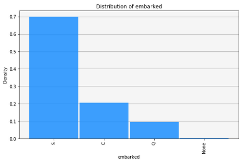
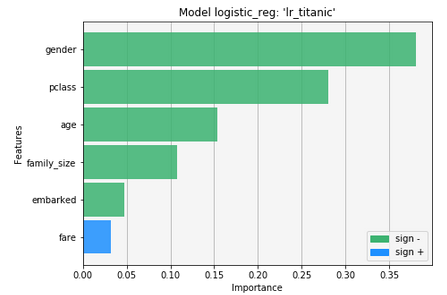
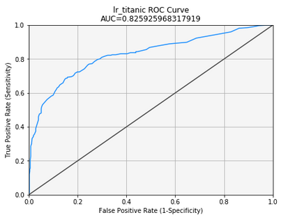

<p align="center">

</p>

(c) Copyright [2018] Micro Focus or one of its affiliates. 
Licensed under the Apache License, Version 2.0 (the "License");
You may not use this file except in compliance with the License.
You may obtain a copy of the License at

http://www.apache.org/licenses/LICENSE-2.0

Unless required by applicable law or agreed to in writing, software
distributed under the License is distributed on an "AS IS" BASIS,
WITHOUT WARRANTIES OR CONDITIONS OF ANY KIND, either express or implied.
See the License for the specific language governing permissions and
limitations under the License.

# Vertica-ML-Python

When we deal with Big Data, it is quite hard to find an API which can be flexible and easy to use. A lot of platforms offer the possibility to create datasets/dataframes which represent just a sample of our data. Most of the time, the data is loaded in memory which is a quite limited method. However, if we want to use all our data and do not move it we need to adapt to the DB language.

Vertica-ML-Python allows user to use some simple Python methods to solve the problem using Vertica. Many objects having very easy methods are available to make the datascience journey exciting. It looks like a Data Science Studio for programmers in the use but without loading any data in memory.

It introduces an object called the RVD which is quite similar in the use to pandas.Dataframe in order to make the Python users feel comfortable. The following example shows how to create a RVD from a csv file (the titanic dataset) and draw the 'embarked' feature histogram.

```
# Creation of the pyodbc cursor
import pyodbc
cur=pyodbc.connect("DSN=VerticaDSN").cursor()

# Creation of the RVD from a csv file
from vertica_ml_python import read_csv
titanic=read_csv('titanic.csv',cur)

titanic["embarked"].hist()
```
<p align="center">

</p>

The following example shows how to create a logistic regression model and evaluate it.

```
# Creation of the logistic regression model
from vertica_ml_python import logistic_reg
logit=logistic_reg(model_name="lr_titanic",input_relation="train_titanic067",response_column="survived",
                   predictor_columns=["age","gender","family_size","embarked","fare","pclass"],cursor=cur)

# Evaluation of the model importance
logit.features_importance()
```
<p align="center">

</p>

```
# Drawing the ROC curve
logit.roc()
```

<p align="center">

</p>

Main advantages:
 - easy data exploration of large dataset using Vertica.
 - easy methods which avoids the call to a huge sql pipeline.
 - easy ML model creation and evaluation.
 - simplify the new functions creation which are hard to create using only sql.

Disadvantages:
 - Vertica-ML-Python will never replace sql and it will never be as fast as using direct sql (direct vsql for example) as some optimizations can not be generated. It is not as complete as sql but it helps to complete it where sql fails.

/ ! \ Please read the Vertica ML Python Documentation. If you do not have time just read below.

It is a prototype version (0.1) and it is thanks to all the feedbacks that it can really be improved. 

/ ! \ Some of the functions will drastically change in the next release!

If you have any feedback about the library, please contact me: badr.ouali@microfocus.com

## Prerequires:

Vertica ML Python library is only using the standard Python libraries such as pyodbc, jaydebeapi, matplotlib, time, shutil (only for Python3) and numpy.

## Installation:

Vertica ML Python doesn’t really need installation.
To import easily the Vertica ML Python library from anywhere in your computer just copy paste the entire vertica_ml_python folder in the site-package folder of the Python framework. In the MAC environment, you can find it in: 
 /Library/Frameworks/Python.framework/Versions/3.6/lib/python3.6/site-packages

## Easy Start:

If you have a DSN and pyodbc is already installed in your machine, write the following command.

```
from vertica_ml_python import RVD
myRVD = RVD('input_relation', dsn='VerticaDSN')
```

You can then see the documentation for the different methods or just enjoy the different tutorials! The titanic and iris tutorials are perfect to understand the library.
