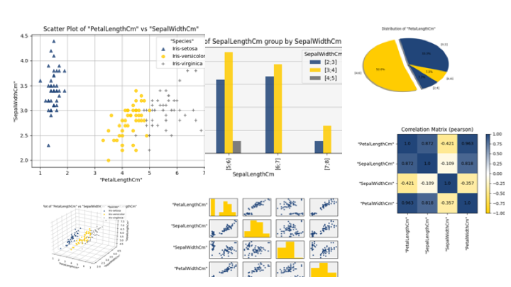
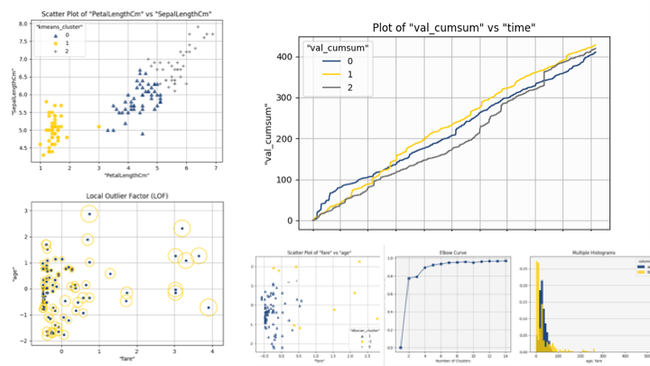
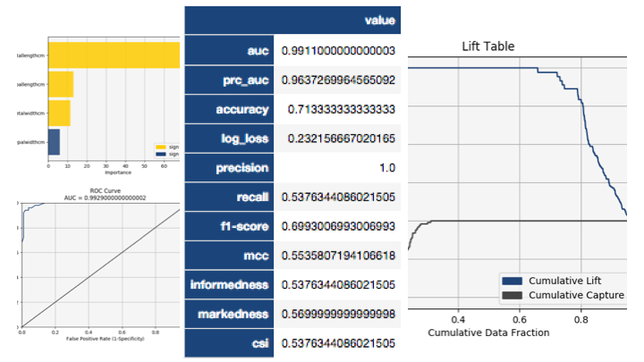

[](https://pypi.org/project/vertica-ml-python/)
[](https://opensource.org/licenses/Apache-2.0)
[](https://www.python.org/downloads/)


<p align="center">

</p>
<p align="center">
<i>Scalable as Vertica, Flexible as Python</i>
</p>
The documentation is available at: 
https://github.com/vertica/Vertica-ML-Python/blob/master/documentation.pdf <br>
Or directly in the Wiki at:
https://github.com/vertica/Vertica-ML-Python/wiki
<br><br>
(c) Copyright [2018-2020] Micro Focus or one of its affiliates. 
Licensed under the Apache License, Version 2.0 (the "License");
You may not use this file except in compliance with the License.
You may obtain a copy of the License at

http://www.apache.org/licenses/LICENSE-2.0

Unless required by applicable law or agreed to in writing, software
distributed under the License is distributed on an "AS IS" BASIS,
WITHOUT WARRANTIES OR CONDITIONS OF ANY KIND, either express or implied.
See the License for the specific language governing permissions and
limitations under the License.

&#9888; If you want to contribute, send a mail to <a href="mailto:badr.ouali@microfocus.com">badr.ouali@microfocus.com</a> <br>
&#9888; Please look at the example (https://github.com/vertica/Vertica-ML-Python/blob/master/EXAMPLE.md) to get in touch with the API.

# Vertica-ML-Python

:loudspeaker: Vertica-ML-Python is a Python library that exposes scikit-like functionality to conduct data science projects on data stored in Vertica, taking advantage Vertica’s speed and built-in analytics and machine learning capabilities. It supports the entire data science life cycle, uses a ‘pipeline’ mechanism to sequentialize data transformation operations (called Virtual Dataframe), and offers several options for graphical rendering.

<p align="center">

</p>

Send us feedback: <a href="mailto:badr.ouali@microfocus.com">badr.ouali@microfocus.com</a>

## Features

Vertica ML Python blends together the scalability of Vertica and the flexibility of Python to bring a unique combination of tools to any data scientist's workflow.

Easily explore your data.
<br>
<p align="center">

</p>
<br>
Find patterns and edtect anomalies.
<br><br>
<p align="center">

</p>
<br>
Effortlessly build and evaluate models that optimize for efficiency and performance.
<br><br>
<p align="center">

</p>
<br>
This all takes place where it should: your database. By aggregating your data with Vertica, you can build, analyze, and model anything without modifying your data.

## Why Vertica ML Python?

Nowadays, 'Big Data' is one of the main topics in the data science world, and data scientists are often at the center of any organization. The benefits of becoming more data-driven are undeniable and are often needed to survive in the industry.

Vertica was the first real analytic columnar database and is still the fastest in the market. However, SQL alone isn't flexible enough to meet the needs of data scientists. Python has quickly become the most popular tool in this domain, owing much of its flexibility to its high-level of abstraction and impressively large and ever-growing set of libraries. Its accessibility has led to the development of popular and perfomant APIs, like pandas and scikit-learn, and a dedicated community of data scientists.

However, Python only works in-memory for a single node process. While distributed programming languages have tried to face this challenge, they are still generally in-memory and can never hope to process all of your data, and moving data is expensive. On top of all of this, data scientists must also find convenient ways to deploy their data and models. The whole process is time consuming.

**Vertica ML Python aims to solve all of these problems**. The idea is simple: instead of moving data around for processing, Vertica ML Python brings the logic to the data.

3 years in the making, we bring you version 1.0 of Vertica ML Python.

### Highlights
This library includes the key features of pandas.DataFrame and scikit + easy-to-use, powerful tools for:
 - data exploration
 - data preparation
 - data/ML modeling
 - model evaluation
 - model deployment
 
## Prerequires
<ul>
	<li> <b>Vertica:</b> >= 9.1 (some functions and algorithms may be unavailable in earlier versions)
	<li> <b>Python Version:</b> >= 3.6 - [version 3.5 may works]
	<li> <b>Python Modules:</b>
		<ul><li><b>matplotlib: </b> >= 3.0  - [other versions of matplotlib may work]</li>
			<li><b>numpy</b> >= 1.9 - [other versions of numpy may work]</li>
		</ul>
</ul>

## Installation:
### Using pip
```shell
$ pip3 install vertica-ml-python
```

### Manual Install
You can also drag and drop the <b>vertica_ml_python</b> folder in the <b>site-package</b> folder of the Python framework.

<b>Mac OS</b>: ```/Library/Frameworks/Python.framework/Versions/3.6/lib/python3.6/site-packages```
<b>Windows</b>: ```\Python38\Lib\site-packages```

### Importing
After installing, you can import each library element using the usual Python syntax.
```python
# to import the vDataframe
from vertica-ml-python import vDataframe
# to import the Logistic Regression
from vertica-ml-python.learn.linear_model import LogisticRegression
```

## Quick Start

Install the library using the <b>pip</b> command:
```shell
$ pip3 install vertica-ml-python
```
Install <b>vertica-python</b> or <b>pyodbc</b> to build a DB cursor:
```shell
$ pip3 install vertica-python
```
Create a vertica cursor
```python
from vertica-ml-python import vertica_cursor
cur = vertica_cursor("VerticaDSN")
```
Create the Virtual Dataframe of your relation:
```python
from vertica-ml-python import vDataframe
vdf = vDataframe("my_relation", cursor = cur)
```
If you don't have data to play, you can easily load well known datasets
```python
from vertica-ml-python.learn.datasets import load_titanic
vdf = load_titanic(cursor = cur)
```
Play with the data:
```python
vdf.describe()

# Output
               min       25%        50%        75%   
age           0.33      21.0       28.0       39.0   
body           1.0     79.25      160.5      257.5   
fare           0.0    7.8958    14.4542    31.3875   
parch          0.0       0.0        0.0        0.0   
pclass         1.0       1.0        3.0        3.0   
sibsp          0.0       0.0        0.0        1.0   
survived       0.0       0.0        0.0        1.0   
                   max    unique  
age               80.0        96  
body             328.0       118  
fare          512.3292       277  
parch              9.0         8  
pclass             3.0         3  
sibsp              8.0         7  
survived           1.0         2 
```

Print the SQL code with the <b>sql_on_off</b> method:

```python
vdf.sql_on_off()
vdf.describe()

# Output
## Compute the descriptive statistics of all the numerical columns ##

SELECT 
   SUMMARIZE_NUMCOL("age","body","survived","pclass","parch","fare","sibsp") OVER ()
FROM public.titanic
```

Solving a ML problem with just four lines of code (two if you don't count importing libraries!):

```python
from vertica-ml-python.learn.model_selection import cross_validate
from vertica-ml-python.learn.ensemble import RandomForestClassifier

# Data Preparation
vdf["sex"].label_encode()["boat"].fillna(method = "0ifnull")["name"].str_extract(' ([A-Za-z]+)\.').eval("family_size", expr = "parch + sibsp + 1").drop(columns = ["cabin", "body", "ticket", "home.dest"])["fare"].fill_outliers().fillna().to_db("titanic_clean")

# Model Evaluation
cross_validate(RandomForestClassifier("rf_titanic", cur, max_leaf_nodes = 100, n_estimators = 30), "titanic_clean", ["age", "family_size", "sex", "pclass", "fare", "boat"], "survived", cutoff = 0.35)

# Output
                           auc               prc_auc   
1-fold      0.9877114427860691    0.9530465915039339   
2-fold      0.9965555014605642    0.7676485351425721   
3-fold      0.9927239216549301    0.6419135521132449   
avg             0.992330288634        0.787536226253   
std           0.00362128464093         0.12779562393   
                     accuracy              log_loss   
1-fold      0.971291866028708    0.0502052541223871   
2-fold      0.983253588516746    0.0298167751798457   
3-fold      0.964824120603015    0.0392745694400433   
avg            0.973123191716       0.0397655329141   
std           0.0076344236729      0.00833079837099   
                     precision                recall   
1-fold                    0.96                  0.96   
2-fold      0.9556962025316456                   1.0   
3-fold      0.9647887323943662    0.9383561643835616   
avg             0.960161644975        0.966118721461   
std           0.00371376912311        0.025535200301   
                      f1-score                   mcc   
1-fold      0.9687259282082884    0.9376119402985075   
2-fold      0.9867172675521821    0.9646971010878469   
3-fold      0.9588020287309097    0.9240569687684576   
avg              0.97141507483        0.942122003385   
std            0.0115538960753       0.0168949813163   
                  informedness            markedness   
1-fold      0.9376119402985075    0.9376119402985075   
2-fold      0.9737827715355807    0.9556962025316456   
3-fold      0.9185148945422918    0.9296324823943662   
avg             0.943303202125        0.940980208408   
std            0.0229190954261       0.0109037699717   
                           csi  
1-fold      0.9230769230769231  
2-fold      0.9556962025316456  
3-fold      0.9072847682119205  
avg             0.928685964607  
std            0.0201579224026
```
Enjoy!
