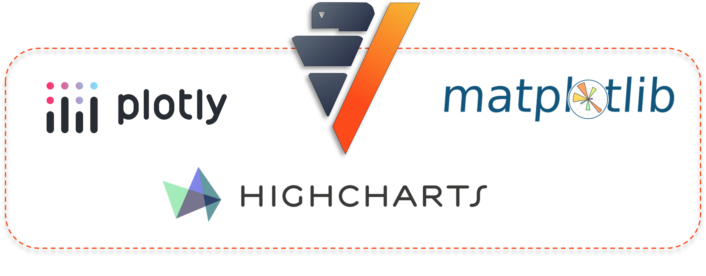

.. _chart_gallery.stepwise:

=============
Stepwise Plot
=============

.. Necessary Code Elements

.. ipython:: python
    :suppress:

    import verticapy as vp
    import verticapy.machine_learning.model_selection as vms
    import verticapy.machine_learning.vertica as vml
    import numpy as np

    N = 500 # Number of Records
    k = 10 # step

    # Normal Distributions
    x = np.random.normal(5, 1, round(N / 2))
    y = np.random.normal(3, 1, round(N / 2))
    z = np.random.normal(3, 1, round(N / 2))

    # Creating a vDataFrame with two clusters
    data = vp.vDataFrame({"x": np.concatenate([x, x + k]), "y": np.concatenate([y, y + k]), "z": np.concatenate([z, z + k]), "c": [0 for i in range(round(N / 2))] + [1 for i in range(round(N / 2))]})

    # Defining the Model
    model = vml.LogisticRegression()

General
-------

VerticaPy's Stepwise Analysis tool is a valuable asset for enhancing machine learning model interpretability and feature selection. It streamlines the process of iteratively adding or removing variables to optimize model performance. By systematically evaluating the impact of different variables, data analysts gain insights into which features contribute most significantly to the model's accuracy, facilitating data-driven decisions and model refinement. This feature is particularly useful for simplifying complex model structures and improving overall model efficiency.

Let's begin by importing `VerticaPy`.

.. ipython:: python

    import verticapy as vp

Let's generate a dataset using the following data.

.. code-block:: python
        
    N = 500 # Number of Records
    k = 10 # step

    # Normal Distributions
    x = np.random.normal(5, 1, round(N / 2))
    y = np.random.normal(3, 1, round(N / 2))
    z = np.random.normal(3, 1, round(N / 2))

    # Creating a vDataFrame with two clusters
    data = vp.vDataFrame({
        "x": np.concatenate([x, x + k]),
        "y": np.concatenate([y, y + k]),
        "z": np.concatenate([z, z + k]),
        "c": [0 for i in range(round(N / 2))] + [1 for i in range(round(N / 2))]
    })

Let's proceed by creating a Logistic Regression model using the complete dataset.

.. code-block:: python
    
    # Importing the Vertica ML module
    import verticapy.machine_learning.vertica as vml

    # Importing the model selection module
    import verticapy.machine_learning.model_selection as vms

    # Defining the Model
    model = vml.LogisticRegression()

In the context of data visualization, we have the flexibility to harness multiple plotting libraries to craft a wide range of graphical representations. VerticaPy, as a versatile tool, provides support for several graphic libraries, such as Matplotlib, Highcharts, and Plotly. Each of these libraries offers unique features and capabilities, allowing us to choose the most suitable one for our specific data visualization needs.

.. note::
    
    To select the desired plotting library, we simply need to use the `set_option` function. VerticaPy offers the flexibility to smoothly transition between different plotting libraries. In instances where a particular graphic is not supported by the chosen library or is not supported within the VerticaPy framework, the tool will automatically generate a warning and then switch to an alternative library where the graphic can be created.

Please click on the tabs to view the various graphics generated by the different plotting libraries.

.. ipython:: python
    :suppress:

    import verticapy as vp

.. tab:: Plotly

    .. ipython:: python
        :suppress:

        vp.set_option("plotting_lib", "plotly")

    We can switch to using the `plotly` module.

    .. code-block:: python
        
        vp.set_option("plotting_lib", "plotly")

    .. tab:: Forward

      .. code-block:: python
          
          figs = vms.stepwise(
            model,
            data,
            X = ["x", "y", "z"],
            y = "c",
            direction = "forward",
          )

      .. ipython:: python
          :suppress:
        
          figs = vms.stepwise(
            model,
            data,
            X = ["x", "y", "z"],
            y = "c",
            direction = "forward",
          )

      **Stepwise**

      .. code-block:: python      

          figs.step_wise_

      .. ipython:: python
          :suppress:

          figs.step_wise_.write_html("figures/plotting_plotly_stepwise_forward_stepwise.html")

      .. raw:: html
          :file: SPHINX_DIRECTORY/figures/plotting_plotly_stepwise_forward_stepwise.html

      **Feature Importance**

      .. code-block:: python      

          figs.importance_

      .. ipython:: python
          :suppress:

          figs.importance_.write_html("figures/plotting_plotly_stepwise_forward_importance.html")

      .. raw:: html
          :file: SPHINX_DIRECTORY/figures/plotting_plotly_stepwise_forward_importance.html

    .. tab:: Backward

      .. code-block:: python
          
          figs = vms.stepwise(
            model,
            data,
            X = ["x", "y", "z"],
            y = "c",
            direction = "backward",
          )

      .. ipython:: python
          :suppress:
        
          figs = vms.stepwise(
            model,
            data,
            X = ["x", "y", "z"],
            y = "c",
            direction = "backward",
          )

      **Stepwise**

      .. code-block:: python      

        figs.step_wise_

      .. ipython:: python
          :suppress:

          figs.step_wise_.write_html("figures/plotting_plotly_stepwise_backward_stepwise.html")

      .. raw:: html
          :file: SPHINX_DIRECTORY/figures/plotting_plotly_stepwise_backward_stepwise.html

      **Feature Importance**

      .. code-block:: python      

        figs.importance_

      .. ipython:: python
          :suppress:
          
          figs.importance_.write_html("figures/plotting_plotly_stepwise_backward_importance.html")

      .. raw:: html
          :file: SPHINX_DIRECTORY/figures/plotting_plotly_stepwise_backward_importance.html

.. tab:: Highcharts

    .. ipython:: python
        :suppress:

        vp.set_option("plotting_lib", "highcharts")

    We can switch to using the `highcharts` module.

    .. code-block:: python
        
        vp.set_option("plotting_lib", "highcharts")

    .. tab:: Forward

      .. code-block:: python
          
          figs = vms.stepwise(
            model,
            data,
            X = ["x", "y", "z"],
            y = "c",
            direction = "forward",
          )

      .. ipython:: python
          :suppress:

          figs = vms.stepwise(
            model,
            data,
            X = ["x", "y", "z"],
            y = "c",
            direction = "forward",
          )

      **Stepwise**

      .. code-block:: python      

          figs.step_wise_

      .. ipython:: python
          :suppress:

          html_text = figs.step_wise_.htmlcontent.replace("container", "plotting_highcharts_stepwise_forward_stepwise")
          with open("figures/plotting_highcharts_stepwise_forward_stepwise.html", "w") as file:
            file.write(html_text)

      .. raw:: html
          :file: SPHINX_DIRECTORY/figures/plotting_highcharts_stepwise_forward_stepwise.html

      **Feature Importance**

          figs.importance_

      .. ipython:: python
          :suppress:

          html_text = figs.importance_.htmlcontent.replace("container", "plotting_highcharts_stepwise_forward_importance")
          with open("figures/plotting_highcharts_stepwise_forward_importance.html", "w") as file:
            file.write(html_text)

      .. raw:: html
          :file: SPHINX_DIRECTORY/figures/plotting_highcharts_stepwise_forward_importance.html

    .. tab:: Backward

      .. code-block:: python
          
          figs = vms.stepwise(
            model,
            data,
            X = ["x", "y", "z"],
            y = "c",
            direction = "backward",
          )

      .. ipython:: python
          :suppress:

          figs = vms.stepwise(
            model,
            data,
            X = ["x", "y", "z"],
            y = "c",
            direction = "backward",
          )

      **Stepwise**

      .. code-block:: python      

          figs.step_wise_

      .. ipython:: python
          :suppress:

          html_text = figs.step_wise_.htmlcontent.replace("container", "plotting_highcharts_stepwise_backward_stepwise")
          with open("figures/plotting_highcharts_stepwise_backward_stepwise.html", "w") as file:
            file.write(html_text)

      .. raw:: html
          :file: SPHINX_DIRECTORY/figures/plotting_highcharts_stepwise_backward_stepwise.html

      **Feature Importance**

      .. code-block:: python      

          figs.importance_

      .. ipython:: python
          :suppress:

          html_text = figs.importance_.htmlcontent.replace("container", "plotting_highcharts_stepwise_backward_importance")
          with open("figures/plotting_highcharts_stepwise_backward_importance.html", "w") as file:
            file.write(html_text)

      .. raw:: html
          :file: SPHINX_DIRECTORY/figures/plotting_highcharts_stepwise_backward_importance.html
        
.. tab:: Matplotlib

    .. ipython:: python
        :suppress:

        vp.set_option("plotting_lib", "matplotlib")

    We can switch to using the `matplotlib` module.

    .. code-block:: python
        
        vp.set_option("plotting_lib", "matplotlib")

    .. tab:: Forward

      .. ipython:: python

          figs = vms.stepwise(
            model,
            data,
            X = ["x", "y", "z"],
            y = "c",
            direction = "forward",
          )

      **Stepwise**

      .. code-block:: python      

        figs.step_wise_.get_figure()

      .. ipython:: python
          :suppress:

          figs.step_wise_.get_figure().savefig("figures/plotting_matplotlib_stepwise_forward_stepwise.png")

      .. image:: ../../../docs/figures/plotting_matplotlib_stepwise_forward_stepwise.png
        :width: 80%
        :align: center

      **Feature Importance**

      .. code-block:: python      

        figs.importance_.get_figure()

      .. ipython:: python
          :suppress:
          
          figs.importance_.get_figure().savefig("figures/plotting_matplotlib_stepwise_backward_importance.png")

      .. image:: ../../../docs/figures/plotting_matplotlib_stepwise_backward_importance.png
        :width: 80%
        :align: center

    .. tab:: Backward

      .. ipython:: python

          vms.stepwise(
            model,
            data,
            X = ["x", "y", "z"],
            y = "c",
            direction = "backward",
          )

      **Stepwise**

      .. code-block:: python      

        figs.step_wise_.get_figure()

      .. ipython:: python
          :suppress:

          figs.step_wise_.get_figure().savefig("figures/plotting_matplotlib_stepwise_forward_stepwise.png")

      .. image:: ../../../docs/figures/plotting_matplotlib_stepwise_forward_stepwise.png
        :width: 80%
        :align: center

      **Feature Importance**

      .. code-block:: python      

        figs.importance_.get_figure()

      .. ipython:: python
          :suppress:
          
          figs.importance_.get_figure().savefig("figures/plotting_matplotlib_stepwise_backward_importance.png")

      .. image:: ../../../docs/figures/plotting_matplotlib_stepwise_backward_importance.png
        :width: 80%
        :align: center

.. hint:: VerticaPy supports both backward and forward stepwise analysis. You simply need to select the appropriate method as a parameter.

___________________

Chart Customization
-------------------

VerticaPy empowers users with a high degree of flexibility when it comes to tailoring the visual aspects of their plots. 
This customization extends to essential elements such as **color schemes**, **text labels**, and **plot sizes**, as well as a wide range of other attributes that can be fine-tuned to align with specific design preferences and analytical requirements. Whether you want to make your visualizations more visually appealing or need to convey specific insights with precision, VerticaPy's customization options enable you to craft graphics that suit your exact needs.

.. note:: As stepwise plots are essentially scatter and bubble plots, customization options are identical to those available for :ref:`scatter`.