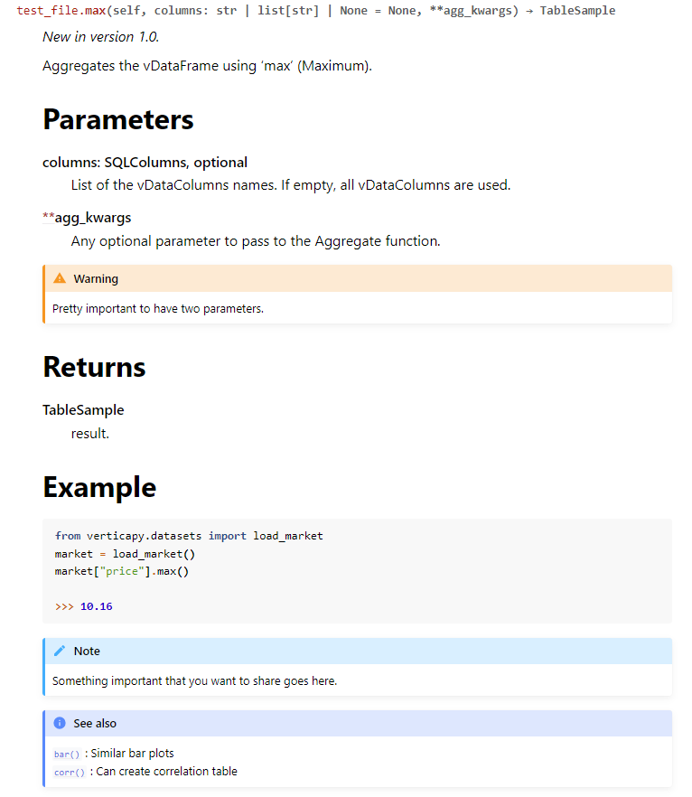
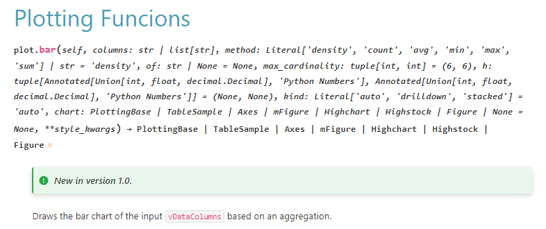
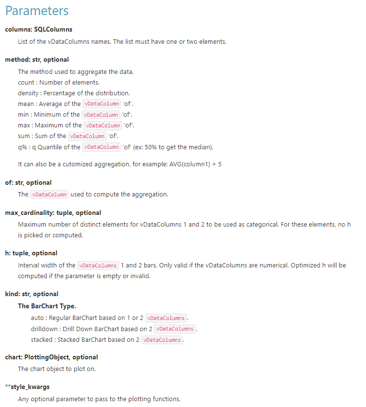
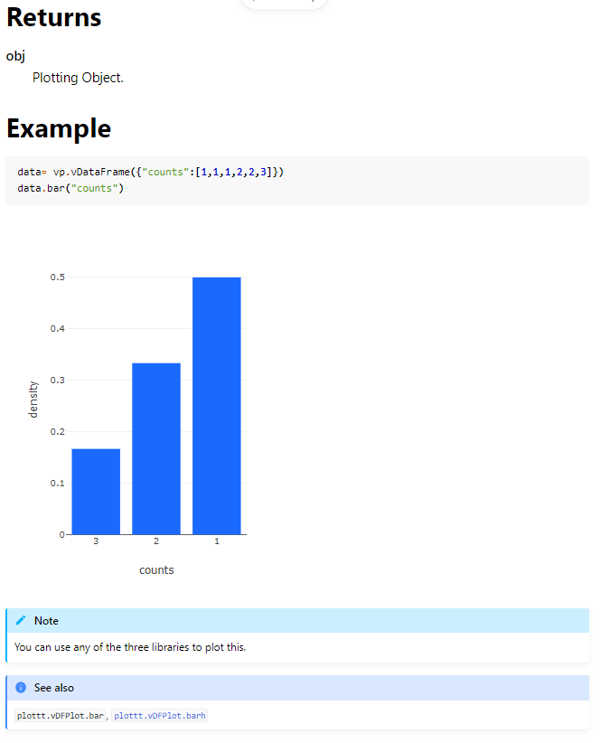
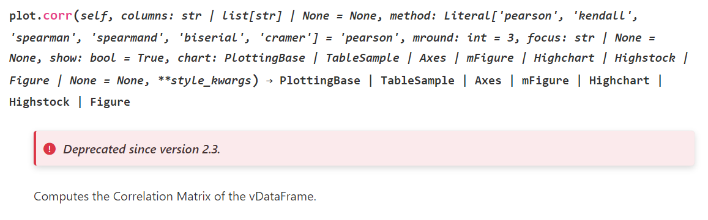
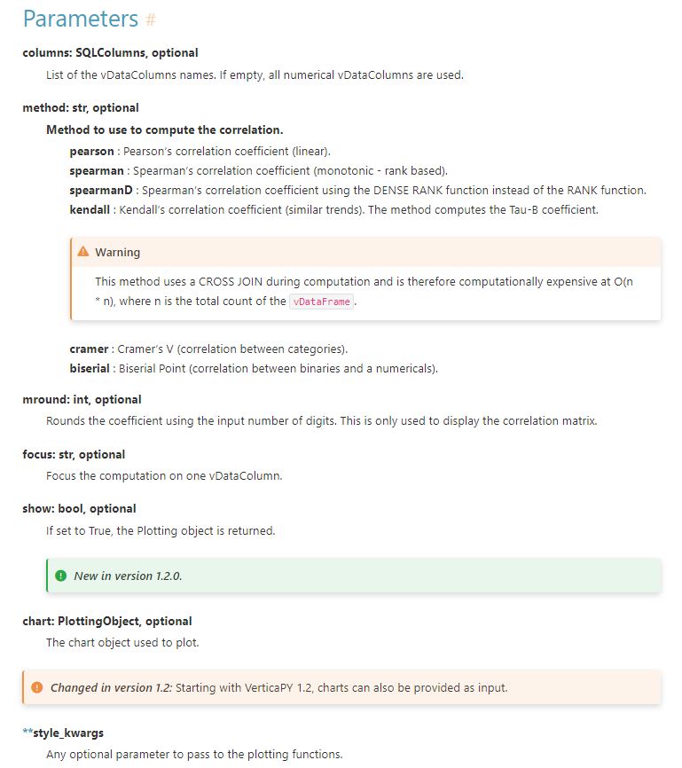
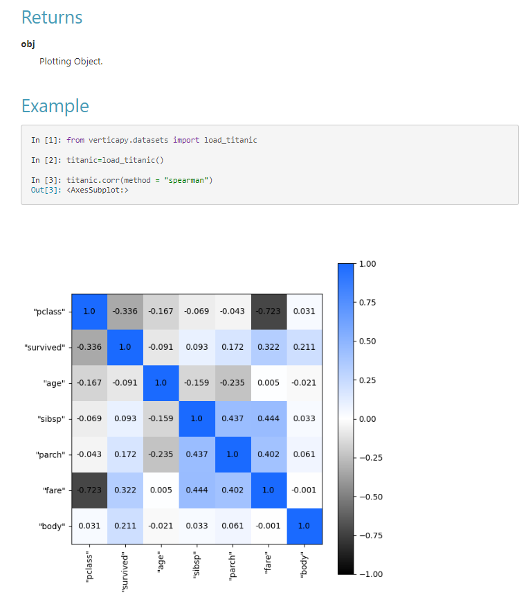
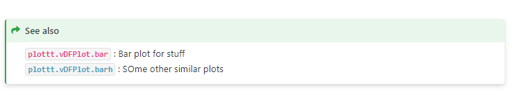
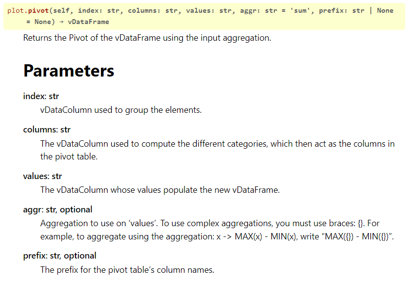
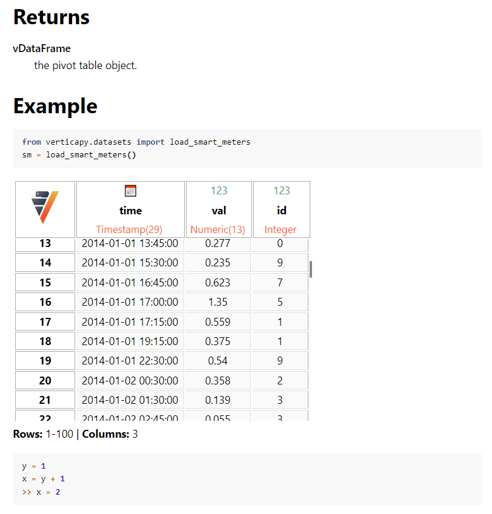

.. _contribution_guidelines.code.auto_doc.example:

========================
Complete Example
========================

In this page we will provide the basic structure for a docstring for any VerticaPy function that we need to follow to create professional and uniform documentation. We will show an example docstring for a couple of functions and highlight some diverse aspects of the rst syntax. At the end of the page, there are instructions to test out/check out your documentation page based on a test file.

Structure for docstring
========================

An ideal docstring should have the following struvture:

Version information
--------------------

On the top of every function's documentation we can write whether a function is new using:

.. code-block:: rst
    
    .. versionadded:: X

.. versionadded:: X

Or we can also mention if the function was deprecate using:

.. code-block::

    .. deprecated:: Y.0

.. deprecated:: Y.0

Or if the version changed:

.. code-block::

    .. versionchanged:: Z.0.0

.. versionchanged:: Z.0.0

.. note:: This may not be applicable to all the functions because of most of the functions are already part of VerticaPy.

.. hint:: For a list of all admonitions, check out: https://sphinx-themes.org/sample-sites/furo/kitchen-sink/admonitions/

Description of the function
----------------------------

We can write a few lines describing the functionality. This is mandatory.

We should elaborate the function as much ass possible. Best practice would be to write one summary line at the top. And then add details. 

Do not forget to use " ` ` " (without space in between) to show VerticaPy objects. This creates a special inline block. Look at the example below:

.. code-block:: python

    def one_hot_encode(
            self,
            prefix: Optional[str] = None,
            prefix_sep: str = "_",
            drop_first: bool = True,
            use_numbers_as_suffix: bool = False,
        ) -> "vDataFrame":
        """     
        Encodes the :py:class:`~vDataColumn` with  the One-Hot Encoding algorithm.

        One hot encoding will be done on the select column. The result will be outputted in new columns thus resulting in additional columns added to the table. 
        The first category/dummy will be dropped by default unless stated otherwise by the parameter ``drop_first``.
        """

**Output:**

     
    Encodes the :py:class:`~vDataColumn` with  the One-Hot Encoding algorithm.

    One hot encoding will be done on the select column. The result will be outputted in new columns thus resulting in additional columns added to the table. 
    The first category/dummy will be dropped by default unless stated otherwise by the parameter ``drop_first``.

Parameters
------------

Next, we need to add the details of the parameters in the Parameters heading. We can do this by writing "-------" underneath the Parameters heading.

For each parameter, we should also add the type of input along with the line explaining the parameter.

For example

.. code-block:: python

    """
    Parameters
    -----------
    x: integer
        x is the input
    """

**Output:**

    Parameters
    -----------
    x: integer
        x is the input

Returns
---------

We simple write what the function returns using the Returns heading:

.. code-block:: python

    """
    Returns
    -------
    obj
        Plotting Object.
    """

**Output:**

    
    Returns
    -------
    obj
        Plotting Object.

Examples
--------

In the examples, we can provide the code syntax to run the function. But first we need to create the Examples heading in a similar way:

.. code-block:: python

    Examples
    --------

Below the heading, we have multiple ways to show our result. The simplest way is to just make code block and type in input and output. Autoamtically, python syntax will be highlighted using the code below:

.. code-block::

    .. code-block:: python

    >>> x = [1,2,3]
    >>> max(x)
    3

**Output:**

.. code-block:: python

    >>> x = [1,2,3]
    >>> max(x)
    3

We can also run the code that is displayed:

.. code-block::

    .. ipython:: python

        x = 2
        y = 3
        x + y

**Output:**

    .. ipython:: python

        x = 2
        y = 3
        x + y

The above code will display and execute the python code as well. This can be useful where you don't want to hardcode the results.

Example - Figures / Equations
-------------------------------

Figures and equations should be added with examples to effectively describe our functions. 

To add equations, use the .. math::  directive:

.. code-block::

    .. math::

    (a + b)^2 = a^2 + 2ab + b^2

**Output:**

    .. math::

    (a + b)^2 = a^2 + 2ab + b^2

To add figures, you can any use either VerticaPy directly, or matplotlib. In VerticaPy, we have three plotting libraries that can switching using the following syntax: ``verticapy.set_options("plotting_lib":"matplotlib")``.

Matplotlib is our default plotting library.

When displaying static pages like matplotlib plots, you can use the ``@savefig`` pseudo directive.

.. important:: Make sure to add the "figures/" directory before the name.

.. note:: You do not need to import verticapy. It is imported by default.

.. code-block::

    .. ipython:: python

        import verticapy
        @savefig core_vDataFrame_plotting_bar_1.png
        verticapy.vDataFrame({"counts":[1,2,1,2]}).bar("counts")

.. note:: The suppress is optional if you don't want to show the code.

For dynamic plots like plotly and highcharts, you can save the plot as html and then use the ``.. raw::`` directive to display. 

.. important:: Make sure to write the custom directory(``SPHINX_DIRECTORY/figures/``) before the name when calling the file.

.. note:: You do not need to import verticapy unless you want to show a different use like import verticapy as vp. It is imported by default.

.. code-block:: 

    .. ipython:: python
        :suppress:

        import verticapy as vp
        vp.set_option("plotting_lib","plotly")
        data= vp.vDataFrame({"counts":[1,1,1,2,2,3]})
        fig=data.bar("counts")
        fig.write_html("figures/core_vDataFrame_vDFPlot_bar.html")

    .. raw:: html
       :file: SPHINX_DIRECTORY/figures/core_vDataFrame_vDFPlot_bar.html

**Output:**

Similarly, we can display the unique VerticaPy table outputs by saving them as html:

.. code-block::

    .. ipython:: python
        :suppress:

        from verticapy.datasets import load_smart_meters
        sm = load_smart_meters()
        html_file = open("figures/core_vDataFrame_agg_table.html", "w")
        html_file.write(sm._repr_html_())
        html_file.close()

    .. raw:: html
        :file: SPHINX_DIRECTORY/figures/core_vDataFrame_agg_table.html

Notes
------

We can also add notes or warning or helpful boxes to get the attention of users. There are many such options for admonitions. Check out https://sphinx-themes.org/sample-sites/furo/kitchen-sink/admonitions/ for the entire list.

But the most basic would be note:

.. code-block::
    
    .. note:: Please note that this is a note

**Output:**

.. note:: Please note that this is a note

See Also
---------

The last part of the docstring would be the see also block. This can be created using the .. seealso::  directive. 

In this block we can reference other modules, functions or class. For example to reference the "bar" function:

.. code-block::

    .. seealso:: 

    :py:func:`~bar` : Similar bar plots

**Output:**

.. seealso:: 

   :py:func:`~bar` : Similar bar plots

And to reference a module named vDataFrame:

.. code-block::

    .. seealso:: 

        :py:mod:`vDataFrame`

**Output:**

.. seealso:: 

   :py:mod:`vDataFrame`

Now you can go throught the below examples to understand the usage in detail. From the examples you will note a few things:

- Headers are created by writing "---------" underneath them
- Automatically the parameters are boldened
- We can display inline code block by using `inline_code`
- Different admonitions such as notes and warnings can be easily displayed e.g. ".. note:" 
- To display code as an example, we have three options:
- Display only the code using code block: '.. code-block:: python". Note this does not run the code. You can manually display output by writing ">> output=3"
- Display and run the code using Ipython: '.. ipython:: python'
- Run the code but do not display it. You can do this by combination of ipython directive and "suppress" option.
- Graph output can be added by two options:
- Save output as figure (suitable for matplotlib plots)
- Save output as html and display
- Special output like interactive tables can also be displayed using html export

Please look at the examples below to understand the use.

.. note:: The display of admonitions, graphics, text, highlights is affected by the theme that is selected. For different themes, you may experience different rendering. Below results are complied using the two themes "furo", and "pydata_sphinx_theme"

Complete Examples
====================

Basic Example - Max Function
------------------------------

.. code-block::

    def max(
        self,
        columns: Optional[SQLColumns] = None,
        **agg_kwargs,
        ) -> TableSample:
        """
        .. versionadded:: 1.0

        Aggregates the vDataFrame using 'max' (Maximum).

        Parameters
        ----------
        columns: SQLColumns, optional
            List of the vDataColumns names. If empty, all vDataColumns
            are used.
        **agg_kwargs
            Any optional parameter  to pass to  the Aggregate function.

        .. warning:: 
        Pretty important to have two parameters.

        Returns
        -------
        TableSample
            result.

        Example
        -------

        .. code-block:: python

            from verticapy.datasets import load_market
            market = load_market()
            market["price"].max()

            >>> 10.16

        .. note:: Something important that you want to share goes here.

        .. seealso:: 
            | :py:func:`~bar` : Similar bar plots
            | :py:func:`~corr` : Can create correlation table

        """
        return None

**Output:**

Advanced Example 1 - Bar Function
----------------------------------

.. code-block::

    def bar(
        self,
        columns: SQLColumns,
        method: PlottingMethod = "density",
        of: Optional[str] = None,
        max_cardinality: tuple[int, int] = (6, 6),
        h: tuple[PythonNumber, PythonNumber] = (None, None),
        kind: Literal["auto", "drilldown", "stacked"] = "auto",
        chart: Optional[PlottingObject] = None,
        **style_kwargs,
    ) -> PlottingObject:
        """

        .. versionadded:: 1.0

        Draws the bar chart of the input :py:class:`~vDataColumn` based
        on an aggregation.

        Parameters
        ----------
        columns: SQLColumns
            List of  the vDataColumns names.  The list must
            have one or two elements.
        method: str, optional
            | The method used to aggregate the data.
            | count   : Number of elements.
            | density : Percentage  of  the  distribution.
            | mean    : Average  of the  :py:class:`~vDataColumn` 'of'.
            | min     : Minimum  of the  :py:class:`~vDataColumn` 'of'.
            | max     : Maximum  of the  :py:class:`~vDataColumn` 'of'.
            | sum     : Sum of the :py:class:`~vDataColumn` 'of'.
            | q%      : q Quantile of the :py:class:`~vDataColumn` 'of'
                            (ex: 50% to get the median).
            
            It can also be a cutomized aggregation, for example:
            AVG(column1) + 5
        of: str, optional
            The  :py:class:`~vDataColumn` used to compute the  aggregation.
        max_cardinality: tuple, optional
            Maximum number of distinct elements for vDataColumns
            1  and  2  to be used as categorical. For these
            elements, no  h is picked or computed.
        h: tuple, optional
            Interval width of  the :py:class:`~vDataColumn` 1 and 2 bars.
            Only  valid if the  vDataColumns are  numerical.
            Optimized  h will be  computed  if the parameter  is
            empty or invalid.
        kind: str, optional
            The BarChart Type.
                | auto      : Regular  BarChart  based on  1  or 2
                            :py:class:`~vDataColumn`.
                | drilldown : Drill   Down  BarChart  based  on  2
                            :py:class:`~vDataColumn`.
                | stacked   : Stacked   BarChart    based    on  2
                            :py:class:`~vDataColumn`.
        chart: PlottingObject, optional
            The chart object to plot on.
        **style_kwargs
            Any  optional  parameter  to  pass  to  the plotting
            functions.

        Returns
        -------
        obj
            Plotting Object.

        Example
        -------

        .. ipython:: python
            :suppress:

            import verticapy as vp
            vp.set_option("plotting_lib","plotly")
            data= vp.vDataFrame({"counts":[1,1,1,2,2,3]})
            fig=data.bar("counts")
            fig.write_html("figures/core_vDataFrame_vDFPlot_bar.html")

        .. code-block:: python
        
        data= vp.vDataFrame({"counts":[1,1,1,2,2,3]})
        data.bar("counts")

        .. raw:: html
            :file: SPHINX_DIRECTORY/figures/core_vDataFrame_vDFPlot_bar.html

        .. note:: You can use any of the three libraries to plot this.

        .. seealso:: 
            :py:func:`~plottt.vDFPlot.bar`, :py:func:`~plottt.vDFPlot.barh`

        """

**Output:**

Advanced Example 2 - Correlation Matrix
-------------------------------------------

.. code-block::

    def corr(
        self,
        columns: Optional[SQLColumns] = None,
        method: Literal[
            "pearson", "kendall", "spearman", "spearmand", "biserial", "cramer"
        ] = "pearson",
        mround: int = 3,
        focus: Optional[str] = None,
        show: bool = True,
        chart: Optional[PlottingObject] = None,
        **style_kwargs,
    ) -> PlottingObject:
        """
    
        .. deprecated:: 2.3
    
    
        Computes the Correlation Matrix of the vDataFrame.
    
        Parameters
        ----------
        columns: SQLColumns, optional
            List of the vDataColumns names. If empty, all
            numerical vDataColumns are used.
        method: str, optional
            Method to use to compute the correlation.
            
            **pearson**   : 
                            Pearson's  correlation coefficient
                            (linear).

            **spearman**  : 
                            Spearman's correlation coefficient
                            (monotonic - rank based).

            **spearmanD** : 
                            Spearman's correlation coefficient
                            using  the   DENSE  RANK  function
                            instead of the RANK function.

            **kendall**   : 
                            Kendall's  correlation coefficient
                            (similar trends).  The method
                            computes the Tau-B coefficient.

            .. Warning::
                This method  uses a CROSS JOIN  during  computation and      is     therefore computationally expensive at  O(n * n),  where n is the  total  count of  the :py:class:`~vDataFrame`.
            
            **cramer**    : 
                            Cramer's V
                            (correlation between categories).
            **biserial**  : 
                            Biserial Point
                            (correlation between binaries and a
                            numericals).

        mround: int, optional
            Rounds  the coefficient using  the input number of
            digits. This is only used to display the correlation
            matrix.
        focus: str, optional
            Focus  the  computation  on  one  vDataColumn.
        show: bool, optional
            If  set  to  True,  the  Plotting  object  is
            returned.
        chart: PlottingObject, optional
            The chart object used to plot.
        **style_kwargs
            Any  optional  parameter  to pass to the  plotting
            functions.
    
        Returns
        -------
        obj
            Plotting Object.
    
        Example
        --------
    
        .. ipython:: python
            
        from verticapy.datasets import load_titanic
        titanic=load_titanic()
        @savefig core_vDataFrame_agg_corr.png
        titanic.corr(method = "spearman")
    
        .. seealso::
            | :py:func:`~plottt.vDFPlot.bar` : Bar plot for stuff
            | :py:func:`~plottt.vDFPlot.barh` : SOme other similar plots
    
    
        """

**Output:**

Advanced Example 3 - Pivot Table
---------------------------------

.. code-block::

    def pivot(
        self,
        index: str,
        columns: str,
        values: str,
        aggr: str = "sum",
        prefix: Optional[str] = None,
    ) -> "vDataFrame":
        """
        Returns the Pivot of the vDataFrame using the input aggregation.

        Parameters
        ----------
        index: str
            vDataColumn used to group the elements.
        columns: str
            The vDataColumn used to compute the different categories,
            which then act as the columns in the pivot table.
        values: str
            The vDataColumn whose values populate the new vDataFrame.
        aggr: str, optional
            Aggregation to use on 'values'.  To use complex aggregations,
            you must use braces: {}. For example, to aggregate using the
            aggregation: x -> MAX(x) - MIN(x), write "MAX({}) - MIN({})".
        prefix: str, optional
            The prefix for the pivot table's column names.

        Returns
        -------
        vDataFrame
            the pivot table object.

        Example
        -------
        .. code-block:: python

            from verticapy.datasets import load_smart_meters
            sm = load_smart_meters()

        .. ipython:: python
            :suppress:

            from verticapy.datasets import load_smart_meters
            sm = load_smart_meters()
            html_file = open("figures/core_vDataFrame_aggregate_pivot.html", "w")
            html_file.write(sm._repr_html_())
            html_file.close()

        .. raw:: html
            :file: SPHINX_DIRECTORY/figures/core_vDataFrame_aggregate_pivot.html

        .. code-block:: python

            y = 1
            x = y + 1
            >> x = 2

        """
        return None

