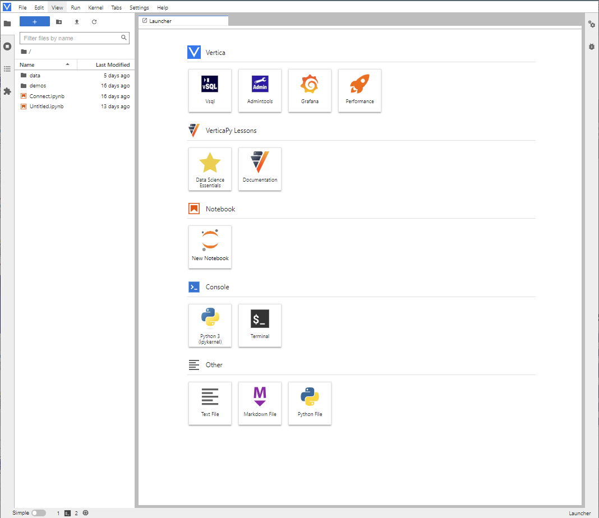

.. _getting_started:

=================
Getting Started
=================

.. raw:: html

   

     
   

.. raw:: html

    

        VerticaPy
    

    

      Python API for Vertica Data Science at Scale
    

Install VerticaPyLab
--------------------

The easiest way to try out VerticaPy is by using `VerticaPyLab <https://github.com/vertica/VerticaPyLab>`_. VerticaPyLab eliminates the need for intricate installations, configurations, 
and managing dependencies. 

By providing a pre-configured environment, VerticaPyLab empowers you to focus on learning and harnessing the combined potential of Vertica and VerticaPy.

VerticaPyLab comprises of two containers: one housing the robust Vertica analytical database and another featuring JupyterLab, an interactive computing environment. 
These two components synergize to offer a cohesive environment that bridges the power of Vertica with the capabilities of Python's ML toolkit, including VerticaPy.

Getting started with VerticaPyLab is quite easy. Follow these simple steps to immerse yourself in a hassle-free ML and Data Analytics environment.

 1. Download VerticaPyLab: Begin by visiting the official `GitHub repository of VerticaPyLab <https://github.com/vertica/VerticaPyLab>`_. You'll find comprehensive installation instructions and resources to guide you through the process.
 2. Install VerticaPyLab: Say goodbye to complex setup processes. With VerticaPyLab, all you need to do is execute a single command: 'make all'. This command triggers the installation of both the Vertica container and the JupyterLab container, automating the entire process.

Install Each Element Separately
-------------------------------

Prerequisite
^^^^^^^^^^^^

**Python 3.9+**

VerticaPy runs with Python 3.9 or higher. You can install Python directly from their `website <https://www.python.org/downloads>`_ .

**Jupyter Lab**

If you want to have a nice environment to play with, we recommend you to install the last Jupyter version. You can find all the information to install it in their `website <https://jupyter.org/install>`_

**Vertica 9+**

VerticaPy relies on Vertica 9 or more recent version.

Vertica is the most advanced analytics data warehouse based on a massively scalable architecture. 
It features the broadest set of analytical functions spanning event and time series, geospatial, end-to-end in-database machine learning, and pattern matching. 

Vertica lets you to easily apply these powerful functions to the largest and most demanding analytical workloads, 
arming you and your customers with predictive business insights faster than any other analytics data warehouse on the market.

Vertica provides a unified analytics platform across major public clouds and on-premises data centers and integrates data in cloud object storage and 
HDFS without forcing you to move any of your data.

To learn more about the Vertica database, check out the `Vertica Official Website <https://www.vertica.com/about/>`_.

If you already have Vertica installed, you can skip this step. Otherwise, you have some options for trying out Vertica for free.

- The easiest way to install Vertica is to use containers on Docker. You can find all the needed information `here <https://hub.docker.com/r/vertica/vertica-k8s>`_.
- If you have a Linux machine, you can install Vertica Community Edition. Please see this `video <https://www.youtube.com/watch?v=D5SbzVVR_Ps&ab_channel=MicroFocusisnowOpenText>`_.
- If you don't have a Linux machine, you can use the Vertica Community Edition VM. In this case, follow the instructions of the `Vertica Community Edition Virtual Machine Installation Guide <https://www.vertica.com/docs/VMs/Vertica_CE_VM_Download_and_Startup_Instructions.pdf>`_.

.. hint::

    You can also install VerticaPyLab which has both Vertica and VerticaPy pre-installed in a docker environment. See :ref:`Install VerticaPyLab`.

Install VerticaPy
^^^^^^^^^^^^^^^^^

To install VerticaPy with all the dependencies, including some geospatial packages such as GeoPandas and Descartes, run the following **pip** command:

>>> pip3 install verticapy[all]

If you do not want to install extra dependencies, you can use the following command:

>>> pip3 install verticapy

To start playing with the API, create a new connection:

.. code-block:: python

    import verticapy as vp

    vp.new_connection(
        {
            "host": "10.211.55.14", 
            "port": "5433", 
            "database": "testdb", 
            "password": "XxX", 
            "user": "dbadmin",
        },
        name = "My_New_Vertica_Connection",
    )

.. note::

    For more information, see: :ref:`connection`.

After a connection is created, you can use the :py:func:`~verticapy.connection.connect` function to reconnect.

.. code-block:: python

    vp.connect("My_New_Vertica_Connection")

Create a VerticaPy schema for native VerticaPy models (that is, models available in VerticaPy, but not Vertica itself):

.. code-block:: python

    vp.create_verticapy_schema()

You can now start playing with the library! A good starting point is the `Quick Start guide <https://github.com/vertica/VerticaPy#quickstart>`_.
