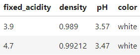
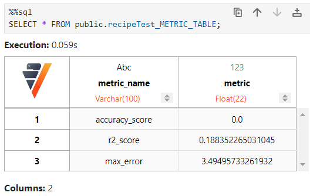

=========
Pipelines
=========

Vertica Pipelines is an open source platform for managing data
scientists’ machine learning pipelines. They are built on a
human-readable data format: **YAML**.

==============================
Setting Up Your First Pipeline
==============================

Requirements
~~~~~~~~~~~~
| To begin, you must:
| - Have access to a machine that has Vertica installed
| - Install Python on your machine
| - Install Verticapy

Create Your First YAML files
~~~~~~~~~~~~~~~~~~~~~~~~~~~~

   | **THE BASIC RULES OF ANY YAML FILE:**
   | - YAML is case sensitive 
   | - The files should have **.yaml** as the extension 
   | - YAML does not allow the use of tabs while creating YAML files

| The information in connection.yaml will be the same you use in Verticapy.
| ``$ vim connection.yaml``

.. code:: yaml

   # Replace with your information #
   host: "127.0.0.1"
   port: "5433"
   database: ""
   password: ""
   user: "dbadmin"

| The information in your pipeline yaml file will outline the flow of data.
| ``$ vim gettingStarted.yaml``

.. code:: yaml

   schema: "public"
   pipeline: "gettingStarted"
   table: public.example_table
   # steps:
       # ingest: 
       # transform: 
       # train:
       # test:

Run the Parser
~~~~~~~~~~~~~~

| The parser will follow the general format:
| ``$python -m verticapy.pipeline.parser [connection_file] [input_file] -o [output file]``

| Both of the following will generate a sql file:
  **gettingStarted.sql**
| ``$python -m verticapy.pipeline.parser connection.yaml gettingStarted.yaml``
| ``$python -m verticapy.pipeline.parser connection.yaml gettingStarted.yaml -o gettingStarted.sql``

Dropping the Pipeline
~~~~~~~~~~~~~~~~~~~~~

| If you are done with the pipeline and want to drop all ingestions,
  views, models, or stored procedures associated with it, you can do
  either of the following:
| **In a VSQL terminal:**
| ``verticadb21455=> CALL drop_pipeline([schema name], [pipeline name]);``
| **In VerticaPy cell**

.. code:: sql

   %%sql
   CALL drop_pipeline([schema name], [pipeline name]);

| for the example above running the sql would drop the pipeline:
| ``CALL drop_pipeline('public', 'gettingStarted');``

Now you should be ready to quickly build new pipelines!

=============
Documentation
=============

Ingestion
~~~~~~~~~

| For more information on how to customize this step: `DataLoader <https://docs.vertica.com/23.4.x/en/sql-reference/statements/create-statements/create-data-loader/#arguments>`__ and `COPY <https://docs.vertica.com/23.4.x/en/sql-reference/statements/copy/>`__

.. code:: yaml

     ingest:
         from: '~/data/bucket/*'
         delimiter: ','
         retry_limit: 'NONE'
         retention_interval: "'15 days'"

Transform
~~~~~~~~~

| `transform functions documentation <https://www.vertica.com/python/documentation/1.0.x/html/vdataframe.html#features-engineering>`__

| ``public.winequality``

**Example**

.. code:: yaml

   transform:
       # 1. Existing Column
       col1:
           sql: fixed_acidity
       # 2. Column + Transform
       col2:
           sql: color
           transform_method:
               name: str_count
               params:
                   pat: white
       # 3. Create a new column with Method
       # Note: Don't specify 'name' in params
       col3:
           transform_method:
               name: cummax
               params:
                   column: fixed_acidity
       # 4. Complex Sql
       col4:
           sql: fixed_acidity * density
       # 5. Multiple Params
       col5:
           transform_method:
               name: regexp
               params:
                   column: color
                   pattern: "white"
                   method: "replace"
                   replacement: "NOT white"
       # 6. Multi-Stage Transforms
       col6:
           sql: color
           transform_method1:
               name: str_count
               params:
                   pat: white
           transform_method2:
               name: add
               params:
                   x: 0.5
       # 7. Using Previously Created Columns
       col7:
           sql: col2
           transform_method:
               name: add
               params:
                   x: 0.5

Train
~~~~~

| `train functions
  documentation <https://www.vertica.com/python/documentation/1.0.x/html/machine_learning_vertica.html#api-machine-learning-vertica>`__
| If you want to train a model the default setting is use all the
  previously created **cols** as predictors to your method. If you wish
  to exclude some columns use ``exclude:`` to subtract the specified
  columns from the default or use ``include:`` to strictly choose the
  subset. The previous transform example is the basis for this train
  example:

**Example 1**

.. code:: yaml

     train:    
       method:
           name: RandomForestClassifier
           target: citric_acid
           params:
               n_estimators: 40
               max_depth: 4

**Example 2**

.. code:: yaml

     train:    
       method:
           name: LinearSVC
           target: col2
           exclude: ['col5', 'col2']

**Example 3**

.. code:: yaml

     train:    
       method:
           name: LinearSVC
           target: col2
           include: ['col1', 'col3', 'col4', 'col6', 'col7']

Test
~~~~

| You may want to compute metrics for your newly created model. To see a
  list click
  `here <https://www.vertica.com/python/documentation/1.0.x/html/machine_learning_metrics.html#api-machine-learning-metrics>`__.
  The results are stored in
| **``[schema].[pipeline_name]_METRIC_TABLE``**

**Example 1**

.. code:: yaml

     test:
       metric1: 
           name: accuracy_score
           y_true: quality
           y_score: prediction
       metric2: 
           name: r2_score
           y_true: quality
           y_score: prediction
       metric3: 
           name: max_error
           y_true: quality
           y_score: prediction

Scheduler
~~~~~~~~~

| If you would like the **ingestion** or **train** to contiously update on a set
| schedule use the ``schedule`` key. The schedule follows the **cron**
| format, for more information see:
| `wiki <https://en.wikipedia.org/wiki/Cron>`__, and `Vertica documentation <https://docs.vertica.com/23.4.x/en/sql-reference/statements/create-statements/create-schedule/>`__.

**Example 1**

.. code:: yaml

     train:
       method:
           name: RandomForestClassifier
           target: survived
           params:
               n_estimators: 40
               max_depth: 4
       schedule: "* * * * *"

**Example 2**

.. code:: yaml

     ingest:
         from: '/scratch_b/znowak/repos/server/udx/supported/MachineLearning/SQLTest/data/bucket/*'
         delimiter: ','
         schedule: "* * * * *"

| ``public.winequality``

