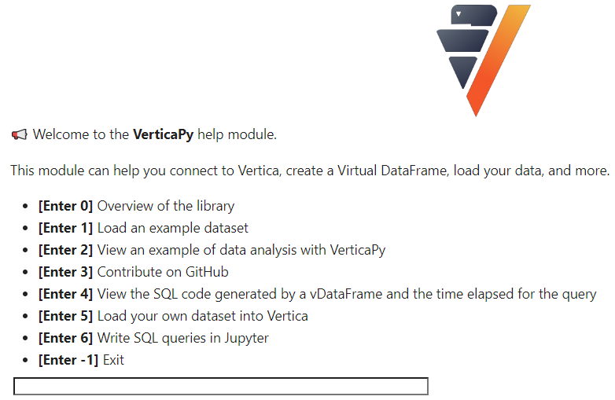

.. _user_guide.introduction.installation:

Connect to a Vertica database
==============================

The following tutorial demonstrates a quick and easy way to connect to a Vertica database using VerticaPy. For a full exploration of the connection possibilities in VerticaPy, including auto-connections, see Connection.

Requirements
--------------

Before connecting to a database, you must satisfy the following requirements:

- Have access to a machine with Vertica version 9 or later installed
- Install Python 3.9 or later on your machine
- Install VerticaPy on your machine

For more information about these installations, 
see :ref:`getting_started`.

Connect to a DB
----------------

To connect to a database for the first time, use the :py:func:`~verticapy.new_connection` function, replacing the configuration values with the credentials for your database:

.. code-block:: python

    import verticapy as vp

    vp.new_connection(
        {
            "host": "12.345.67.89", 
            "port": "5433", 
            "database": "testdb", 
            "password": "XxX", 
            "user": "dbadmin",
        },
        name = "Vertica_Connection",
    )

.. ipython:: python
    :suppress:

    import verticapy as vp

The connection is saved to the VerticaPy connection file under the name specified in the name parameter. To reconnect to 
the database using this connection, run the :py:func:`~verticapy.connect` function with the name of the connection as the argument value:

.. code-block:: python

    vp.connect("Vertica_Connection")

To view all available connections, use :py:func:`~verticapy.available_connection`.

.. code-block:: python

    vp.available_connections()

    Out: ['Vertica_New_Connection', 'Vertica_Connection']

If you need to confirm the parameters for a given function, you can also use the help function:

.. ipython:: python

    help(vp.new_connection)

For an interactive start guide, you can use the :py:func:`~verticapy.help_start()` function:

.. code-block:: python

    vp.help_start()

