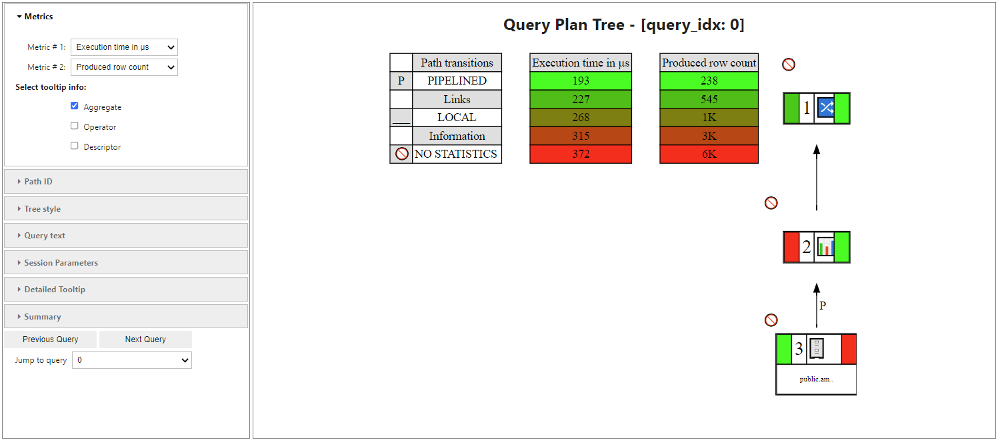

.. _user_guide.performance.qprof:

====================================
Getting started with Query Profiler
====================================

This starter notebook will help you get up and running with the Query Profiler (:py:mod:`~verticapy.performance.vertica.QueryProfiler`) tool in VerticaPyLab and demonstrate functionality through various examples and use cases.

This tool is a work in progress and the VerticaPy team is continuously adding new features.

See also :py:mod:`~verticapy.performance.vertica.QueryProfiler`, 
:py:func:`~verticapy.performance.vertica.QueryProfilerInterface`, 
:py:func:`~verticapy.performance.vertica.QueryProfilerComparison`.

VerticaPyLab
-------------

The easiest way to use the :py:mod:`~verticapy.performance.vertica.QueryProfiler` tool is through VerticaPyLab. For installation instructions, see :ref:`getting_started`.

Before using the :py:mod:`~verticapy.performance.vertica.QueryProfiler` tool, confirm that you are connected to a Vertica database. If not, follow the connection instructions in a Jupyter notebook or connect using the Connect option on the VerticaPyLab homepage.

QueryProfiler
--------------

The :py:mod:`~verticapy.performance.vertica.QueryProfiler` object is a python object that includes many built-in methods for analyzing queries and their performance. There are a few different ways to create a :py:mod:`~verticapy.performance.vertica.QueryProfiler` object.

Create and save a QueryProfiler object
+++++++++++++++++++++++++++++++++++++++

First, import the verticapy package and load the datasets:

.. ipython:: python

    import verticapy as vp
    from verticapy.datasets import load_titanic, load_amazon
    # load datasets
    titanic = load_titanic()
    amazon = load_amazon()

Create :py:mod:`~verticapy.performance.vertica.QueryProfiler` object from transaction id and statement id
+++++++++++++++++++++++++++++++++++++++++++++++++++++++++

Before creating the :py:mod:`~verticapy.performance.vertica.QueryProfiler` object, take a look at the data used by the query:

.. code-block:: python

    amazon.head(100)

.. ipython:: python
    :suppress:

    res = amazon.head(100)
    html_file = open("SPHINX_DIRECTORY/figures/user_guides_performance_qprof_amazon.html", "w")
    html_file.write(res._repr_html_())
    html_file.close()

.. raw:: html
    :file: SPHINX_DIRECTORY/figures/user_guides_performance_qprof_amazon.html

.. code-block:: python

    titanic.head(100)

.. ipython:: python
    :suppress:

    res = titanic.head(100)
    html_file = open("SPHINX_DIRECTORY/figures/user_guides_performance_qprof_titanic.html", "w")
    html_file.write(res._repr_html_())
    html_file.close()

.. raw:: html
    :file: SPHINX_DIRECTORY/figures/user_guides_performance_qprof_titanic.html

We can now run some queries to create a :py:mod:`~verticapy.performance.vertica.QueryProfiler` object. One way to do so is by using the queries ``statement_id`` and ``transaction_id``.

To allow for SQL execution in Jupyter cells, load the sql extension:

.. ipython:: python

    %load_ext verticapy.sql

Next, let us run the queries:

.. code-block:: python

    %%sql
    SELECT 
        date, 
        MONTH(date) as month, 
        AVG(number) as avg_number_test 
    FROM public.amazon 
    GROUP BY date
    ORDER BY avg_number_test DESC;

.. ipython:: python
    :suppress:

    query = """
    SELECT 
        date, 
        MONTH(date) as month, 
        AVG(number) as avg_number_test 
    FROM public.amazon 
    GROUP BY date
    ORDER BY avg_number_test DESC;
    """
    res = vp.vDataFrame(query)
    query_1 = query
    html_file = open("SPHINX_DIRECTORY/figures/user_guides_performance_qprof_sql.html", "w")
    html_file.write(res._repr_html_())
    html_file.close()

.. raw:: html
    :file: SPHINX_DIRECTORY/figures/user_guides_performance_qprof_sql.html

.. code-block:: python

    %%sql
    SELECT 
        a.date, 
        MONTH(a.date) AS month, 
        AVG(a.number) AS avg_number_test, 
        b.max_number
    FROM 
        public.amazon AS a
    JOIN (
        SELECT 
            date, 
            MAX(number) AS max_number
        FROM 
            public.amazon
        GROUP BY 
            date
    ) AS b 
    ON 
        a.date = b.date
    GROUP BY 
        a.date, b.max_number
    ORDER BY 
        avg_number_test DESC;

.. ipython:: python
    :suppress:

    query = """
    SELECT 
        a.date, 
        MONTH(a.date) AS month, 
        AVG(a.number) AS avg_number_test, 
        b.max_number
    FROM 
        public.amazon AS a
    JOIN (
        SELECT 
            date, 
            MAX(number) AS max_number
        FROM 
            public.amazon
        GROUP BY 
            date
    ) AS b 
    ON 
        a.date = b.date
    GROUP BY 
        a.date, b.max_number
    ORDER BY 
        avg_number_test DESC;
    """
    query_2 = query
    res = vp.vDataFrame(query_2)
    html_file = open("SPHINX_DIRECTORY/figures/user_guides_performance_qprof_sql_2.html", "w")
    html_file.write(res._repr_html_())
    html_file.close()

.. raw:: html
    :file: SPHINX_DIRECTORY/figures/user_guides_performance_qprof_sql_2.html

In order to create a :py:mod:`~verticapy.performance.vertica.QueryProfiler` object from a query, we need the queries statement_id and transaction_id, both of which are found in the QUERY_REQUESTS system table:

.. code-block:: python

    from verticapy.performance.vertica import QueryProfiler, QueryProfilerInterface

    qprof = QueryProfiler((45035996273780927,76))

To create a :py:mod:`~verticapy.performance.vertica.QueryProfiler` object w/ multiple queries, provide a list of tuples

.. code-block:: python

    qprof = QueryProfilerInterface([(45035996273780927,74), (45035996273780075,6)])

Once the :py:mod:`~verticapy.performance.vertica.QueryProfiler` object is created, you can run the get_queries() method to view the queries contained in the :py:mod:`~verticapy.performance.vertica.QueryProfiler` object:

.. code-block:: python
  
    qprof.get_queries()

.. ipython:: python
    :suppress:
    :okwarning:

    from verticapy.performance.vertica import QueryProfiler, QueryProfilerInterface
    qprof = QueryProfilerInterface([query_1, query_2])
    res = qprof.get_queries()
    html_file = open("SPHINX_DIRECTORY/figures/user_guides_performance_qprof_get_queries.html", "w")
    html_file.write(res._repr_html_())
    html_file.close()

.. raw:: html
    :file: SPHINX_DIRECTORY/figures/user_guides_performance_qprof_get_queries.html

To visualize the query plan, run :py:func:`verticapy.QueryProfilerInterface.get_qplan_tree`, 
which is customizable, allowing you to specify certain metrics or focus on a specified tree path:

Create a :py:mod:`~verticapy.performance.vertica.QueryProfiler` object directly from a query
++++++++++++++++++++++++++++++++++++++++++++++++++++++++++++++++++++++++++++++++++++++++++++++

You can also create the :py:mod:`~verticapy.performance.vertica.QueryProfiler` Object directly from an SQL Command:

.. code-block:: python

    qprof = QueryProfiler("""
        select transaction_id, statement_id, request, request_duration
        from query_requests where start_timestamp > (now() - interval'1 hour')
        order by request_duration desc limit 10; 
        """
    )

Save the QueryProfiler object in a target schema
+++++++++++++++++++++++++++++++++++++++++++++++++

After you create a :py:mod:`~verticapy.performance.vertica.QueryProfiler` object, you can save it to a target schema. 

In this example, we will save the object to the ``sc_demo`` schema:

.. ipython:: python

    vp.create_schema("sc_demo")

To save the :py:mod:`~verticapy.performance.vertica.QueryProfiler` object, specify the ``target_schema`` and, optionally, a ``key_id`` (it is a unique key which is used to search for the stored Qprof object) when creating the :py:mod:`~verticapy.performance.vertica.QueryProfiler` object:

.. code-block:: python

    # Save it to your schema
    qprof = QueryProfiler(
        (45035996273780927, 76),
        target_schema = "sc_demo",
        key_id = "unique_xx1",
        overwrite = True,
    )

Load a :py:mod:`~verticapy.performance.vertica.QueryProfiler` object
----------------------------------------------------------------------

To load a previously saved :py:mod:`~verticapy.performance.vertica.QueryProfiler`, simply provide its ``target_schema`` and ``key_id``:

.. code-block:: python

    from verticapy.performance.vertica import QueryProfiler, QueryProfilerInterface

    # Someone else can now connect to my DB and use the object.
    qprof = QueryProfiler(
        target_schema = "sc_demo",
        key_id = "unique_xx1",
    )

Export and import
------------------

You can export and import :py:mod:`~verticapy.performance.vertica.QueryProfiler` objects as .tar files.

Export
+++++++

To export a :py:mod:`~verticapy.performance.vertica.QueryProfiler` object, use the :py:func:`~verticapy.performance.vertica.QueryProfiler.export_profile` method:

.. code-block:: python

    qprof.export_profile(filename="test_export_1.tar")

.. note:: 
    
    There is also a shell script which helps you export ``qprof`` data without python. See `qprof_export <https://github.com/mail4umar/qprof_export>`_.

Import
+++++++

To import a :py:mod:`~verticapy.performance.vertica.QueryProfiler` object, use the :py:func:`~verticapy.performance.vertica.QueryProfiler.import_profile` method and provide the ``target_schema`` and ``key_id``.

Make sure the ``key_id`` is unique/unused. Let us create a new schema to load this into:

.. code-block:: python

    vp.create_schema("sc_demo_1")

    qprof = QueryProfiler.import_profile(
        target_schema = "sc_demo_1",
        key_id = "unique_load_xx1",
        filename = "test_export_1.tar",
        auto_initialize = True,                                        
    )

Methods & attributes
---------------------

The :py:mod:`~verticapy.performance.vertica.QueryProfiler` object includes many useful methods and attributes to aid in the analysis of query performence.

Access performance tables
++++++++++++++++++++++++++

With the :py:mod:`~verticapy.performance.vertica.QueryProfiler` object, you can access any of the following tables:

.. ipython:: python

    qprof.get_table()

For example, view the ``QUERY_EVENTS`` table:

.. code-block:: python

    qprof.get_table("query_events")

.. ipython:: python
  :suppress:

  res = qprof.get_table("query_events")
  html_file = open("SPHINX_DIRECTORY/figures/user_guides_performance_qprof_query_events.html", "w")
  html_file.write(res._repr_html_())
  html_file.close()

.. raw:: html
  :file: SPHINX_DIRECTORY/figures/user_guides_performance_qprof_query_events.html

Or the ``DC_EXPLAIN_PLANS`` table:

.. code-block:: python

    qprof.get_table('dc_explain_plans')

.. ipython:: python
    :suppress:

    res = qprof.get_table('dc_explain_plans')
    html_file = open("SPHINX_DIRECTORY/figures/user_guides_performance_qprof_dc_explain_plans.html", "w")
    html_file.write(res._repr_html_())
    html_file.close()

.. raw:: html
    :file: SPHINX_DIRECTORY/figures/user_guides_performance_qprof_dc_explain_plans.html

Or the ``QUERY_CONSUMPTION`` table:

.. code-block:: python

    qprof.get_table("query_consumption")

.. ipython:: python
    :suppress:

    res = qprof.get_table("query_consumption")
    html_file = open("SPHINX_DIRECTORY/figures/user_guides_performance_qprof_query_consumption.html", "w")
    html_file.write(res._repr_html_())
    html_file.close()

.. raw:: html
    :file: SPHINX_DIRECTORY/figures/user_guides_performance_qprof_query_consumption.html

Get query information
++++++++++++++++++++++

You can retrieve the query information, such as ``transaction_id`` and ``statement_id``, from the :py:mod:`~verticapy.performance.vertica.QueryProfiler` object:

.. ipython:: python
    :okwarning:

    qprof = QueryProfiler("""
        select transaction_id, statement_id, request, request_duration
        from query_requests where start_timestamp > (now() - interval'1 hour')
        order by request_duration desc limit 10;
        """
    )

View the ``transaction_id`` and ``statement_id``:

.. ipython:: python

    tid = qprof.transaction_id
    sid = qprof.statement_id
    print(tid, sid)

Display the query request:

.. ipython:: python

    # Pretty, Formatted, Results
    qprof.get_request()

View the number of query steps in a bar graph:

.. code-block:: python

    qprof.get_qsteps(kind="bar")

.. ipython:: python
    :suppress:
    :okwarning:

    fig = qprof.get_qsteps(kind="bar")
    html_text = fig.htmlcontent.replace("container", "user_guides_performance_qprof_bar")
    with open("figures/user_guides_performance_qprof_bar.html", "w") as file:
        file.write(html_text)

.. raw:: html
    :file: SPHINX_DIRECTORY/figures/user_guides_performance_qprof_bar.html

.. ipython:: python

    qprof.get_qplan()

.. code-block:: python

    qprof.get_qplan_tree()

To view the query plan profile in a pie chart:

.. code-block:: python

    qprof.get_qplan_profile(kind = "pie")

.. ipython:: python
    :suppress:
    :okwarning:

    vp.set_option("plotting_lib", "plotly")
    fig = qprof.get_qplan_profile(kind = "pie")
    fig.write_html("SPHINX_DIRECTORY/figures/user_guides_performance_qprof_pie.html")

.. raw:: html
    :file: SPHINX_DIRECTORY/figures/user_guides_performance_qprof_pie.html

To view the cpu time of the query in a bar graph:

.. code-block:: python

    qprof.get_cpu_time(kind="bar")

.. ipython:: python
    :suppress:
    :okwarning:

    fig = qprof.get_cpu_time(kind="bar")
    fig.write_html("SPHINX_DIRECTORY/figures/user_guides_performance_qprof_cpu_bar.html")

.. raw:: html
    :file: SPHINX_DIRECTORY/figures/user_guides_performance_qprof_cpu_bar.html

:py:mod:`~verticapy.performance.vertica.QueryProfiler` execution report
+++++++++++++++++++++++++++++++++++++++++++++++++++++++++++++++++++++++++

The :py:mod:`~verticapy.performance.vertica.QueryProfiler` object can also generate a report that includes various performence metrics, including which operation took the most amount of time:

.. code-block:: python
    
    qprof.get_qexecution_report().sort({"exec_time_us": "desc"})

.. ipython:: python
    :suppress:
    :okwarning:

    res = qprof.get_qexecution_report().sort({"exec_time_us": "desc"})
    html_file = open("SPHINX_DIRECTORY/figures/user_guides_performance_qprof_query_report.html", "w")
    html_file.write(res._repr_html_())
    html_file.close()

.. raw:: html
    :file: SPHINX_DIRECTORY/figures/user_guides_performance_qprof_query_report.html

To view the query execution details:

.. code-block:: python

    qprof.get_qexecution()

.. ipython:: python
    :suppress:
    :okwarning:

    fig = qprof.get_qexecution()
    fig.write_html("SPHINX_DIRECTORY/figures/user_guides_performance_qprof_last.html")

.. raw:: html
    :file: SPHINX_DIRECTORY/figures/user_guides_performance_qprof_last.html

:py:mod:`~verticapy.performance.vertica.QueryProfiler` Summary Report Export
++++++++++++++++++++++++++++++++++++++++++++++++++++++++++++++++++++++++++++++

You can also easily export the entire report in an HTML format. This report can be read without having any connection to database or a jupyter environment making it very convenient to share and analyze offline.

.. code-block:: python

    qprof.to_html("my-report.html") # Where "my-report.html" is the path of the file to save.