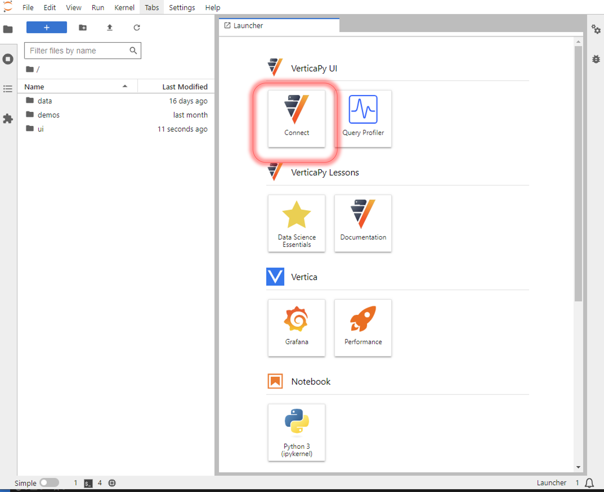

.. _verticapylab_gs.queryprofiler:

=============================
Query Profiler User Interface
=============================

If you already have a Vertica database running and just want to use the QueryProfiler tool 
to analyze your query, then you can do the minimalistic installaion of VerticaPyLab
to achieve this.

Prerequisites
=================

VerticaPyLab requires the following prerequisites:
- Docker Desktop version 
- (Windows only) Windows Subsystem for Linux  2 (WSL 2)

.. note:: To learn how to get the above please look at :ref:`verticapylab_gs`.

VerticaPyLab Quickstart
========================

The following steps import and launch VerticaPyLab:

1. Start a Linux distribution (WSL 2 for Windows).
2. Clone the VerticaPyLab repository:  
    .. code-block::

      git clone https://github.com/vertica/VerticaPyLab.git

3. Navigate to the cloned directory:  
      .. code-block::
            
        cd VerticaPyLab

4.  Start the JupyterLab container:
    .. code-block::
        
        make verticapylab-start

When you are done with using the container and want to shut it down, you can simple do:

.. code-block::
    
    make verticapylab-stop

Connect to Database
====================

Once the container launches click on the Connect button to navigate to the Connection page. 
Here enter your database credentials to connect to any Vertica database. 

Now you are ready to use the Query Profiler tool using the GUI.