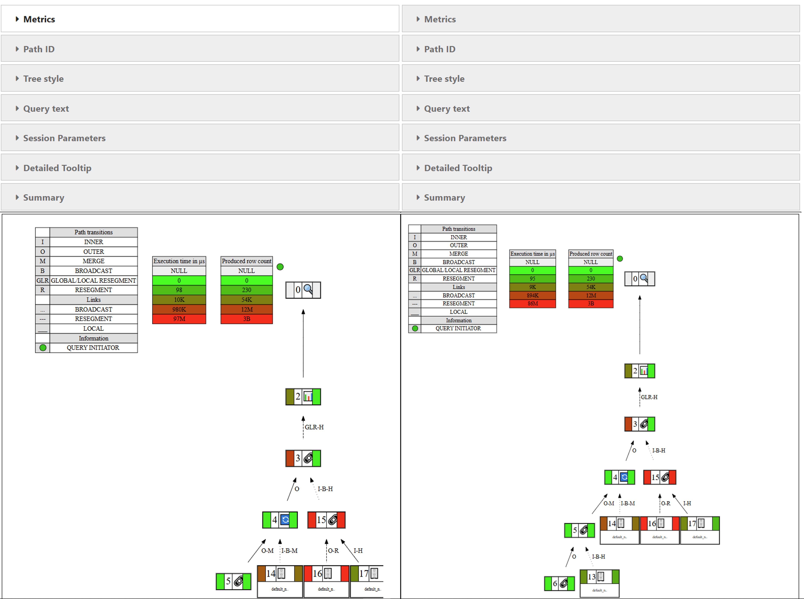

.. _whats_new_v1_1_0:

===============
Version 1.1.0
===============

This release encompasses all the features introduced in ``1.0.0`` (see :ref:`whats_new_v1_0_0`) and introduces additional functionalities along with more precise docstrings.

Options
--------

:py:func:`~verticapy.set_option` function has more options:
  - ``max_cellwidth``: Maximum width of any VerticaPy table's cell.
  - ``max_tableheight``: Maximum height of VerticaPy tables.
  - ``theme``: Theme used to display the VerticaPy objects (``light``, ``dark`` or ``sphinx``).
  - ``verbosity``: This will set the amount of information to display while executing VerticaPy functions.

.. note::
  
  There are four levels of ``verbosity``:

  - 0 (silent)
  - 1 (warning)
  - 2 (info)
  - 3 (debug)

_________

Machine Learning
-----------------

PLS Regression
+++++++++++++++

Partial Least Squares (PLS) regression has been added to VerticaPy. 

This integration will enhance VerticaPy's analytics capabilities, particularly benefiting Vertica customers who have expressed interest in utilizing PLS regression.

For more details, please look at 
:py:mod:`~verticapy.machine_learning.vertica.linear_model.PLSRegression`

Example use:

.. code-block:: python

  from verticapy.machine_learning.vertica import PLSRegression

  model = PLSRegression()
  model.fit(
    train_data,
    [
        "col1",
        "col2",
        "col3",
    ],
    "Y",
    test_data,
  )

.. note:: 

  All the ML models that were introduced in version ``1.0.x`` are also supported in version ``1.1.x`` .
___________

Performance
------------

:py:class:`~verticapy.performance.vertica.qprof.QueryProfiler` has been greatly supplemented in this release: 

QueryProfilerInterface
+++++++++++++++++++++++

Now we have added the functionality of a ``session_control_param`` parameter.
This allows users to enter the alter session SQL before profiling the queries.

QueryProfilerInterface
+++++++++++++++++++++++

- Added many more metrics for the profiled queries such as:

  - ``rows_filtered_sip``
  - ``container_rows_filtered_sip``
  - ``container_rows_pruned_sip``
  
  and more...

- There is a new tab which helps you select particular tooltips from any select path id.
- A new tab also highlights if there are any non-default ``SESSION PARAMETERS`` .
- Improved the efficiency of plotting the tree by chaching results.

QueryProfilerComparison
++++++++++++++++++++++++

- :py:class:`~verticapy.performance.vertica.qprof_interface.QueryProfilerComparison` class offers an extended set of functionalities, enabling the creation of complex trees with multiple metrics.
  
.. code-block:: python
    
  from verticapy.performance.vertica import QueryProfilerInterface

  qprof_interface_1 = QueryProfilerInterface(
    key_id = "key_1",
    target_schema = "schema_1",
  )

  qprof_interface_2 = QueryProfilerInterface(
    key_id = "key_2",
    target_schema = "schema_1",
  )

  from verticapy.performance.vertica import QueryProfilerComparison

  qprof_compare = QueryProfilerComparison(qprof_interface_1, qprof_interface_2)

  qprof_compare.get_qplan_tree()

.. raw:: html

   

___________

Deprecations
-------------

.. warning:: 

   Because of the re-structuring of VerticaPy, some previous imports will not work.

Please look at the latest doc for the up-to-date imports.

.. raw:: html

   
