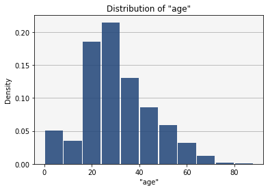
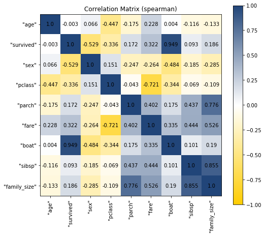
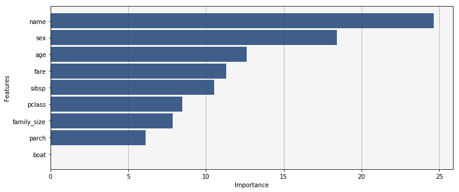

<p align="center">

</p>

# Vertica ML Python Example

This notebook is an example on how to use the Vetica ML Python Library. It will use the Titanic dataset to introduce you the library. The purpose is to predict the passengers survival.

## Initialization

Let's create a connection and load the dataset.


```python
from vertica_ml_python.utilities import vertica_cursor
from vertica_ml_python.learn.datasets import load_titanic
cur = vertica_cursor("VerticaDSN")
titanic = load_titanic(cur)
print(titanic)
```


<table style="border-collapse: collapse; border: 2px solid white"><tr style="{border: 1px solid white;}"><td style="border-bottom: 1px solid #DDD;font-size:1.02em;background-color:#214579;color:white"><b></b></td><td style="font-size:1.02em;background-color:#214579;color:white"><b>age</b></td><td style="font-size:1.02em;background-color:#214579;color:white"><b>body</b></td><td style="font-size:1.02em;background-color:#214579;color:white"><b>survived</b></td><td style="font-size:1.02em;background-color:#214579;color:white"><b>ticket</b></td><td style="font-size:1.02em;background-color:#214579;color:white"><b>home.dest</b></td><td style="font-size:1.02em;background-color:#214579;color:white"><b>cabin</b></td><td style="font-size:1.02em;background-color:#214579;color:white"><b>sex</b></td><td style="font-size:1.02em;background-color:#214579;color:white"><b>pclass</b></td><td style="font-size:1.02em;background-color:#214579;color:white"><b>embarked</b></td><td style="font-size:1.02em;background-color:#214579;color:white"><b>parch</b></td><td style="font-size:1.02em;background-color:#214579;color:white"><b>fare</b></td><td style="font-size:1.02em;background-color:#214579;color:white"><b>name</b></td><td style="font-size:1.02em;background-color:#214579;color:white"><b>boat</b></td><td style="font-size:1.02em;background-color:#214579;color:white"><b>sibsp</b></td></tr><tr style="{border: 1px solid white;}"><td style="border-bottom: 1px solid #DDD;font-size:1.02em;background-color:#214579;color:white"><b>0</b></td><td style="border: 1px solid white;">2.000</td><td style="border: 1px solid white;">None</td><td style="border: 1px solid white;">0</td><td style="border: 1px solid white;">113781</td><td style="border: 1px solid white;">Montreal, PQ / Chesterville, ON</td><td style="border: 1px solid white;">C22 C26</td><td style="border: 1px solid white;">female</td><td style="border: 1px solid white;">1</td><td style="border: 1px solid white;">S</td><td style="border: 1px solid white;">2</td><td style="border: 1px solid white;">151.55000</td><td style="border: 1px solid white;">Allison, Miss. Helen Loraine</td><td style="border: 1px solid white;">None</td><td style="border: 1px solid white;">1</td></tr><tr style="{border: 1px solid white;}"><td style="border-bottom: 1px solid #DDD;font-size:1.02em;background-color:#214579;color:white"><b>1</b></td><td style="border: 1px solid white;">30.000</td><td style="border: 1px solid white;">135</td><td style="border: 1px solid white;">0</td><td style="border: 1px solid white;">113781</td><td style="border: 1px solid white;">Montreal, PQ / Chesterville, ON</td><td style="border: 1px solid white;">C22 C26</td><td style="border: 1px solid white;">male</td><td style="border: 1px solid white;">1</td><td style="border: 1px solid white;">S</td><td style="border: 1px solid white;">2</td><td style="border: 1px solid white;">151.55000</td><td style="border: 1px solid white;">Allison, Mr. Hudson Joshua Creighton</td><td style="border: 1px solid white;">None</td><td style="border: 1px solid white;">1</td></tr><tr style="{border: 1px solid white;}"><td style="border-bottom: 1px solid #DDD;font-size:1.02em;background-color:#214579;color:white"><b>2</b></td><td style="border: 1px solid white;">25.000</td><td style="border: 1px solid white;">None</td><td style="border: 1px solid white;">0</td><td style="border: 1px solid white;">113781</td><td style="border: 1px solid white;">Montreal, PQ / Chesterville, ON</td><td style="border: 1px solid white;">C22 C26</td><td style="border: 1px solid white;">female</td><td style="border: 1px solid white;">1</td><td style="border: 1px solid white;">S</td><td style="border: 1px solid white;">2</td><td style="border: 1px solid white;">151.55000</td><td style="border: 1px solid white;">Allison, Mrs. Hudson J C (Bessie Waldo Daniels)</td><td style="border: 1px solid white;">None</td><td style="border: 1px solid white;">1</td></tr><tr style="{border: 1px solid white;}"><td style="border-bottom: 1px solid #DDD;font-size:1.02em;background-color:#214579;color:white"><b>3</b></td><td style="border: 1px solid white;">39.000</td><td style="border: 1px solid white;">None</td><td style="border: 1px solid white;">0</td><td style="border: 1px solid white;">112050</td><td style="border: 1px solid white;">Belfast, NI</td><td style="border: 1px solid white;">A36</td><td style="border: 1px solid white;">male</td><td style="border: 1px solid white;">1</td><td style="border: 1px solid white;">S</td><td style="border: 1px solid white;">0</td><td style="border: 1px solid white;">0.00000</td><td style="border: 1px solid white;">Andrews, Mr. Thomas Jr</td><td style="border: 1px solid white;">None</td><td style="border: 1px solid white;">0</td></tr><tr style="{border: 1px solid white;}"><td style="border-bottom: 1px solid #DDD;font-size:1.02em;background-color:#214579;color:white"><b>4</b></td><td style="border: 1px solid white;">71.000</td><td style="border: 1px solid white;">22</td><td style="border: 1px solid white;">0</td><td style="border: 1px solid white;">PC 17609</td><td style="border: 1px solid white;">Montevideo, Uruguay</td><td style="border: 1px solid white;">None</td><td style="border: 1px solid white;">male</td><td style="border: 1px solid white;">1</td><td style="border: 1px solid white;">C</td><td style="border: 1px solid white;">0</td><td style="border: 1px solid white;">49.50420</td><td style="border: 1px solid white;">Artagaveytia, Mr. Ramon</td><td style="border: 1px solid white;">None</td><td style="border: 1px solid white;">0</td></tr><tr><td style="border-top: 1px solid white;background-color:#214579;color:white"></td><td style="border: 1px solid white;">...</td><td style="border: 1px solid white;">...</td><td style="border: 1px solid white;">...</td><td style="border: 1px solid white;">...</td><td style="border: 1px solid white;">...</td><td style="border: 1px solid white;">...</td><td style="border: 1px solid white;">...</td><td style="border: 1px solid white;">...</td><td style="border: 1px solid white;">...</td><td style="border: 1px solid white;">...</td><td style="border: 1px solid white;">...</td><td style="border: 1px solid white;">...</td><td style="border: 1px solid white;">...</td><td style="border: 1px solid white;">...</td></tr></table>


    <object>  Name: titanic, Number of rows: 1234, Number of columns: 14


## Data Exploration and Preparation

Let's explore the data by displaying descriptive statistics of all the columns.


```python
titanic.describe(method = "categorical")
```


<table style="border-collapse: collapse; border: 2px solid white"><tr style="{border: 1px solid white;}"><td style="border-bottom: 1px solid #DDD;font-size:1.02em;background-color:#214579;color:white"><b></b></td><td style="font-size:1.02em;background-color:#214579;color:white"><b>dtype</b></td><td style="font-size:1.02em;background-color:#214579;color:white"><b>unique</b></td><td style="font-size:1.02em;background-color:#214579;color:white"><b>count</b></td><td style="font-size:1.02em;background-color:#214579;color:white"><b>top</b></td><td style="font-size:1.02em;background-color:#214579;color:white"><b>top_percent</b></td></tr><tr style="{border: 1px solid white;}"><td style="border-bottom: 1px solid #DDD;font-size:1.02em;background-color:#214579;color:white"><b>"age"</b></td><td style="border: 1px solid white;">numeric(6,3)</td><td style="border: 1px solid white;">96</td><td style="border: 1px solid white;">997</td><td style="border: 1px solid white;">24.000</td><td style="border: 1px solid white;">4.413</td></tr><tr style="{border: 1px solid white;}"><td style="border-bottom: 1px solid #DDD;font-size:1.02em;background-color:#214579;color:white"><b>"body"</b></td><td style="border: 1px solid white;">int</td><td style="border: 1px solid white;">118</td><td style="border: 1px solid white;">118</td><td style="border: 1px solid white;">1</td><td style="border: 1px solid white;">0.847</td></tr><tr style="{border: 1px solid white;}"><td style="border-bottom: 1px solid #DDD;font-size:1.02em;background-color:#214579;color:white"><b>"survived"</b></td><td style="border: 1px solid white;">int</td><td style="border: 1px solid white;">2</td><td style="border: 1px solid white;">1234</td><td style="border: 1px solid white;">0</td><td style="border: 1px solid white;">63.533</td></tr><tr style="{border: 1px solid white;}"><td style="border-bottom: 1px solid #DDD;font-size:1.02em;background-color:#214579;color:white"><b>"ticket"</b></td><td style="border: 1px solid white;">varchar(36)</td><td style="border: 1px solid white;">887</td><td style="border: 1px solid white;">1234</td><td style="border: 1px solid white;">CA. 2343</td><td style="border: 1px solid white;">0.81</td></tr><tr style="{border: 1px solid white;}"><td style="border-bottom: 1px solid #DDD;font-size:1.02em;background-color:#214579;color:white"><b>"home.dest"</b></td><td style="border: 1px solid white;">varchar(100)</td><td style="border: 1px solid white;">359</td><td style="border: 1px solid white;">706</td><td style="border: 1px solid white;">New York, NY</td><td style="border: 1px solid white;">8.782</td></tr><tr style="{border: 1px solid white;}"><td style="border-bottom: 1px solid #DDD;font-size:1.02em;background-color:#214579;color:white"><b>"cabin"</b></td><td style="border: 1px solid white;">varchar(30)</td><td style="border: 1px solid white;">182</td><td style="border: 1px solid white;">286</td><td style="border: 1px solid white;">C23 C25 C27</td><td style="border: 1px solid white;">2.098</td></tr><tr style="{border: 1px solid white;}"><td style="border-bottom: 1px solid #DDD;font-size:1.02em;background-color:#214579;color:white"><b>"sex"</b></td><td style="border: 1px solid white;">varchar(20)</td><td style="border: 1px solid white;">2</td><td style="border: 1px solid white;">1234</td><td style="border: 1px solid white;">male</td><td style="border: 1px solid white;">65.964</td></tr><tr style="{border: 1px solid white;}"><td style="border-bottom: 1px solid #DDD;font-size:1.02em;background-color:#214579;color:white"><b>"pclass"</b></td><td style="border: 1px solid white;">int</td><td style="border: 1px solid white;">3</td><td style="border: 1px solid white;">1234</td><td style="border: 1px solid white;">3</td><td style="border: 1px solid white;">53.728</td></tr><tr style="{border: 1px solid white;}"><td style="border-bottom: 1px solid #DDD;font-size:1.02em;background-color:#214579;color:white"><b>"embarked"</b></td><td style="border: 1px solid white;">varchar(20)</td><td style="border: 1px solid white;">3</td><td style="border: 1px solid white;">1232</td><td style="border: 1px solid white;">S</td><td style="border: 1px solid white;">70.86</td></tr><tr style="{border: 1px solid white;}"><td style="border-bottom: 1px solid #DDD;font-size:1.02em;background-color:#214579;color:white"><b>"parch"</b></td><td style="border: 1px solid white;">int</td><td style="border: 1px solid white;">8</td><td style="border: 1px solid white;">1234</td><td style="border: 1px solid white;">0</td><td style="border: 1px solid white;">76.904</td></tr><tr style="{border: 1px solid white;}"><td style="border-bottom: 1px solid #DDD;font-size:1.02em;background-color:#214579;color:white"><b>"fare"</b></td><td style="border: 1px solid white;">numeric(10,5)</td><td style="border: 1px solid white;">277</td><td style="border: 1px solid white;">1233</td><td style="border: 1px solid white;">8.05000</td><td style="border: 1px solid white;">4.704</td></tr><tr style="{border: 1px solid white;}"><td style="border-bottom: 1px solid #DDD;font-size:1.02em;background-color:#214579;color:white"><b>"name"</b></td><td style="border: 1px solid white;">varchar(164)</td><td style="border: 1px solid white;">1232</td><td style="border: 1px solid white;">1234</td><td style="border: 1px solid white;">Connolly, Miss. Kate</td><td style="border: 1px solid white;">0.162</td></tr><tr style="{border: 1px solid white;}"><td style="border-bottom: 1px solid #DDD;font-size:1.02em;background-color:#214579;color:white"><b>"boat"</b></td><td style="border: 1px solid white;">varchar(100)</td><td style="border: 1px solid white;">26</td><td style="border: 1px solid white;">439</td><td style="border: 1px solid white;">13</td><td style="border: 1px solid white;">8.428</td></tr><tr style="{border: 1px solid white;}"><td style="border-bottom: 1px solid #DDD;font-size:1.02em;background-color:#214579;color:white"><b>"sibsp"</b></td><td style="border: 1px solid white;">int</td><td style="border: 1px solid white;">7</td><td style="border: 1px solid white;">1234</td><td style="border: 1px solid white;">0</td><td style="border: 1px solid white;">67.747</td></tr></table>


    <object>


The column "body" is useless as it is only the ID of the passengers. Besides, it has too much missing values. 
The column "home.dest" will not influence the survival as it is from where the passengers embarked and where they are going to. We can have the same conclusion with "embarked" which is the port of embarkation. The column 'ticket' which is the ticket ID will also not give us information on the survival. Let's analyze the columns "name" and "cabin to see if we can extract some information. Let's first look at the passengers 'name'.


```python
from vertica_ml_python.learn.preprocessing import CountVectorizer
CountVectorizer("name_voc", cur).fit("titanic", ["Name"]).to_vdf()
```


<table style="border-collapse: collapse; border: 2px solid white"><tr style="{border: 1px solid white;}"><td style="border-bottom: 1px solid #DDD;font-size:1.02em;background-color:#214579;color:white"><b></b></td><td style="font-size:1.02em;background-color:#214579;color:white"><b>token</b></td><td style="font-size:1.02em;background-color:#214579;color:white"><b>df</b></td><td style="font-size:1.02em;background-color:#214579;color:white"><b>cnt</b></td><td style="font-size:1.02em;background-color:#214579;color:white"><b>rnk</b></td></tr><tr style="{border: 1px solid white;}"><td style="border-bottom: 1px solid #DDD;font-size:1.02em;background-color:#214579;color:white"><b>0</b></td><td style="border: 1px solid white;">mr</td><td style="border: 1px solid white;">0.148163100524828421</td><td style="border: 1px solid white;">734</td><td style="border: 1px solid white;">1</td></tr><tr style="{border: 1px solid white;}"><td style="border-bottom: 1px solid #DDD;font-size:1.02em;background-color:#214579;color:white"><b>1</b></td><td style="border: 1px solid white;">miss</td><td style="border: 1px solid white;">0.046023415421881308</td><td style="border: 1px solid white;">228</td><td style="border: 1px solid white;">2</td></tr><tr style="{border: 1px solid white;}"><td style="border-bottom: 1px solid #DDD;font-size:1.02em;background-color:#214579;color:white"><b>2</b></td><td style="border: 1px solid white;">mrs</td><td style="border: 1px solid white;">0.037343560758982640</td><td style="border: 1px solid white;">185</td><td style="border: 1px solid white;">3</td></tr><tr style="{border: 1px solid white;}"><td style="border-bottom: 1px solid #DDD;font-size:1.02em;background-color:#214579;color:white"><b>3</b></td><td style="border: 1px solid white;">william</td><td style="border: 1px solid white;">0.016148566814695196</td><td style="border: 1px solid white;">80</td><td style="border: 1px solid white;">4</td></tr><tr style="{border: 1px solid white;}"><td style="border-bottom: 1px solid #DDD;font-size:1.02em;background-color:#214579;color:white"><b>4</b></td><td style="border: 1px solid white;">john</td><td style="border: 1px solid white;">0.013726281792490916</td><td style="border: 1px solid white;">68</td><td style="border: 1px solid white;">5</td></tr><tr><td style="border-top: 1px solid white;background-color:#214579;color:white"></td><td style="border: 1px solid white;">...</td><td style="border: 1px solid white;">...</td><td style="border: 1px solid white;">...</td><td style="border: 1px solid white;">...</td></tr></table>


    <object>  Name: name_voc, Number of rows: 1841, Number of columns: 4


It is possible to extract from the 'name' the title of the passengers. Let's now look at the 'cabins'.


```python
from vertica_ml_python.learn.preprocessing import CountVectorizer
CountVectorizer("cabin_voc", cur).fit("titanic", ["cabin"]).to_vdf()
```


<table style="border-collapse: collapse; border: 2px solid white"><tr style="{border: 1px solid white;}"><td style="border-bottom: 1px solid #DDD;font-size:1.02em;background-color:#214579;color:white"><b></b></td><td style="font-size:1.02em;background-color:#214579;color:white"><b>token</b></td><td style="font-size:1.02em;background-color:#214579;color:white"><b>df</b></td><td style="font-size:1.02em;background-color:#214579;color:white"><b>cnt</b></td><td style="font-size:1.02em;background-color:#214579;color:white"><b>rnk</b></td></tr><tr style="{border: 1px solid white;}"><td style="border-bottom: 1px solid #DDD;font-size:1.02em;background-color:#214579;color:white"><b>0</b></td><td style="border: 1px solid white;">None</td><td style="border: 1px solid white;">0.733746130030959752</td><td style="border: 1px solid white;">948</td><td style="border: 1px solid white;">1</td></tr><tr style="{border: 1px solid white;}"><td style="border-bottom: 1px solid #DDD;font-size:1.02em;background-color:#214579;color:white"><b>1</b></td><td style="border: 1px solid white;">f</td><td style="border: 1px solid white;">0.006191950464396285</td><td style="border: 1px solid white;">8</td><td style="border: 1px solid white;">2</td></tr><tr style="{border: 1px solid white;}"><td style="border-bottom: 1px solid #DDD;font-size:1.02em;background-color:#214579;color:white"><b>2</b></td><td style="border: 1px solid white;">c27</td><td style="border: 1px solid white;">0.004643962848297214</td><td style="border: 1px solid white;">6</td><td style="border: 1px solid white;">3</td></tr><tr style="{border: 1px solid white;}"><td style="border-bottom: 1px solid #DDD;font-size:1.02em;background-color:#214579;color:white"><b>3</b></td><td style="border: 1px solid white;">c25</td><td style="border: 1px solid white;">0.004643962848297214</td><td style="border: 1px solid white;">6</td><td style="border: 1px solid white;">3</td></tr><tr style="{border: 1px solid white;}"><td style="border-bottom: 1px solid #DDD;font-size:1.02em;background-color:#214579;color:white"><b>4</b></td><td style="border: 1px solid white;">c23</td><td style="border: 1px solid white;">0.004643962848297214</td><td style="border: 1px solid white;">6</td><td style="border: 1px solid white;">3</td></tr><tr><td style="border-top: 1px solid white;background-color:#214579;color:white"></td><td style="border: 1px solid white;">...</td><td style="border: 1px solid white;">...</td><td style="border: 1px solid white;">...</td><td style="border: 1px solid white;">...</td></tr></table>


    <object>  Name: cabin_voc, Number of rows: 199, Number of columns: 4


We can extract the cabin position (the letter which reprent the position in the boat) and look at the number of occurences.


```python
CountVectorizer("cabin_voc", cur).fit("titanic", ["cabin"]).to_vdf()["token"].str_slice(1, 1).groupby(
                columns = ["token"], expr = ["SUM(cnt)"]).head(30)
```


<table style="border-collapse: collapse; border: 2px solid white"><tr style="{border: 1px solid white;}"><td style="border-bottom: 1px solid #DDD;font-size:1.02em;background-color:#214579;color:white"><b></b></td><td style="font-size:1.02em;background-color:#214579;color:white"><b>token</b></td><td style="font-size:1.02em;background-color:#214579;color:white"><b>SUM</b></td></tr><tr style="{border: 1px solid white;}"><td style="border-bottom: 1px solid #DDD;font-size:1.02em;background-color:#214579;color:white"><b>0</b></td><td style="border: 1px solid white;">None</td><td style="border: 1px solid white;">948</td></tr><tr style="{border: 1px solid white;}"><td style="border-bottom: 1px solid #DDD;font-size:1.02em;background-color:#214579;color:white"><b>1</b></td><td style="border: 1px solid white;">a</td><td style="border: 1px solid white;">20</td></tr><tr style="{border: 1px solid white;}"><td style="border-bottom: 1px solid #DDD;font-size:1.02em;background-color:#214579;color:white"><b>2</b></td><td style="border: 1px solid white;">b</td><td style="border: 1px solid white;">92</td></tr><tr style="{border: 1px solid white;}"><td style="border-bottom: 1px solid #DDD;font-size:1.02em;background-color:#214579;color:white"><b>3</b></td><td style="border: 1px solid white;">c</td><td style="border: 1px solid white;">113</td></tr><tr style="{border: 1px solid white;}"><td style="border-bottom: 1px solid #DDD;font-size:1.02em;background-color:#214579;color:white"><b>4</b></td><td style="border: 1px solid white;">d</td><td style="border: 1px solid white;">47</td></tr><tr style="{border: 1px solid white;}"><td style="border-bottom: 1px solid #DDD;font-size:1.02em;background-color:#214579;color:white"><b>5</b></td><td style="border: 1px solid white;">e</td><td style="border: 1px solid white;">43</td></tr><tr style="{border: 1px solid white;}"><td style="border-bottom: 1px solid #DDD;font-size:1.02em;background-color:#214579;color:white"><b>6</b></td><td style="border: 1px solid white;">f</td><td style="border: 1px solid white;">19</td></tr><tr style="{border: 1px solid white;}"><td style="border-bottom: 1px solid #DDD;font-size:1.02em;background-color:#214579;color:white"><b>7</b></td><td style="border: 1px solid white;">g</td><td style="border: 1px solid white;">9</td></tr><tr style="{border: 1px solid white;}"><td style="border-bottom: 1px solid #DDD;font-size:1.02em;background-color:#214579;color:white"><b>8</b></td><td style="border: 1px solid white;">t</td><td style="border: 1px solid white;">1</td></tr></table>


    <object>  Name: cabin_voc, Number of rows: 9, Number of columns: 2


The NULL values possibly represent passengers having no cabin (MNAR = Missing values not at random). The same for the column "boat" NULL values which represent passengers who bought the 'lifeboat' option. We can drop the useless columns and encode the others.


```python
titanic.drop(["body", "home.dest", "embarked", "ticket"])
```

    vColumn '"body"' deleted from the vDataframe.
    vColumn '"home.dest"' deleted from the vDataframe.
    vColumn '"embarked"' deleted from the vDataframe.
    vColumn '"ticket"' deleted from the vDataframe.


<table style="border-collapse: collapse; border: 2px solid white"><tr style="{border: 1px solid white;}"><td style="border-bottom: 1px solid #DDD;font-size:1.02em;background-color:#214579;color:white"><b></b></td><td style="font-size:1.02em;background-color:#214579;color:white"><b>age</b></td><td style="font-size:1.02em;background-color:#214579;color:white"><b>survived</b></td><td style="font-size:1.02em;background-color:#214579;color:white"><b>cabin</b></td><td style="font-size:1.02em;background-color:#214579;color:white"><b>sex</b></td><td style="font-size:1.02em;background-color:#214579;color:white"><b>pclass</b></td><td style="font-size:1.02em;background-color:#214579;color:white"><b>parch</b></td><td style="font-size:1.02em;background-color:#214579;color:white"><b>fare</b></td><td style="font-size:1.02em;background-color:#214579;color:white"><b>name</b></td><td style="font-size:1.02em;background-color:#214579;color:white"><b>boat</b></td><td style="font-size:1.02em;background-color:#214579;color:white"><b>sibsp</b></td></tr><tr style="{border: 1px solid white;}"><td style="border-bottom: 1px solid #DDD;font-size:1.02em;background-color:#214579;color:white"><b>0</b></td><td style="border: 1px solid white;">2.000</td><td style="border: 1px solid white;">0</td><td style="border: 1px solid white;">C22 C26</td><td style="border: 1px solid white;">female</td><td style="border: 1px solid white;">1</td><td style="border: 1px solid white;">2</td><td style="border: 1px solid white;">151.55000</td><td style="border: 1px solid white;">Allison, Miss. Helen Loraine</td><td style="border: 1px solid white;">None</td><td style="border: 1px solid white;">1</td></tr><tr style="{border: 1px solid white;}"><td style="border-bottom: 1px solid #DDD;font-size:1.02em;background-color:#214579;color:white"><b>1</b></td><td style="border: 1px solid white;">30.000</td><td style="border: 1px solid white;">0</td><td style="border: 1px solid white;">C22 C26</td><td style="border: 1px solid white;">male</td><td style="border: 1px solid white;">1</td><td style="border: 1px solid white;">2</td><td style="border: 1px solid white;">151.55000</td><td style="border: 1px solid white;">Allison, Mr. Hudson Joshua Creighton</td><td style="border: 1px solid white;">None</td><td style="border: 1px solid white;">1</td></tr><tr style="{border: 1px solid white;}"><td style="border-bottom: 1px solid #DDD;font-size:1.02em;background-color:#214579;color:white"><b>2</b></td><td style="border: 1px solid white;">25.000</td><td style="border: 1px solid white;">0</td><td style="border: 1px solid white;">C22 C26</td><td style="border: 1px solid white;">female</td><td style="border: 1px solid white;">1</td><td style="border: 1px solid white;">2</td><td style="border: 1px solid white;">151.55000</td><td style="border: 1px solid white;">Allison, Mrs. Hudson J C (Bessie Waldo Daniels)</td><td style="border: 1px solid white;">None</td><td style="border: 1px solid white;">1</td></tr><tr style="{border: 1px solid white;}"><td style="border-bottom: 1px solid #DDD;font-size:1.02em;background-color:#214579;color:white"><b>3</b></td><td style="border: 1px solid white;">39.000</td><td style="border: 1px solid white;">0</td><td style="border: 1px solid white;">A36</td><td style="border: 1px solid white;">male</td><td style="border: 1px solid white;">1</td><td style="border: 1px solid white;">0</td><td style="border: 1px solid white;">0.00000</td><td style="border: 1px solid white;">Andrews, Mr. Thomas Jr</td><td style="border: 1px solid white;">None</td><td style="border: 1px solid white;">0</td></tr><tr style="{border: 1px solid white;}"><td style="border-bottom: 1px solid #DDD;font-size:1.02em;background-color:#214579;color:white"><b>4</b></td><td style="border: 1px solid white;">71.000</td><td style="border: 1px solid white;">0</td><td style="border: 1px solid white;">None</td><td style="border: 1px solid white;">male</td><td style="border: 1px solid white;">1</td><td style="border: 1px solid white;">0</td><td style="border: 1px solid white;">49.50420</td><td style="border: 1px solid white;">Artagaveytia, Mr. Ramon</td><td style="border: 1px solid white;">None</td><td style="border: 1px solid white;">0</td></tr><tr><td style="border-top: 1px solid white;background-color:#214579;color:white"></td><td style="border: 1px solid white;">...</td><td style="border: 1px solid white;">...</td><td style="border: 1px solid white;">...</td><td style="border: 1px solid white;">...</td><td style="border: 1px solid white;">...</td><td style="border: 1px solid white;">...</td><td style="border: 1px solid white;">...</td><td style="border: 1px solid white;">...</td><td style="border: 1px solid white;">...</td><td style="border: 1px solid white;">...</td></tr></table>


    <object>  Name: titanic, Number of rows: 1234, Number of columns: 10


```python
titanic["cabin"].str_slice(1, 1)["name"].str_extract(' ([A-Za-z]+)\.')["boat"].fillna(
        method = "0ifnull")["cabin"].fillna("No Cabin")
```

    795 elements were filled
    948 elements were filled


<table style="border-collapse: collapse; border: 2px solid white"><tr style="{border: 1px solid white;}"><td style="border-bottom: 1px solid #DDD;font-size:1.02em;background-color:#214579;color:white"><b></b></td><td style="font-size:1.02em;background-color:#214579;color:white"><b>age</b></td><td style="font-size:1.02em;background-color:#214579;color:white"><b>survived</b></td><td style="font-size:1.02em;background-color:#214579;color:white"><b>cabin</b></td><td style="font-size:1.02em;background-color:#214579;color:white"><b>sex</b></td><td style="font-size:1.02em;background-color:#214579;color:white"><b>pclass</b></td><td style="font-size:1.02em;background-color:#214579;color:white"><b>parch</b></td><td style="font-size:1.02em;background-color:#214579;color:white"><b>fare</b></td><td style="font-size:1.02em;background-color:#214579;color:white"><b>name</b></td><td style="font-size:1.02em;background-color:#214579;color:white"><b>boat</b></td><td style="font-size:1.02em;background-color:#214579;color:white"><b>sibsp</b></td></tr><tr style="{border: 1px solid white;}"><td style="border-bottom: 1px solid #DDD;font-size:1.02em;background-color:#214579;color:white"><b>0</b></td><td style="border: 1px solid white;">2.000</td><td style="border: 1px solid white;">0</td><td style="border: 1px solid white;">C</td><td style="border: 1px solid white;">female</td><td style="border: 1px solid white;">1</td><td style="border: 1px solid white;">2</td><td style="border: 1px solid white;">151.55000</td><td style="border: 1px solid white;"> Miss.</td><td style="border: 1px solid white;">0</td><td style="border: 1px solid white;">1</td></tr><tr style="{border: 1px solid white;}"><td style="border-bottom: 1px solid #DDD;font-size:1.02em;background-color:#214579;color:white"><b>1</b></td><td style="border: 1px solid white;">30.000</td><td style="border: 1px solid white;">0</td><td style="border: 1px solid white;">C</td><td style="border: 1px solid white;">male</td><td style="border: 1px solid white;">1</td><td style="border: 1px solid white;">2</td><td style="border: 1px solid white;">151.55000</td><td style="border: 1px solid white;"> Mr.</td><td style="border: 1px solid white;">0</td><td style="border: 1px solid white;">1</td></tr><tr style="{border: 1px solid white;}"><td style="border-bottom: 1px solid #DDD;font-size:1.02em;background-color:#214579;color:white"><b>2</b></td><td style="border: 1px solid white;">25.000</td><td style="border: 1px solid white;">0</td><td style="border: 1px solid white;">C</td><td style="border: 1px solid white;">female</td><td style="border: 1px solid white;">1</td><td style="border: 1px solid white;">2</td><td style="border: 1px solid white;">151.55000</td><td style="border: 1px solid white;"> Mrs.</td><td style="border: 1px solid white;">0</td><td style="border: 1px solid white;">1</td></tr><tr style="{border: 1px solid white;}"><td style="border-bottom: 1px solid #DDD;font-size:1.02em;background-color:#214579;color:white"><b>3</b></td><td style="border: 1px solid white;">39.000</td><td style="border: 1px solid white;">0</td><td style="border: 1px solid white;">A</td><td style="border: 1px solid white;">male</td><td style="border: 1px solid white;">1</td><td style="border: 1px solid white;">0</td><td style="border: 1px solid white;">0.00000</td><td style="border: 1px solid white;"> Mr.</td><td style="border: 1px solid white;">0</td><td style="border: 1px solid white;">0</td></tr><tr style="{border: 1px solid white;}"><td style="border-bottom: 1px solid #DDD;font-size:1.02em;background-color:#214579;color:white"><b>4</b></td><td style="border: 1px solid white;">71.000</td><td style="border: 1px solid white;">0</td><td style="border: 1px solid white;">No Cabin</td><td style="border: 1px solid white;">male</td><td style="border: 1px solid white;">1</td><td style="border: 1px solid white;">0</td><td style="border: 1px solid white;">49.50420</td><td style="border: 1px solid white;"> Mr.</td><td style="border: 1px solid white;">0</td><td style="border: 1px solid white;">0</td></tr><tr><td style="border-top: 1px solid white;background-color:#214579;color:white"></td><td style="border: 1px solid white;">...</td><td style="border: 1px solid white;">...</td><td style="border: 1px solid white;">...</td><td style="border: 1px solid white;">...</td><td style="border: 1px solid white;">...</td><td style="border: 1px solid white;">...</td><td style="border: 1px solid white;">...</td><td style="border: 1px solid white;">...</td><td style="border: 1px solid white;">...</td><td style="border: 1px solid white;">...</td></tr></table>


    <object>  Name: titanic, Number of rows: 1234, Number of columns: 10


We can notice that our assumptions about the cabin is wrong as passengers in first class must have a cabin. This column has missing values at random (MAR) and too much. We can drop it.


```python
titanic["cabin"].drop()
```

    vColumn '"cabin"' deleted from the vDataframe.


<table style="border-collapse: collapse; border: 2px solid white"><tr style="{border: 1px solid white;}"><td style="border-bottom: 1px solid #DDD;font-size:1.02em;background-color:#214579;color:white"><b></b></td><td style="font-size:1.02em;background-color:#214579;color:white"><b>age</b></td><td style="font-size:1.02em;background-color:#214579;color:white"><b>survived</b></td><td style="font-size:1.02em;background-color:#214579;color:white"><b>sex</b></td><td style="font-size:1.02em;background-color:#214579;color:white"><b>pclass</b></td><td style="font-size:1.02em;background-color:#214579;color:white"><b>parch</b></td><td style="font-size:1.02em;background-color:#214579;color:white"><b>fare</b></td><td style="font-size:1.02em;background-color:#214579;color:white"><b>name</b></td><td style="font-size:1.02em;background-color:#214579;color:white"><b>boat</b></td><td style="font-size:1.02em;background-color:#214579;color:white"><b>sibsp</b></td></tr><tr style="{border: 1px solid white;}"><td style="border-bottom: 1px solid #DDD;font-size:1.02em;background-color:#214579;color:white"><b>0</b></td><td style="border: 1px solid white;">2.000</td><td style="border: 1px solid white;">0</td><td style="border: 1px solid white;">female</td><td style="border: 1px solid white;">1</td><td style="border: 1px solid white;">2</td><td style="border: 1px solid white;">151.55000</td><td style="border: 1px solid white;"> Miss.</td><td style="border: 1px solid white;">0</td><td style="border: 1px solid white;">1</td></tr><tr style="{border: 1px solid white;}"><td style="border-bottom: 1px solid #DDD;font-size:1.02em;background-color:#214579;color:white"><b>1</b></td><td style="border: 1px solid white;">30.000</td><td style="border: 1px solid white;">0</td><td style="border: 1px solid white;">male</td><td style="border: 1px solid white;">1</td><td style="border: 1px solid white;">2</td><td style="border: 1px solid white;">151.55000</td><td style="border: 1px solid white;"> Mr.</td><td style="border: 1px solid white;">0</td><td style="border: 1px solid white;">1</td></tr><tr style="{border: 1px solid white;}"><td style="border-bottom: 1px solid #DDD;font-size:1.02em;background-color:#214579;color:white"><b>2</b></td><td style="border: 1px solid white;">25.000</td><td style="border: 1px solid white;">0</td><td style="border: 1px solid white;">female</td><td style="border: 1px solid white;">1</td><td style="border: 1px solid white;">2</td><td style="border: 1px solid white;">151.55000</td><td style="border: 1px solid white;"> Mrs.</td><td style="border: 1px solid white;">0</td><td style="border: 1px solid white;">1</td></tr><tr style="{border: 1px solid white;}"><td style="border-bottom: 1px solid #DDD;font-size:1.02em;background-color:#214579;color:white"><b>3</b></td><td style="border: 1px solid white;">39.000</td><td style="border: 1px solid white;">0</td><td style="border: 1px solid white;">male</td><td style="border: 1px solid white;">1</td><td style="border: 1px solid white;">0</td><td style="border: 1px solid white;">0.00000</td><td style="border: 1px solid white;"> Mr.</td><td style="border: 1px solid white;">0</td><td style="border: 1px solid white;">0</td></tr><tr style="{border: 1px solid white;}"><td style="border-bottom: 1px solid #DDD;font-size:1.02em;background-color:#214579;color:white"><b>4</b></td><td style="border: 1px solid white;">71.000</td><td style="border: 1px solid white;">0</td><td style="border: 1px solid white;">male</td><td style="border: 1px solid white;">1</td><td style="border: 1px solid white;">0</td><td style="border: 1px solid white;">49.50420</td><td style="border: 1px solid white;"> Mr.</td><td style="border: 1px solid white;">0</td><td style="border: 1px solid white;">0</td></tr><tr><td style="border-top: 1px solid white;background-color:#214579;color:white"></td><td style="border: 1px solid white;">...</td><td style="border: 1px solid white;">...</td><td style="border: 1px solid white;">...</td><td style="border: 1px solid white;">...</td><td style="border: 1px solid white;">...</td><td style="border: 1px solid white;">...</td><td style="border: 1px solid white;">...</td><td style="border: 1px solid white;">...</td><td style="border: 1px solid white;">...</td></tr></table>


    <object>  Name: titanic, Number of rows: 1234, Number of columns: 9


Let's look at descriptive statistics of the entire Virtual Dataframe.


```python
titanic.statistics()
```


<table style="border-collapse: collapse; border: 2px solid white"><tr style="{border: 1px solid white;}"><td style="border-bottom: 1px solid #DDD;font-size:1.02em;background-color:#214579;color:white"><b></b></td><td style="font-size:1.02em;background-color:#214579;color:white"><b>"age"</b></td><td style="font-size:1.02em;background-color:#214579;color:white"><b>"survived"</b></td><td style="font-size:1.02em;background-color:#214579;color:white"><b>"pclass"</b></td><td style="font-size:1.02em;background-color:#214579;color:white"><b>"parch"</b></td><td style="font-size:1.02em;background-color:#214579;color:white"><b>"fare"</b></td><td style="font-size:1.02em;background-color:#214579;color:white"><b>"boat"</b></td><td style="font-size:1.02em;background-color:#214579;color:white"><b>"sibsp"</b></td></tr><tr style="{border: 1px solid white;}"><td style="border-bottom: 1px solid #DDD;font-size:1.02em;background-color:#214579;color:white"><b>count</b></td><td style="border: 1px solid white;">997.0</td><td style="border: 1px solid white;">1234.0</td><td style="border: 1px solid white;">1234.0</td><td style="border: 1px solid white;">1234.0</td><td style="border: 1px solid white;">1233.0</td><td style="border: 1px solid white;">1234.0</td><td style="border: 1px solid white;">1234.0</td></tr><tr style="{border: 1px solid white;}"><td style="border-bottom: 1px solid #DDD;font-size:1.02em;background-color:#214579;color:white"><b>avg</b></td><td style="border: 1px solid white;">30.1524573721163</td><td style="border: 1px solid white;">0.364667747163695</td><td style="border: 1px solid white;">2.28444084278768</td><td style="border: 1px solid white;">0.378444084278768</td><td style="border: 1px solid white;">33.9637936739659</td><td style="border: 1px solid white;">0.355753646677472</td><td style="border: 1px solid white;">0.504051863857374</td></tr><tr style="{border: 1px solid white;}"><td style="border-bottom: 1px solid #DDD;font-size:1.02em;background-color:#214579;color:white"><b>stddev</b></td><td style="border: 1px solid white;">14.4353046299159</td><td style="border: 1px solid white;">0.481532018641288</td><td style="border: 1px solid white;">0.842485636190292</td><td style="border: 1px solid white;">0.868604707790392</td><td style="border: 1px solid white;">52.6460729831293</td><td style="border: 1px solid white;">0.478935143777661</td><td style="border: 1px solid white;">1.04111727241629</td></tr><tr style="{border: 1px solid white;}"><td style="border-bottom: 1px solid #DDD;font-size:1.02em;background-color:#214579;color:white"><b>min</b></td><td style="border: 1px solid white;">0.33</td><td style="border: 1px solid white;">0.0</td><td style="border: 1px solid white;">1.0</td><td style="border: 1px solid white;">0.0</td><td style="border: 1px solid white;">0.0</td><td style="border: 1px solid white;">0.0</td><td style="border: 1px solid white;">0.0</td></tr><tr style="{border: 1px solid white;}"><td style="border-bottom: 1px solid #DDD;font-size:1.02em;background-color:#214579;color:white"><b>10%</b></td><td style="border: 1px solid white;">14.5</td><td style="border: 1px solid white;">0.0</td><td style="border: 1px solid white;">1.0</td><td style="border: 1px solid white;">0.0</td><td style="border: 1px solid white;">7.5892</td><td style="border: 1px solid white;">0.0</td><td style="border: 1px solid white;">0.0</td></tr><tr style="{border: 1px solid white;}"><td style="border-bottom: 1px solid #DDD;font-size:1.02em;background-color:#214579;color:white"><b>25%</b></td><td style="border: 1px solid white;">21.0</td><td style="border: 1px solid white;">0.0</td><td style="border: 1px solid white;">1.0</td><td style="border: 1px solid white;">0.0</td><td style="border: 1px solid white;">7.8958</td><td style="border: 1px solid white;">0.0</td><td style="border: 1px solid white;">0.0</td></tr><tr style="{border: 1px solid white;}"><td style="border-bottom: 1px solid #DDD;font-size:1.02em;background-color:#214579;color:white"><b>median</b></td><td style="border: 1px solid white;">28.0</td><td style="border: 1px solid white;">0.0</td><td style="border: 1px solid white;">3.0</td><td style="border: 1px solid white;">0.0</td><td style="border: 1px solid white;">14.4542</td><td style="border: 1px solid white;">0.0</td><td style="border: 1px solid white;">0.0</td></tr><tr style="{border: 1px solid white;}"><td style="border-bottom: 1px solid #DDD;font-size:1.02em;background-color:#214579;color:white"><b>75%</b></td><td style="border: 1px solid white;">39.0</td><td style="border: 1px solid white;">1.0</td><td style="border: 1px solid white;">3.0</td><td style="border: 1px solid white;">0.0</td><td style="border: 1px solid white;">31.3875</td><td style="border: 1px solid white;">1.0</td><td style="border: 1px solid white;">1.0</td></tr><tr style="{border: 1px solid white;}"><td style="border-bottom: 1px solid #DDD;font-size:1.02em;background-color:#214579;color:white"><b>90%</b></td><td style="border: 1px solid white;">50.0</td><td style="border: 1px solid white;">1.0</td><td style="border: 1px solid white;">3.0</td><td style="border: 1px solid white;">1.0</td><td style="border: 1px solid white;">79.13</td><td style="border: 1px solid white;">1.0</td><td style="border: 1px solid white;">1.0</td></tr><tr style="{border: 1px solid white;}"><td style="border-bottom: 1px solid #DDD;font-size:1.02em;background-color:#214579;color:white"><b>max</b></td><td style="border: 1px solid white;">80.0</td><td style="border: 1px solid white;">1.0</td><td style="border: 1px solid white;">3.0</td><td style="border: 1px solid white;">9.0</td><td style="border: 1px solid white;">512.3292</td><td style="border: 1px solid white;">1.0</td><td style="border: 1px solid white;">8.0</td></tr><tr style="{border: 1px solid white;}"><td style="border-bottom: 1px solid #DDD;font-size:1.02em;background-color:#214579;color:white"><b>skewness</b></td><td style="border: 1px solid white;">0.408876460779437</td><td style="border: 1px solid white;">0.56300284427369</td><td style="border: 1px solid white;">-0.576258567091907</td><td style="border: 1px solid white;">3.79801928269975</td><td style="border: 1px solid white;">4.30069918891405</td><td style="border: 1px solid white;">0.60334064583739</td><td style="border: 1px solid white;">3.7597831472411</td></tr><tr style="{border: 1px solid white;}"><td style="border-bottom: 1px solid #DDD;font-size:1.02em;background-color:#214579;color:white"><b>kurtosis</b></td><td style="border: 1px solid white;">0.15689691331997</td><td style="border: 1px solid white;">-1.68576262213743</td><td style="border: 1px solid white;">-1.34962169484619</td><td style="border: 1px solid white;">22.6438022640172</td><td style="border: 1px solid white;">26.2543152552867</td><td style="border: 1px solid white;">-1.63863851358893</td><td style="border: 1px solid white;">19.2138853382802</td></tr></table>


    <object>


We can have with this method many relevant information. We can notice for example that the 'age' of the passengers follows more or less a normal distribution (kurtosis and skewness around 0).


```python
x = titanic["age"].hist()
```





The column 'fare' has many outliers (512.33 which is the maximum is much greater than 79.13 which is the 9th decile). Most of the passengers traveled in 3rd class (median of pclass = 3) and much more...

'sibsp' represents the number of siblings and parch the number of parents and children, it can be relevant to build a new feature 'family_size'.


```python
titanic.eval("family_size", "parch + sibsp + 1")
```

    The new vColumn "family_size" was added to the vDataframe.


<table style="border-collapse: collapse; border: 2px solid white"><tr style="{border: 1px solid white;}"><td style="border-bottom: 1px solid #DDD;font-size:1.02em;background-color:#214579;color:white"><b></b></td><td style="font-size:1.02em;background-color:#214579;color:white"><b>age</b></td><td style="font-size:1.02em;background-color:#214579;color:white"><b>survived</b></td><td style="font-size:1.02em;background-color:#214579;color:white"><b>sex</b></td><td style="font-size:1.02em;background-color:#214579;color:white"><b>pclass</b></td><td style="font-size:1.02em;background-color:#214579;color:white"><b>parch</b></td><td style="font-size:1.02em;background-color:#214579;color:white"><b>fare</b></td><td style="font-size:1.02em;background-color:#214579;color:white"><b>name</b></td><td style="font-size:1.02em;background-color:#214579;color:white"><b>boat</b></td><td style="font-size:1.02em;background-color:#214579;color:white"><b>sibsp</b></td><td style="font-size:1.02em;background-color:#214579;color:white"><b>family_size</b></td></tr><tr style="{border: 1px solid white;}"><td style="border-bottom: 1px solid #DDD;font-size:1.02em;background-color:#214579;color:white"><b>0</b></td><td style="border: 1px solid white;">2.000</td><td style="border: 1px solid white;">0</td><td style="border: 1px solid white;">female</td><td style="border: 1px solid white;">1</td><td style="border: 1px solid white;">2</td><td style="border: 1px solid white;">151.55000</td><td style="border: 1px solid white;"> Miss.</td><td style="border: 1px solid white;">0</td><td style="border: 1px solid white;">1</td><td style="border: 1px solid white;">4</td></tr><tr style="{border: 1px solid white;}"><td style="border-bottom: 1px solid #DDD;font-size:1.02em;background-color:#214579;color:white"><b>1</b></td><td style="border: 1px solid white;">30.000</td><td style="border: 1px solid white;">0</td><td style="border: 1px solid white;">male</td><td style="border: 1px solid white;">1</td><td style="border: 1px solid white;">2</td><td style="border: 1px solid white;">151.55000</td><td style="border: 1px solid white;"> Mr.</td><td style="border: 1px solid white;">0</td><td style="border: 1px solid white;">1</td><td style="border: 1px solid white;">4</td></tr><tr style="{border: 1px solid white;}"><td style="border-bottom: 1px solid #DDD;font-size:1.02em;background-color:#214579;color:white"><b>2</b></td><td style="border: 1px solid white;">25.000</td><td style="border: 1px solid white;">0</td><td style="border: 1px solid white;">female</td><td style="border: 1px solid white;">1</td><td style="border: 1px solid white;">2</td><td style="border: 1px solid white;">151.55000</td><td style="border: 1px solid white;"> Mrs.</td><td style="border: 1px solid white;">0</td><td style="border: 1px solid white;">1</td><td style="border: 1px solid white;">4</td></tr><tr style="{border: 1px solid white;}"><td style="border-bottom: 1px solid #DDD;font-size:1.02em;background-color:#214579;color:white"><b>3</b></td><td style="border: 1px solid white;">39.000</td><td style="border: 1px solid white;">0</td><td style="border: 1px solid white;">male</td><td style="border: 1px solid white;">1</td><td style="border: 1px solid white;">0</td><td style="border: 1px solid white;">0.00000</td><td style="border: 1px solid white;"> Mr.</td><td style="border: 1px solid white;">0</td><td style="border: 1px solid white;">0</td><td style="border: 1px solid white;">1</td></tr><tr style="{border: 1px solid white;}"><td style="border-bottom: 1px solid #DDD;font-size:1.02em;background-color:#214579;color:white"><b>4</b></td><td style="border: 1px solid white;">71.000</td><td style="border: 1px solid white;">0</td><td style="border: 1px solid white;">male</td><td style="border: 1px solid white;">1</td><td style="border: 1px solid white;">0</td><td style="border: 1px solid white;">49.50420</td><td style="border: 1px solid white;"> Mr.</td><td style="border: 1px solid white;">0</td><td style="border: 1px solid white;">0</td><td style="border: 1px solid white;">1</td></tr><tr><td style="border-top: 1px solid white;background-color:#214579;color:white"></td><td style="border: 1px solid white;">...</td><td style="border: 1px solid white;">...</td><td style="border: 1px solid white;">...</td><td style="border: 1px solid white;">...</td><td style="border: 1px solid white;">...</td><td style="border: 1px solid white;">...</td><td style="border: 1px solid white;">...</td><td style="border: 1px solid white;">...</td><td style="border: 1px solid white;">...</td><td style="border: 1px solid white;">...</td></tr></table>


    <object>  Name: titanic, Number of rows: 1234, Number of columns: 10


Let's deal with the outliers. There are many methods to find them (LocalOutlier Factors, DBSCAN, KMeans...) but we will just winsorize the 'fare' distribution which is the main subject to this anomaly (some passengers could have paid a very expensive fare but outliers could destroy our model prediction). 


```python
titanic["fare"].fill_outliers(method = "winsorize", alpha = 0.03)
```


<table style="border-collapse: collapse; border: 2px solid white"><tr style="{border: 1px solid white;}"><td style="border-bottom: 1px solid #DDD;font-size:1.02em;background-color:#214579;color:white"><b></b></td><td style="font-size:1.02em;background-color:#214579;color:white"><b>age</b></td><td style="font-size:1.02em;background-color:#214579;color:white"><b>survived</b></td><td style="font-size:1.02em;background-color:#214579;color:white"><b>sex</b></td><td style="font-size:1.02em;background-color:#214579;color:white"><b>pclass</b></td><td style="font-size:1.02em;background-color:#214579;color:white"><b>parch</b></td><td style="font-size:1.02em;background-color:#214579;color:white"><b>fare</b></td><td style="font-size:1.02em;background-color:#214579;color:white"><b>name</b></td><td style="font-size:1.02em;background-color:#214579;color:white"><b>boat</b></td><td style="font-size:1.02em;background-color:#214579;color:white"><b>sibsp</b></td><td style="font-size:1.02em;background-color:#214579;color:white"><b>family_size</b></td></tr><tr style="{border: 1px solid white;}"><td style="border-bottom: 1px solid #DDD;font-size:1.02em;background-color:#214579;color:white"><b>0</b></td><td style="border: 1px solid white;">2.000</td><td style="border: 1px solid white;">0</td><td style="border: 1px solid white;">female</td><td style="border: 1px solid white;">1</td><td style="border: 1px solid white;">2</td><td style="border: 1px solid white;">151.550000000000</td><td style="border: 1px solid white;"> Miss.</td><td style="border: 1px solid white;">0</td><td style="border: 1px solid white;">1</td><td style="border: 1px solid white;">4</td></tr><tr style="{border: 1px solid white;}"><td style="border-bottom: 1px solid #DDD;font-size:1.02em;background-color:#214579;color:white"><b>1</b></td><td style="border: 1px solid white;">30.000</td><td style="border: 1px solid white;">0</td><td style="border: 1px solid white;">male</td><td style="border: 1px solid white;">1</td><td style="border: 1px solid white;">2</td><td style="border: 1px solid white;">151.550000000000</td><td style="border: 1px solid white;"> Mr.</td><td style="border: 1px solid white;">0</td><td style="border: 1px solid white;">1</td><td style="border: 1px solid white;">4</td></tr><tr style="{border: 1px solid white;}"><td style="border-bottom: 1px solid #DDD;font-size:1.02em;background-color:#214579;color:white"><b>2</b></td><td style="border: 1px solid white;">25.000</td><td style="border: 1px solid white;">0</td><td style="border: 1px solid white;">female</td><td style="border: 1px solid white;">1</td><td style="border: 1px solid white;">2</td><td style="border: 1px solid white;">151.550000000000</td><td style="border: 1px solid white;"> Mrs.</td><td style="border: 1px solid white;">0</td><td style="border: 1px solid white;">1</td><td style="border: 1px solid white;">4</td></tr><tr style="{border: 1px solid white;}"><td style="border-bottom: 1px solid #DDD;font-size:1.02em;background-color:#214579;color:white"><b>3</b></td><td style="border: 1px solid white;">39.000</td><td style="border: 1px solid white;">0</td><td style="border: 1px solid white;">male</td><td style="border: 1px solid white;">1</td><td style="border: 1px solid white;">0</td><td style="border: 1px solid white;">7.050000000000</td><td style="border: 1px solid white;"> Mr.</td><td style="border: 1px solid white;">0</td><td style="border: 1px solid white;">0</td><td style="border: 1px solid white;">1</td></tr><tr style="{border: 1px solid white;}"><td style="border-bottom: 1px solid #DDD;font-size:1.02em;background-color:#214579;color:white"><b>4</b></td><td style="border: 1px solid white;">71.000</td><td style="border: 1px solid white;">0</td><td style="border: 1px solid white;">male</td><td style="border: 1px solid white;">1</td><td style="border: 1px solid white;">0</td><td style="border: 1px solid white;">49.504200000000</td><td style="border: 1px solid white;"> Mr.</td><td style="border: 1px solid white;">0</td><td style="border: 1px solid white;">0</td><td style="border: 1px solid white;">1</td></tr><tr><td style="border-top: 1px solid white;background-color:#214579;color:white"></td><td style="border: 1px solid white;">...</td><td style="border: 1px solid white;">...</td><td style="border: 1px solid white;">...</td><td style="border: 1px solid white;">...</td><td style="border: 1px solid white;">...</td><td style="border: 1px solid white;">...</td><td style="border: 1px solid white;">...</td><td style="border: 1px solid white;">...</td><td style="border: 1px solid white;">...</td><td style="border: 1px solid white;">...</td></tr></table>


    <object>  Name: titanic, Number of rows: 1234, Number of columns: 10


Let's encode the column 'sex' to be able to use it with numerical methods. 


```python
titanic["sex"].label_encode()
```


<table style="border-collapse: collapse; border: 2px solid white"><tr style="{border: 1px solid white;}"><td style="border-bottom: 1px solid #DDD;font-size:1.02em;background-color:#214579;color:white"><b></b></td><td style="font-size:1.02em;background-color:#214579;color:white"><b>age</b></td><td style="font-size:1.02em;background-color:#214579;color:white"><b>survived</b></td><td style="font-size:1.02em;background-color:#214579;color:white"><b>sex</b></td><td style="font-size:1.02em;background-color:#214579;color:white"><b>pclass</b></td><td style="font-size:1.02em;background-color:#214579;color:white"><b>parch</b></td><td style="font-size:1.02em;background-color:#214579;color:white"><b>fare</b></td><td style="font-size:1.02em;background-color:#214579;color:white"><b>name</b></td><td style="font-size:1.02em;background-color:#214579;color:white"><b>boat</b></td><td style="font-size:1.02em;background-color:#214579;color:white"><b>sibsp</b></td><td style="font-size:1.02em;background-color:#214579;color:white"><b>family_size</b></td></tr><tr style="{border: 1px solid white;}"><td style="border-bottom: 1px solid #DDD;font-size:1.02em;background-color:#214579;color:white"><b>0</b></td><td style="border: 1px solid white;">2.000</td><td style="border: 1px solid white;">0</td><td style="border: 1px solid white;">0</td><td style="border: 1px solid white;">1</td><td style="border: 1px solid white;">2</td><td style="border: 1px solid white;">151.550000000000</td><td style="border: 1px solid white;"> Miss.</td><td style="border: 1px solid white;">0</td><td style="border: 1px solid white;">1</td><td style="border: 1px solid white;">4</td></tr><tr style="{border: 1px solid white;}"><td style="border-bottom: 1px solid #DDD;font-size:1.02em;background-color:#214579;color:white"><b>1</b></td><td style="border: 1px solid white;">30.000</td><td style="border: 1px solid white;">0</td><td style="border: 1px solid white;">1</td><td style="border: 1px solid white;">1</td><td style="border: 1px solid white;">2</td><td style="border: 1px solid white;">151.550000000000</td><td style="border: 1px solid white;"> Mr.</td><td style="border: 1px solid white;">0</td><td style="border: 1px solid white;">1</td><td style="border: 1px solid white;">4</td></tr><tr style="{border: 1px solid white;}"><td style="border-bottom: 1px solid #DDD;font-size:1.02em;background-color:#214579;color:white"><b>2</b></td><td style="border: 1px solid white;">25.000</td><td style="border: 1px solid white;">0</td><td style="border: 1px solid white;">0</td><td style="border: 1px solid white;">1</td><td style="border: 1px solid white;">2</td><td style="border: 1px solid white;">151.550000000000</td><td style="border: 1px solid white;"> Mrs.</td><td style="border: 1px solid white;">0</td><td style="border: 1px solid white;">1</td><td style="border: 1px solid white;">4</td></tr><tr style="{border: 1px solid white;}"><td style="border-bottom: 1px solid #DDD;font-size:1.02em;background-color:#214579;color:white"><b>3</b></td><td style="border: 1px solid white;">39.000</td><td style="border: 1px solid white;">0</td><td style="border: 1px solid white;">1</td><td style="border: 1px solid white;">1</td><td style="border: 1px solid white;">0</td><td style="border: 1px solid white;">7.050000000000</td><td style="border: 1px solid white;"> Mr.</td><td style="border: 1px solid white;">0</td><td style="border: 1px solid white;">0</td><td style="border: 1px solid white;">1</td></tr><tr style="{border: 1px solid white;}"><td style="border-bottom: 1px solid #DDD;font-size:1.02em;background-color:#214579;color:white"><b>4</b></td><td style="border: 1px solid white;">71.000</td><td style="border: 1px solid white;">0</td><td style="border: 1px solid white;">1</td><td style="border: 1px solid white;">1</td><td style="border: 1px solid white;">0</td><td style="border: 1px solid white;">49.504200000000</td><td style="border: 1px solid white;"> Mr.</td><td style="border: 1px solid white;">0</td><td style="border: 1px solid white;">0</td><td style="border: 1px solid white;">1</td></tr><tr><td style="border-top: 1px solid white;background-color:#214579;color:white"></td><td style="border: 1px solid white;">...</td><td style="border: 1px solid white;">...</td><td style="border: 1px solid white;">...</td><td style="border: 1px solid white;">...</td><td style="border: 1px solid white;">...</td><td style="border: 1px solid white;">...</td><td style="border: 1px solid white;">...</td><td style="border: 1px solid white;">...</td><td style="border: 1px solid white;">...</td><td style="border: 1px solid white;">...</td></tr></table>


    <object>  Name: titanic, Number of rows: 1234, Number of columns: 10


The column 'age' has too many missing values and we need to impute them. Let's impute them by the average of passengers having the same 'pclass' and the same 'sex'.


```python
titanic["age"].fillna(method = "mean", by = ["pclass", "sex"])
```

    237 elements were filled


<table style="border-collapse: collapse; border: 2px solid white"><tr style="{border: 1px solid white;}"><td style="border-bottom: 1px solid #DDD;font-size:1.02em;background-color:#214579;color:white"><b></b></td><td style="font-size:1.02em;background-color:#214579;color:white"><b>age</b></td><td style="font-size:1.02em;background-color:#214579;color:white"><b>survived</b></td><td style="font-size:1.02em;background-color:#214579;color:white"><b>sex</b></td><td style="font-size:1.02em;background-color:#214579;color:white"><b>pclass</b></td><td style="font-size:1.02em;background-color:#214579;color:white"><b>parch</b></td><td style="font-size:1.02em;background-color:#214579;color:white"><b>fare</b></td><td style="font-size:1.02em;background-color:#214579;color:white"><b>name</b></td><td style="font-size:1.02em;background-color:#214579;color:white"><b>boat</b></td><td style="font-size:1.02em;background-color:#214579;color:white"><b>sibsp</b></td><td style="font-size:1.02em;background-color:#214579;color:white"><b>family_size</b></td></tr><tr style="{border: 1px solid white;}"><td style="border-bottom: 1px solid #DDD;font-size:1.02em;background-color:#214579;color:white"><b>0</b></td><td style="border: 1px solid white;">36.0</td><td style="border: 1px solid white;">1</td><td style="border: 1px solid white;">0</td><td style="border: 1px solid white;">1</td><td style="border: 1px solid white;">0</td><td style="border: 1px solid white;">135.633300000000</td><td style="border: 1px solid white;"> Miss.</td><td style="border: 1px solid white;">1</td><td style="border: 1px solid white;">0</td><td style="border: 1px solid white;">1</td></tr><tr style="{border: 1px solid white;}"><td style="border-bottom: 1px solid #DDD;font-size:1.02em;background-color:#214579;color:white"><b>1</b></td><td style="border: 1px solid white;">31.0</td><td style="border: 1px solid white;">1</td><td style="border: 1px solid white;">0</td><td style="border: 1px solid white;">1</td><td style="border: 1px solid white;">0</td><td style="border: 1px solid white;">134.500000000000</td><td style="border: 1px solid white;"> Miss.</td><td style="border: 1px solid white;">1</td><td style="border: 1px solid white;">0</td><td style="border: 1px solid white;">1</td></tr><tr style="{border: 1px solid white;}"><td style="border-bottom: 1px solid #DDD;font-size:1.02em;background-color:#214579;color:white"><b>2</b></td><td style="border: 1px solid white;">21.0</td><td style="border: 1px solid white;">1</td><td style="border: 1px solid white;">0</td><td style="border: 1px solid white;">1</td><td style="border: 1px solid white;">0</td><td style="border: 1px solid white;">26.550000000000</td><td style="border: 1px solid white;"> Miss.</td><td style="border: 1px solid white;">1</td><td style="border: 1px solid white;">0</td><td style="border: 1px solid white;">1</td></tr><tr style="{border: 1px solid white;}"><td style="border-bottom: 1px solid #DDD;font-size:1.02em;background-color:#214579;color:white"><b>3</b></td><td style="border: 1px solid white;">50.0</td><td style="border: 1px solid white;">1</td><td style="border: 1px solid white;">0</td><td style="border: 1px solid white;">1</td><td style="border: 1px solid white;">1</td><td style="border: 1px solid white;">166.725531999998</td><td style="border: 1px solid white;"> Mrs.</td><td style="border: 1px solid white;">1</td><td style="border: 1px solid white;">1</td><td style="border: 1px solid white;">3</td></tr><tr style="{border: 1px solid white;}"><td style="border-bottom: 1px solid #DDD;font-size:1.02em;background-color:#214579;color:white"><b>4</b></td><td style="border: 1px solid white;">45.0</td><td style="border: 1px solid white;">1</td><td style="border: 1px solid white;">0</td><td style="border: 1px solid white;">1</td><td style="border: 1px solid white;">1</td><td style="border: 1px solid white;">164.866700000000</td><td style="border: 1px solid white;"> Mrs.</td><td style="border: 1px solid white;">1</td><td style="border: 1px solid white;">1</td><td style="border: 1px solid white;">3</td></tr><tr><td style="border-top: 1px solid white;background-color:#214579;color:white"></td><td style="border: 1px solid white;">...</td><td style="border: 1px solid white;">...</td><td style="border: 1px solid white;">...</td><td style="border: 1px solid white;">...</td><td style="border: 1px solid white;">...</td><td style="border: 1px solid white;">...</td><td style="border: 1px solid white;">...</td><td style="border: 1px solid white;">...</td><td style="border: 1px solid white;">...</td><td style="border: 1px solid white;">...</td></tr></table>


    <object>  Name: titanic, Number of rows: 1234, Number of columns: 10


We can draw the correlation matrix to see different information we could get.


```python
titanic.corr(method = "spearman")
```





<table style="border-collapse: collapse; border: 2px solid white"><tr style="{border: 1px solid white;}"><td style="border-bottom: 1px solid #DDD;font-size:1.02em;background-color:#214579;color:white"><b></b></td><td style="font-size:1.02em;background-color:#214579;color:white"><b>"age"</b></td><td style="font-size:1.02em;background-color:#214579;color:white"><b>"survived"</b></td><td style="font-size:1.02em;background-color:#214579;color:white"><b>"sex"</b></td><td style="font-size:1.02em;background-color:#214579;color:white"><b>"pclass"</b></td><td style="font-size:1.02em;background-color:#214579;color:white"><b>"parch"</b></td><td style="font-size:1.02em;background-color:#214579;color:white"><b>"fare"</b></td><td style="font-size:1.02em;background-color:#214579;color:white"><b>"boat"</b></td><td style="font-size:1.02em;background-color:#214579;color:white"><b>"sibsp"</b></td><td style="font-size:1.02em;background-color:#214579;color:white"><b>"family_size"</b></td></tr><tr style="{border: 1px solid white;}"><td style="border-bottom: 1px solid #DDD;font-size:1.02em;background-color:#214579;color:white"><b>"age"</b></td><td style="border: 1px solid white;">1</td><td style="border: 1px solid white;">-0.003</td><td style="border: 1px solid white;">0.066</td><td style="border: 1px solid white;">-0.447</td><td style="border: 1px solid white;">-0.175</td><td style="border: 1px solid white;">0.228</td><td style="border: 1px solid white;">0.004</td><td style="border: 1px solid white;">-0.116</td><td style="border: 1px solid white;">-0.133</td></tr><tr style="{border: 1px solid white;}"><td style="border-bottom: 1px solid #DDD;font-size:1.02em;background-color:#214579;color:white"><b>"survived"</b></td><td style="border: 1px solid white;">-0.003</td><td style="border: 1px solid white;">1</td><td style="border: 1px solid white;">-0.529</td><td style="border: 1px solid white;">-0.336</td><td style="border: 1px solid white;">0.172</td><td style="border: 1px solid white;">0.322</td><td style="border: 1px solid white;">0.949</td><td style="border: 1px solid white;">0.093</td><td style="border: 1px solid white;">0.186</td></tr><tr style="{border: 1px solid white;}"><td style="border-bottom: 1px solid #DDD;font-size:1.02em;background-color:#214579;color:white"><b>"sex"</b></td><td style="border: 1px solid white;">0.066</td><td style="border: 1px solid white;">-0.529</td><td style="border: 1px solid white;">1</td><td style="border: 1px solid white;">0.151</td><td style="border: 1px solid white;">-0.247</td><td style="border: 1px solid white;">-0.264</td><td style="border: 1px solid white;">-0.484</td><td style="border: 1px solid white;">-0.185</td><td style="border: 1px solid white;">-0.285</td></tr><tr style="{border: 1px solid white;}"><td style="border-bottom: 1px solid #DDD;font-size:1.02em;background-color:#214579;color:white"><b>"pclass"</b></td><td style="border: 1px solid white;">-0.447</td><td style="border: 1px solid white;">-0.336</td><td style="border: 1px solid white;">0.151</td><td style="border: 1px solid white;">1</td><td style="border: 1px solid white;">-0.043</td><td style="border: 1px solid white;">-0.721</td><td style="border: 1px solid white;">-0.344</td><td style="border: 1px solid white;">-0.069</td><td style="border: 1px solid white;">-0.109</td></tr><tr style="{border: 1px solid white;}"><td style="border-bottom: 1px solid #DDD;font-size:1.02em;background-color:#214579;color:white"><b>"parch"</b></td><td style="border: 1px solid white;">-0.175</td><td style="border: 1px solid white;">0.172</td><td style="border: 1px solid white;">-0.247</td><td style="border: 1px solid white;">-0.043</td><td style="border: 1px solid white;">1</td><td style="border: 1px solid white;">0.402</td><td style="border: 1px solid white;">0.175</td><td style="border: 1px solid white;">0.437</td><td style="border: 1px solid white;">0.776</td></tr><tr style="{border: 1px solid white;}"><td style="border-bottom: 1px solid #DDD;font-size:1.02em;background-color:#214579;color:white"><b>"fare"</b></td><td style="border: 1px solid white;">0.228</td><td style="border: 1px solid white;">0.322</td><td style="border: 1px solid white;">-0.264</td><td style="border: 1px solid white;">-0.721</td><td style="border: 1px solid white;">0.402</td><td style="border: 1px solid white;">1</td><td style="border: 1px solid white;">0.335</td><td style="border: 1px solid white;">0.444</td><td style="border: 1px solid white;">0.526</td></tr><tr style="{border: 1px solid white;}"><td style="border-bottom: 1px solid #DDD;font-size:1.02em;background-color:#214579;color:white"><b>"boat"</b></td><td style="border: 1px solid white;">0.004</td><td style="border: 1px solid white;">0.949</td><td style="border: 1px solid white;">-0.484</td><td style="border: 1px solid white;">-0.344</td><td style="border: 1px solid white;">0.175</td><td style="border: 1px solid white;">0.335</td><td style="border: 1px solid white;">1</td><td style="border: 1px solid white;">0.101</td><td style="border: 1px solid white;">0.19</td></tr><tr style="{border: 1px solid white;}"><td style="border-bottom: 1px solid #DDD;font-size:1.02em;background-color:#214579;color:white"><b>"sibsp"</b></td><td style="border: 1px solid white;">-0.116</td><td style="border: 1px solid white;">0.093</td><td style="border: 1px solid white;">-0.185</td><td style="border: 1px solid white;">-0.069</td><td style="border: 1px solid white;">0.437</td><td style="border: 1px solid white;">0.444</td><td style="border: 1px solid white;">0.101</td><td style="border: 1px solid white;">1</td><td style="border: 1px solid white;">0.855</td></tr><tr style="{border: 1px solid white;}"><td style="border-bottom: 1px solid #DDD;font-size:1.02em;background-color:#214579;color:white"><b>"family_size"</b></td><td style="border: 1px solid white;">-0.133</td><td style="border: 1px solid white;">0.186</td><td style="border: 1px solid white;">-0.285</td><td style="border: 1px solid white;">-0.109</td><td style="border: 1px solid white;">0.776</td><td style="border: 1px solid white;">0.526</td><td style="border: 1px solid white;">0.19</td><td style="border: 1px solid white;">0.855</td><td style="border: 1px solid white;">1</td></tr></table>


    <object>


The fare is very correlated to the family size. It is normal as the bigger the family is, the greater the number of tickets they have to buy will be (so the fare as well). The survival is very correlated to the 'boat'. In case of linear model we will never be able to predict the survival of the passenger having no life boat. To be able to create a real predictive model, we must split the study into 2 use cases: 
<ul>
    <li>Passengers having no lifeboat</li>
    <li>Passengers having a lifeboat</li>
</ul>
We did a lot of operations to clean this table and nothing was saved in the DB ! We can look at the Virtual Dataframe relation to be sure.


```python
titanic.current_relation()
```


    '(SELECT COALESCE("age", AVG("age") over (PARTITION BY pclass, sex)) AS "age", "survived" AS "survived", DECODE("sex", \'female\', 0, \'male\', 1, 2) AS "sex", "pclass" AS "pclass", "parch" AS "parch", (CASE WHEN "fare" < 7.05 THEN 7.05 WHEN "fare" > 166.725531999998 THEN 166.725531999998 ELSE "fare" END) AS "fare", REGEXP_SUBSTR("name", \' ([A-Za-z]+)\\.\') AS "name", DECODE("boat", NULL, 0, 1) AS "boat", "sibsp" AS "sibsp", parch + sibsp + 1 AS "family_size" FROM (SELECT "age" AS "age", "survived" AS "survived", "sex" AS "sex", "pclass" AS "pclass", "parch" AS "parch", "fare" AS "fare", "name" AS "name", "boat" AS "boat", "sibsp" AS "sibsp", 0 AS "family_size" FROM public.titanic) t1) final_table'


Let see what's happening when we aggregate and turn on the SQL.


```python
titanic.sql_on_off().avg()
```


<h4 style='color:#444444;text-decoration:underline;'>COMPUTE AGGREGATION(S)</h4>


SELECT AVG("age"), <br> &emsp;  &emsp;  &emsp;  AVG("survived"), <br> &emsp;  &emsp;  &emsp;  AVG("sex"), <br> &emsp;  &emsp;  &emsp;  AVG("pclass"), <br> &emsp;  &emsp;  &emsp;  AVG("parch"), <br> &emsp;  &emsp;  &emsp;  AVG("fare"), <br> &emsp;  &emsp;  &emsp;  AVG("boat"), <br> &emsp;  &emsp;  &emsp;  AVG("sibsp"), <br> &emsp;  &emsp;  &emsp;  AVG("family_size") <br>FROM <br> &emsp; (SELECT COALESCE("age", AVG("age") over (PARTITION BY pclass, sex)) AS "age", <br> &emsp;  &emsp;  &emsp;  &emsp;  &emsp; "survived" AS "survived", <br> &emsp;  &emsp;  &emsp;  &emsp;  &emsp; DECODE("sex", 'female', 0, 'male', 1, 2) AS "sex", <br> &emsp;  &emsp;  &emsp;  &emsp;  &emsp; "pclass" AS "pclass", <br> &emsp;  &emsp;  &emsp;  &emsp;  &emsp; "parch" AS "parch", <br> &emsp;  &emsp;  &emsp;  &emsp;  &emsp; (CASE <br> &emsp;  &emsp;  &emsp;  &emsp;  &emsp;  &emsp;  &emsp;  WHEN "fare" < 7.05 THEN 7.05 <br> &emsp;  &emsp;  &emsp;  &emsp;  &emsp;  &emsp;  &emsp;  WHEN "fare" > 166.725531999998 THEN 166.725531999998 <br> &emsp;  &emsp;  &emsp;  &emsp;  &emsp;  &emsp;  &emsp;  ELSE "fare" <br> &emsp;  &emsp;  &emsp;  &emsp;  &emsp;  END) AS "fare", <br> &emsp;  &emsp;  &emsp;  &emsp;  &emsp; REGEXP_SUBSTR("name", ' ([A-Za-z]+)\.') AS "name", <br> &emsp;  &emsp;  &emsp;  &emsp;  &emsp; DECODE("boat", NULL, 0, 1) AS "boat", <br> &emsp;  &emsp;  &emsp;  &emsp;  &emsp; "sibsp" AS "sibsp", <br> &emsp;  &emsp;  &emsp;  &emsp;  &emsp; parch + sibsp + 1 AS "family_size" <br> &emsp;  FROM <br> &emsp;  &emsp;  (SELECT "age" AS "age", <br> &emsp;  &emsp;  &emsp;  &emsp;  &emsp;  &emsp;  "survived" AS "survived", <br> &emsp;  &emsp;  &emsp;  &emsp;  &emsp;  &emsp;  "sex" AS "sex", <br> &emsp;  &emsp;  &emsp;  &emsp;  &emsp;  &emsp;  "pclass" AS "pclass", <br> &emsp;  &emsp;  &emsp;  &emsp;  &emsp;  &emsp;  "parch" AS "parch", <br> &emsp;  &emsp;  &emsp;  &emsp;  &emsp;  &emsp;  "fare" AS "fare", <br> &emsp;  &emsp;  &emsp;  &emsp;  &emsp;  &emsp;  "name" AS "name", <br> &emsp;  &emsp;  &emsp;  &emsp;  &emsp;  &emsp;  "boat" AS "boat", <br> &emsp;  &emsp;  &emsp;  &emsp;  &emsp;  &emsp;  "sibsp" AS "sibsp", <br> &emsp;  &emsp;  &emsp;  &emsp;  &emsp;  &emsp;  0 AS "family_size" <br> &emsp;  &emsp;  &emsp; FROM public.titanic) t1) final_table


<div style = 'border : 1px dashed black; width : 100%'></div>


<table style="border-collapse: collapse; border: 2px solid white"><tr style="{border: 1px solid white;}"><td style="border-bottom: 1px solid #DDD;font-size:1.02em;background-color:#214579;color:white"><b></b></td><td style="font-size:1.02em;background-color:#214579;color:white"><b>avg</b></td></tr><tr style="{border: 1px solid white;}"><td style="border-bottom: 1px solid #DDD;font-size:1.02em;background-color:#214579;color:white"><b>"age"</b></td><td style="border: 1px solid white;">29.717623352014</td></tr><tr style="{border: 1px solid white;}"><td style="border-bottom: 1px solid #DDD;font-size:1.02em;background-color:#214579;color:white"><b>"survived"</b></td><td style="border: 1px solid white;">0.364667747163695</td></tr><tr style="{border: 1px solid white;}"><td style="border-bottom: 1px solid #DDD;font-size:1.02em;background-color:#214579;color:white"><b>"sex"</b></td><td style="border: 1px solid white;">0.659643435980551</td></tr><tr style="{border: 1px solid white;}"><td style="border-bottom: 1px solid #DDD;font-size:1.02em;background-color:#214579;color:white"><b>"pclass"</b></td><td style="border: 1px solid white;">2.28444084278768</td></tr><tr style="{border: 1px solid white;}"><td style="border-bottom: 1px solid #DDD;font-size:1.02em;background-color:#214579;color:white"><b>"parch"</b></td><td style="border: 1px solid white;">0.378444084278768</td></tr><tr style="{border: 1px solid white;}"><td style="border-bottom: 1px solid #DDD;font-size:1.02em;background-color:#214579;color:white"><b>"fare"</b></td><td style="border: 1px solid white;">31.0583588678021</td></tr><tr style="{border: 1px solid white;}"><td style="border-bottom: 1px solid #DDD;font-size:1.02em;background-color:#214579;color:white"><b>"boat"</b></td><td style="border: 1px solid white;">0.355753646677472</td></tr><tr style="{border: 1px solid white;}"><td style="border-bottom: 1px solid #DDD;font-size:1.02em;background-color:#214579;color:white"><b>"sibsp"</b></td><td style="border: 1px solid white;">0.504051863857374</td></tr><tr style="{border: 1px solid white;}"><td style="border-bottom: 1px solid #DDD;font-size:1.02em;background-color:#214579;color:white"><b>"family_size"</b></td><td style="border: 1px solid white;">1.88249594813614</td></tr></table>


    <object>


VERTICA ML Python will do SQL generation during the entire process and keep in mind all the users modifications.


```python
titanic.sql_on_off().info()
```

    The vDataframe was modified many times: 
     * {Thu Nov 28 15:42:44 2019} [Drop]: vColumn '"body"' was deleted from the vDataframe.
     * {Thu Nov 28 15:42:44 2019} [Drop]: vColumn '"home.dest"' was deleted from the vDataframe.
     * {Thu Nov 28 15:42:44 2019} [Drop]: vColumn '"embarked"' was deleted from the vDataframe.
     * {Thu Nov 28 15:42:44 2019} [Drop]: vColumn '"ticket"' was deleted from the vDataframe.
     * {Thu Nov 28 15:42:47 2019} [SUBSTR(, 1, 1)]: The vColumn 'cabin' was transformed with the func 'x -> SUBSTR(x, 1, 1)'.
     * {Thu Nov 28 15:42:47 2019} [REGEXP_SUBSTR(, ' ([A-Za-z]+)\.')]: The vColumn 'name' was transformed with the func 'x -> REGEXP_SUBSTR(x, ' ([A-Za-z]+)\.')'.
     * {Thu Nov 28 15:42:47 2019} [Fillna]: 795 missing values of the vColumn '"boat"' were filled.
     * {Thu Nov 28 15:42:47 2019} [Fillna]: 948 missing values of the vColumn '"cabin"' were filled.
     * {Thu Nov 28 15:42:48 2019} [Drop]: vColumn '"cabin"' was deleted from the vDataframe.
     * {Thu Nov 28 15:42:58 2019} [Eval]: A new vColumn '"family_size"' was added to the vDataframe.
     * {Thu Nov 28 15:43:00 2019} [(CASE WHEN  < 7.05 THEN 7.05 WHEN  > 166.725531999998 THEN 166.725531999998 ELSE  END)]: The vColumn 'fare' was transformed with the func 'x -> (CASE WHEN x < 7.05 THEN 7.05 WHEN x > 166.725531999998 THEN 166.725531999998 ELSE x END)'.
     * {Thu Nov 28 15:43:02 2019} [Label Encoding]: Label Encoding was applied to the vColumn '"sex"' using the following mapping:
    	female => 0	male => 1
     * {Thu Nov 28 15:43:04 2019} [Fillna]: 237 missing values of the vColumn '"age"' were filled.


<table style="border-collapse: collapse; border: 2px solid white"><tr style="{border: 1px solid white;}"><td style="border-bottom: 1px solid #DDD;font-size:1.02em;background-color:#214579;color:white"><b></b></td><td style="font-size:1.02em;background-color:#214579;color:white"><b>age</b></td><td style="font-size:1.02em;background-color:#214579;color:white"><b>survived</b></td><td style="font-size:1.02em;background-color:#214579;color:white"><b>sex</b></td><td style="font-size:1.02em;background-color:#214579;color:white"><b>pclass</b></td><td style="font-size:1.02em;background-color:#214579;color:white"><b>parch</b></td><td style="font-size:1.02em;background-color:#214579;color:white"><b>fare</b></td><td style="font-size:1.02em;background-color:#214579;color:white"><b>name</b></td><td style="font-size:1.02em;background-color:#214579;color:white"><b>boat</b></td><td style="font-size:1.02em;background-color:#214579;color:white"><b>sibsp</b></td><td style="font-size:1.02em;background-color:#214579;color:white"><b>family_size</b></td></tr><tr style="{border: 1px solid white;}"><td style="border-bottom: 1px solid #DDD;font-size:1.02em;background-color:#214579;color:white"><b>0</b></td><td style="border: 1px solid white;">36.0</td><td style="border: 1px solid white;">1</td><td style="border: 1px solid white;">0</td><td style="border: 1px solid white;">1</td><td style="border: 1px solid white;">0</td><td style="border: 1px solid white;">135.633300000000</td><td style="border: 1px solid white;"> Miss.</td><td style="border: 1px solid white;">1</td><td style="border: 1px solid white;">0</td><td style="border: 1px solid white;">1</td></tr><tr style="{border: 1px solid white;}"><td style="border-bottom: 1px solid #DDD;font-size:1.02em;background-color:#214579;color:white"><b>1</b></td><td style="border: 1px solid white;">31.0</td><td style="border: 1px solid white;">1</td><td style="border: 1px solid white;">0</td><td style="border: 1px solid white;">1</td><td style="border: 1px solid white;">0</td><td style="border: 1px solid white;">134.500000000000</td><td style="border: 1px solid white;"> Miss.</td><td style="border: 1px solid white;">1</td><td style="border: 1px solid white;">0</td><td style="border: 1px solid white;">1</td></tr><tr style="{border: 1px solid white;}"><td style="border-bottom: 1px solid #DDD;font-size:1.02em;background-color:#214579;color:white"><b>2</b></td><td style="border: 1px solid white;">21.0</td><td style="border: 1px solid white;">1</td><td style="border: 1px solid white;">0</td><td style="border: 1px solid white;">1</td><td style="border: 1px solid white;">0</td><td style="border: 1px solid white;">26.550000000000</td><td style="border: 1px solid white;"> Miss.</td><td style="border: 1px solid white;">1</td><td style="border: 1px solid white;">0</td><td style="border: 1px solid white;">1</td></tr><tr style="{border: 1px solid white;}"><td style="border-bottom: 1px solid #DDD;font-size:1.02em;background-color:#214579;color:white"><b>3</b></td><td style="border: 1px solid white;">50.0</td><td style="border: 1px solid white;">1</td><td style="border: 1px solid white;">0</td><td style="border: 1px solid white;">1</td><td style="border: 1px solid white;">1</td><td style="border: 1px solid white;">166.725531999998</td><td style="border: 1px solid white;"> Mrs.</td><td style="border: 1px solid white;">1</td><td style="border: 1px solid white;">1</td><td style="border: 1px solid white;">3</td></tr><tr style="{border: 1px solid white;}"><td style="border-bottom: 1px solid #DDD;font-size:1.02em;background-color:#214579;color:white"><b>4</b></td><td style="border: 1px solid white;">45.0</td><td style="border: 1px solid white;">1</td><td style="border: 1px solid white;">0</td><td style="border: 1px solid white;">1</td><td style="border: 1px solid white;">1</td><td style="border: 1px solid white;">164.866700000000</td><td style="border: 1px solid white;"> Mrs.</td><td style="border: 1px solid white;">1</td><td style="border: 1px solid white;">1</td><td style="border: 1px solid white;">3</td></tr><tr><td style="border-top: 1px solid white;background-color:#214579;color:white"></td><td style="border: 1px solid white;">...</td><td style="border: 1px solid white;">...</td><td style="border: 1px solid white;">...</td><td style="border: 1px solid white;">...</td><td style="border: 1px solid white;">...</td><td style="border: 1px solid white;">...</td><td style="border: 1px solid white;">...</td><td style="border: 1px solid white;">...</td><td style="border: 1px solid white;">...</td><td style="border: 1px solid white;">...</td></tr></table>


    <object>  Name: titanic, Number of rows: 1234, Number of columns: 10


You already love the Virtual Dataframe, do you? &#128540;

If you want to share the object with a member of the team, you can use the following method.


```python
x = titanic.to_vdf("titanic")
```

We created a .vdf file which can be read with the 'read_vdf' function:


```python
from vertica_ml_python.utilities import read_vdf
titanic2 = read_vdf("titanic.vdf", cur)
print(titanic2)
```


<table style="border-collapse: collapse; border: 2px solid white"><tr style="{border: 1px solid white;}"><td style="border-bottom: 1px solid #DDD;font-size:1.02em;background-color:#214579;color:white"><b></b></td><td style="font-size:1.02em;background-color:#214579;color:white"><b>age</b></td><td style="font-size:1.02em;background-color:#214579;color:white"><b>survived</b></td><td style="font-size:1.02em;background-color:#214579;color:white"><b>sex</b></td><td style="font-size:1.02em;background-color:#214579;color:white"><b>pclass</b></td><td style="font-size:1.02em;background-color:#214579;color:white"><b>parch</b></td><td style="font-size:1.02em;background-color:#214579;color:white"><b>fare</b></td><td style="font-size:1.02em;background-color:#214579;color:white"><b>name</b></td><td style="font-size:1.02em;background-color:#214579;color:white"><b>boat</b></td><td style="font-size:1.02em;background-color:#214579;color:white"><b>sibsp</b></td><td style="font-size:1.02em;background-color:#214579;color:white"><b>family_size</b></td></tr><tr style="{border: 1px solid white;}"><td style="border-bottom: 1px solid #DDD;font-size:1.02em;background-color:#214579;color:white"><b>0</b></td><td style="border: 1px solid white;">36.0</td><td style="border: 1px solid white;">1</td><td style="border: 1px solid white;">0</td><td style="border: 1px solid white;">1</td><td style="border: 1px solid white;">0</td><td style="border: 1px solid white;">135.633300000000</td><td style="border: 1px solid white;"> Miss.</td><td style="border: 1px solid white;">1</td><td style="border: 1px solid white;">0</td><td style="border: 1px solid white;">1</td></tr><tr style="{border: 1px solid white;}"><td style="border-bottom: 1px solid #DDD;font-size:1.02em;background-color:#214579;color:white"><b>1</b></td><td style="border: 1px solid white;">31.0</td><td style="border: 1px solid white;">1</td><td style="border: 1px solid white;">0</td><td style="border: 1px solid white;">1</td><td style="border: 1px solid white;">0</td><td style="border: 1px solid white;">134.500000000000</td><td style="border: 1px solid white;"> Miss.</td><td style="border: 1px solid white;">1</td><td style="border: 1px solid white;">0</td><td style="border: 1px solid white;">1</td></tr><tr style="{border: 1px solid white;}"><td style="border-bottom: 1px solid #DDD;font-size:1.02em;background-color:#214579;color:white"><b>2</b></td><td style="border: 1px solid white;">21.0</td><td style="border: 1px solid white;">1</td><td style="border: 1px solid white;">0</td><td style="border: 1px solid white;">1</td><td style="border: 1px solid white;">0</td><td style="border: 1px solid white;">26.550000000000</td><td style="border: 1px solid white;"> Miss.</td><td style="border: 1px solid white;">1</td><td style="border: 1px solid white;">0</td><td style="border: 1px solid white;">1</td></tr><tr style="{border: 1px solid white;}"><td style="border-bottom: 1px solid #DDD;font-size:1.02em;background-color:#214579;color:white"><b>3</b></td><td style="border: 1px solid white;">50.0</td><td style="border: 1px solid white;">1</td><td style="border: 1px solid white;">0</td><td style="border: 1px solid white;">1</td><td style="border: 1px solid white;">1</td><td style="border: 1px solid white;">166.725531999998</td><td style="border: 1px solid white;"> Mrs.</td><td style="border: 1px solid white;">1</td><td style="border: 1px solid white;">1</td><td style="border: 1px solid white;">3</td></tr><tr style="{border: 1px solid white;}"><td style="border-bottom: 1px solid #DDD;font-size:1.02em;background-color:#214579;color:white"><b>4</b></td><td style="border: 1px solid white;">45.0</td><td style="border: 1px solid white;">1</td><td style="border: 1px solid white;">0</td><td style="border: 1px solid white;">1</td><td style="border: 1px solid white;">1</td><td style="border: 1px solid white;">164.866700000000</td><td style="border: 1px solid white;"> Mrs.</td><td style="border: 1px solid white;">1</td><td style="border: 1px solid white;">1</td><td style="border: 1px solid white;">3</td></tr><tr><td style="border-top: 1px solid white;background-color:#214579;color:white"></td><td style="border: 1px solid white;">...</td><td style="border: 1px solid white;">...</td><td style="border: 1px solid white;">...</td><td style="border: 1px solid white;">...</td><td style="border: 1px solid white;">...</td><td style="border: 1px solid white;">...</td><td style="border: 1px solid white;">...</td><td style="border: 1px solid white;">...</td><td style="border: 1px solid white;">...</td><td style="border: 1px solid white;">...</td></tr></table>


    <object>  Name: titanic, Number of rows: 1234, Number of columns: 10


Let's now save the vDataframe in the Database to fulfill the next step: Data Modelling.


```python
from vertica_ml_python.utilities import drop_view
drop_view("titanic_boat", cur)
drop_view("titanic_not_boat", cur)
x = titanic.save().filter("boat = 1").to_db("titanic_boat").load().filter("boat = 0").to_db("titanic_not_boat")
```

    The view titanic_boat was successfully dropped.
    The view titanic_not_boat was successfully dropped.
    795 elements were filtered
    439 elements were filtered


## Machine Learning

### Passengers with a lifeboat


First let's look at the number of survivors in this dataset.


```python
from vertica_ml_python import vDataframe
titanic_boat = vDataframe("titanic_boat", cur)
titanic_boat["survived"].describe()
```


<table style="border-collapse: collapse; border: 2px solid white"><tr style="{border: 1px solid white;}"><td style="border-bottom: 1px solid #DDD;font-size:1.02em;background-color:#214579;color:white"><b></b></td><td style="font-size:1.02em;background-color:#214579;color:white"><b>value</b></td></tr><tr style="{border: 1px solid white;}"><td style="border-bottom: 1px solid #DDD;font-size:1.02em;background-color:#214579;color:white"><b>name</b></td><td style="border: 1px solid white;">"survived"</td></tr><tr style="{border: 1px solid white;}"><td style="border-bottom: 1px solid #DDD;font-size:1.02em;background-color:#214579;color:white"><b>dtype</b></td><td style="border: 1px solid white;">int</td></tr><tr style="{border: 1px solid white;}"><td style="border-bottom: 1px solid #DDD;font-size:1.02em;background-color:#214579;color:white"><b>unique</b></td><td style="border: 1px solid white;">2</td></tr><tr style="{border: 1px solid white;}"><td style="border-bottom: 1px solid #DDD;font-size:1.02em;background-color:#214579;color:white"><b>1</b></td><td style="border: 1px solid white;">430</td></tr><tr style="{border: 1px solid white;}"><td style="border-bottom: 1px solid #DDD;font-size:1.02em;background-color:#214579;color:white"><b>0</b></td><td style="border: 1px solid white;">9</td></tr></table>


    <object>


We only have 9 death. Let's try to understand why these passengers died.


```python
titanic_boat.filter("survived = 0").head(10)
```

    430 elements were filtered


<table style="border-collapse: collapse; border: 2px solid white"><tr style="{border: 1px solid white;}"><td style="border-bottom: 1px solid #DDD;font-size:1.02em;background-color:#214579;color:white"><b></b></td><td style="font-size:1.02em;background-color:#214579;color:white"><b>age</b></td><td style="font-size:1.02em;background-color:#214579;color:white"><b>survived</b></td><td style="font-size:1.02em;background-color:#214579;color:white"><b>family_size</b></td><td style="font-size:1.02em;background-color:#214579;color:white"><b>sex</b></td><td style="font-size:1.02em;background-color:#214579;color:white"><b>pclass</b></td><td style="font-size:1.02em;background-color:#214579;color:white"><b>parch</b></td><td style="font-size:1.02em;background-color:#214579;color:white"><b>fare</b></td><td style="font-size:1.02em;background-color:#214579;color:white"><b>name</b></td><td style="font-size:1.02em;background-color:#214579;color:white"><b>boat</b></td><td style="font-size:1.02em;background-color:#214579;color:white"><b>sibsp</b></td></tr><tr style="{border: 1px solid white;}"><td style="border-bottom: 1px solid #DDD;font-size:1.02em;background-color:#214579;color:white"><b>0</b></td><td style="border: 1px solid white;">40.9822068965517</td><td style="border: 1px solid white;">0</td><td style="border: 1px solid white;">1</td><td style="border: 1px solid white;">1</td><td style="border: 1px solid white;">1</td><td style="border: 1px solid white;">0</td><td style="border: 1px solid white;">30.695800000000</td><td style="border: 1px solid white;"> Mr.</td><td style="border: 1px solid white;">1</td><td style="border: 1px solid white;">0</td></tr><tr style="{border: 1px solid white;}"><td style="border-bottom: 1px solid #DDD;font-size:1.02em;background-color:#214579;color:white"><b>1</b></td><td style="border: 1px solid white;">36.0</td><td style="border: 1px solid white;">0</td><td style="border: 1px solid white;">1</td><td style="border: 1px solid white;">1</td><td style="border: 1px solid white;">1</td><td style="border: 1px solid white;">0</td><td style="border: 1px solid white;">75.241700000000</td><td style="border: 1px solid white;"> Mr.</td><td style="border: 1px solid white;">1</td><td style="border: 1px solid white;">0</td></tr><tr style="{border: 1px solid white;}"><td style="border-bottom: 1px solid #DDD;font-size:1.02em;background-color:#214579;color:white"><b>2</b></td><td style="border: 1px solid white;">34.0</td><td style="border: 1px solid white;">0</td><td style="border: 1px solid white;">2</td><td style="border: 1px solid white;">1</td><td style="border: 1px solid white;">2</td><td style="border: 1px solid white;">0</td><td style="border: 1px solid white;">21.000000000000</td><td style="border: 1px solid white;"> Mr.</td><td style="border: 1px solid white;">1</td><td style="border: 1px solid white;">1</td></tr><tr style="{border: 1px solid white;}"><td style="border-bottom: 1px solid #DDD;font-size:1.02em;background-color:#214579;color:white"><b>3</b></td><td style="border: 1px solid white;">30.0</td><td style="border: 1px solid white;">0</td><td style="border: 1px solid white;">2</td><td style="border: 1px solid white;">0</td><td style="border: 1px solid white;">3</td><td style="border: 1px solid white;">0</td><td style="border: 1px solid white;">15.550000000000</td><td style="border: 1px solid white;"> Mrs.</td><td style="border: 1px solid white;">1</td><td style="border: 1px solid white;">1</td></tr><tr style="{border: 1px solid white;}"><td style="border-bottom: 1px solid #DDD;font-size:1.02em;background-color:#214579;color:white"><b>4</b></td><td style="border: 1px solid white;">27.0</td><td style="border: 1px solid white;">0</td><td style="border: 1px solid white;">2</td><td style="border: 1px solid white;">1</td><td style="border: 1px solid white;">3</td><td style="border: 1px solid white;">0</td><td style="border: 1px solid white;">14.454200000000</td><td style="border: 1px solid white;"> Mr.</td><td style="border: 1px solid white;">1</td><td style="border: 1px solid white;">1</td></tr><tr style="{border: 1px solid white;}"><td style="border-bottom: 1px solid #DDD;font-size:1.02em;background-color:#214579;color:white"><b>5</b></td><td style="border: 1px solid white;">36.0</td><td style="border: 1px solid white;">0</td><td style="border: 1px solid white;">2</td><td style="border: 1px solid white;">1</td><td style="border: 1px solid white;">3</td><td style="border: 1px solid white;">0</td><td style="border: 1px solid white;">15.550000000000</td><td style="border: 1px solid white;"> Mr.</td><td style="border: 1px solid white;">1</td><td style="border: 1px solid white;">1</td></tr><tr style="{border: 1px solid white;}"><td style="border-bottom: 1px solid #DDD;font-size:1.02em;background-color:#214579;color:white"><b>6</b></td><td style="border: 1px solid white;">26.2142058823529</td><td style="border: 1px solid white;">0</td><td style="border: 1px solid white;">1</td><td style="border: 1px solid white;">1</td><td style="border: 1px solid white;">3</td><td style="border: 1px solid white;">0</td><td style="border: 1px solid white;">7.250000000000</td><td style="border: 1px solid white;"> Mr.</td><td style="border: 1px solid white;">1</td><td style="border: 1px solid white;">0</td></tr><tr style="{border: 1px solid white;}"><td style="border-bottom: 1px solid #DDD;font-size:1.02em;background-color:#214579;color:white"><b>7</b></td><td style="border: 1px solid white;">25.0</td><td style="border: 1px solid white;">0</td><td style="border: 1px solid white;">1</td><td style="border: 1px solid white;">1</td><td style="border: 1px solid white;">3</td><td style="border: 1px solid white;">0</td><td style="border: 1px solid white;">7.250000000000</td><td style="border: 1px solid white;"> Mr.</td><td style="border: 1px solid white;">1</td><td style="border: 1px solid white;">0</td></tr><tr style="{border: 1px solid white;}"><td style="border-bottom: 1px solid #DDD;font-size:1.02em;background-color:#214579;color:white"><b>8</b></td><td style="border: 1px solid white;">32.0</td><td style="border: 1px solid white;">0</td><td style="border: 1px solid white;">2</td><td style="border: 1px solid white;">1</td><td style="border: 1px solid white;">3</td><td style="border: 1px solid white;">0</td><td style="border: 1px solid white;">15.850000000000</td><td style="border: 1px solid white;"> Mr.</td><td style="border: 1px solid white;">1</td><td style="border: 1px solid white;">1</td></tr></table>


    <object>  Name: titanic_boat, Number of rows: 9, Number of columns: 10


These passengers have no reason to die except the ones in third class. Building a model for this part of the data is useless.

### Passengers without a lifeboat

Let's now look at passengers without a lifeboat. 


```python
from vertica_ml_python import vDataframe
titanic_boat = vDataframe("titanic_not_boat", cur)
titanic_boat["survived"].describe()
```


<table style="border-collapse: collapse; border: 2px solid white"><tr style="{border: 1px solid white;}"><td style="border-bottom: 1px solid #DDD;font-size:1.02em;background-color:#214579;color:white"><b></b></td><td style="font-size:1.02em;background-color:#214579;color:white"><b>value</b></td></tr><tr style="{border: 1px solid white;}"><td style="border-bottom: 1px solid #DDD;font-size:1.02em;background-color:#214579;color:white"><b>name</b></td><td style="border: 1px solid white;">"survived"</td></tr><tr style="{border: 1px solid white;}"><td style="border-bottom: 1px solid #DDD;font-size:1.02em;background-color:#214579;color:white"><b>dtype</b></td><td style="border: 1px solid white;">int</td></tr><tr style="{border: 1px solid white;}"><td style="border-bottom: 1px solid #DDD;font-size:1.02em;background-color:#214579;color:white"><b>unique</b></td><td style="border: 1px solid white;">2</td></tr><tr style="{border: 1px solid white;}"><td style="border-bottom: 1px solid #DDD;font-size:1.02em;background-color:#214579;color:white"><b>0</b></td><td style="border: 1px solid white;">775</td></tr><tr style="{border: 1px solid white;}"><td style="border-bottom: 1px solid #DDD;font-size:1.02em;background-color:#214579;color:white"><b>1</b></td><td style="border: 1px solid white;">20</td></tr></table>


    <object>


Only 20 survived. Let's look why.


```python
titanic_boat.filter("survived = 1").head(20)
```

    775 elements were filtered


<table style="border-collapse: collapse; border: 2px solid white"><tr style="{border: 1px solid white;}"><td style="border-bottom: 1px solid #DDD;font-size:1.02em;background-color:#214579;color:white"><b></b></td><td style="font-size:1.02em;background-color:#214579;color:white"><b>age</b></td><td style="font-size:1.02em;background-color:#214579;color:white"><b>survived</b></td><td style="font-size:1.02em;background-color:#214579;color:white"><b>family_size</b></td><td style="font-size:1.02em;background-color:#214579;color:white"><b>sex</b></td><td style="font-size:1.02em;background-color:#214579;color:white"><b>pclass</b></td><td style="font-size:1.02em;background-color:#214579;color:white"><b>parch</b></td><td style="font-size:1.02em;background-color:#214579;color:white"><b>fare</b></td><td style="font-size:1.02em;background-color:#214579;color:white"><b>name</b></td><td style="font-size:1.02em;background-color:#214579;color:white"><b>boat</b></td><td style="font-size:1.02em;background-color:#214579;color:white"><b>sibsp</b></td></tr><tr style="{border: 1px solid white;}"><td style="border-bottom: 1px solid #DDD;font-size:1.02em;background-color:#214579;color:white"><b>0</b></td><td style="border: 1px solid white;">58.0</td><td style="border: 1px solid white;">1</td><td style="border: 1px solid white;">1</td><td style="border: 1px solid white;">0</td><td style="border: 1px solid white;">1</td><td style="border: 1px solid white;">0</td><td style="border: 1px solid white;">146.520800000000</td><td style="border: 1px solid white;"> Miss.</td><td style="border: 1px solid white;">0</td><td style="border: 1px solid white;">0</td></tr><tr style="{border: 1px solid white;}"><td style="border-bottom: 1px solid #DDD;font-size:1.02em;background-color:#214579;color:white"><b>1</b></td><td style="border: 1px solid white;">28.0</td><td style="border: 1px solid white;">1</td><td style="border: 1px solid white;">1</td><td style="border: 1px solid white;">0</td><td style="border: 1px solid white;">2</td><td style="border: 1px solid white;">0</td><td style="border: 1px solid white;">12.650000000000</td><td style="border: 1px solid white;"> Mrs.</td><td style="border: 1px solid white;">0</td><td style="border: 1px solid white;">0</td></tr><tr style="{border: 1px solid white;}"><td style="border-bottom: 1px solid #DDD;font-size:1.02em;background-color:#214579;color:white"><b>2</b></td><td style="border: 1px solid white;">30.0</td><td style="border: 1px solid white;">1</td><td style="border: 1px solid white;">4</td><td style="border: 1px solid white;">0</td><td style="border: 1px solid white;">2</td><td style="border: 1px solid white;">0</td><td style="border: 1px solid white;">21.000000000000</td><td style="border: 1px solid white;"> Mrs.</td><td style="border: 1px solid white;">0</td><td style="border: 1px solid white;">3</td></tr><tr style="{border: 1px solid white;}"><td style="border-bottom: 1px solid #DDD;font-size:1.02em;background-color:#214579;color:white"><b>3</b></td><td style="border: 1px solid white;">14.0</td><td style="border: 1px solid white;">1</td><td style="border: 1px solid white;">2</td><td style="border: 1px solid white;">0</td><td style="border: 1px solid white;">2</td><td style="border: 1px solid white;">0</td><td style="border: 1px solid white;">30.070800000000</td><td style="border: 1px solid white;"> Mrs.</td><td style="border: 1px solid white;">0</td><td style="border: 1px solid white;">1</td></tr><tr style="{border: 1px solid white;}"><td style="border-bottom: 1px solid #DDD;font-size:1.02em;background-color:#214579;color:white"><b>4</b></td><td style="border: 1px solid white;">42.0</td><td style="border: 1px solid white;">1</td><td style="border: 1px solid white;">2</td><td style="border: 1px solid white;">0</td><td style="border: 1px solid white;">2</td><td style="border: 1px solid white;">0</td><td style="border: 1px solid white;">26.000000000000</td><td style="border: 1px solid white;"> Mrs.</td><td style="border: 1px solid white;">0</td><td style="border: 1px solid white;">1</td></tr><tr style="{border: 1px solid white;}"><td style="border-bottom: 1px solid #DDD;font-size:1.02em;background-color:#214579;color:white"><b>5</b></td><td style="border: 1px solid white;">17.0</td><td style="border: 1px solid white;">1</td><td style="border: 1px solid white;">1</td><td style="border: 1px solid white;">0</td><td style="border: 1px solid white;">2</td><td style="border: 1px solid white;">0</td><td style="border: 1px solid white;">10.500000000000</td><td style="border: 1px solid white;"> Miss.</td><td style="border: 1px solid white;">0</td><td style="border: 1px solid white;">0</td></tr><tr style="{border: 1px solid white;}"><td style="border-bottom: 1px solid #DDD;font-size:1.02em;background-color:#214579;color:white"><b>6</b></td><td style="border: 1px solid white;">34.0</td><td style="border: 1px solid white;">1</td><td style="border: 1px solid white;">2</td><td style="border: 1px solid white;">0</td><td style="border: 1px solid white;">2</td><td style="border: 1px solid white;">1</td><td style="border: 1px solid white;">23.000000000000</td><td style="border: 1px solid white;"> Mrs.</td><td style="border: 1px solid white;">0</td><td style="border: 1px solid white;">0</td></tr><tr style="{border: 1px solid white;}"><td style="border-bottom: 1px solid #DDD;font-size:1.02em;background-color:#214579;color:white"><b>7</b></td><td style="border: 1px solid white;">18.0</td><td style="border: 1px solid white;">1</td><td style="border: 1px solid white;">2</td><td style="border: 1px solid white;">0</td><td style="border: 1px solid white;">2</td><td style="border: 1px solid white;">1</td><td style="border: 1px solid white;">23.000000000000</td><td style="border: 1px solid white;"> Miss.</td><td style="border: 1px solid white;">0</td><td style="border: 1px solid white;">0</td></tr><tr style="{border: 1px solid white;}"><td style="border-bottom: 1px solid #DDD;font-size:1.02em;background-color:#214579;color:white"><b>8</b></td><td style="border: 1px solid white;">42.0</td><td style="border: 1px solid white;">1</td><td style="border: 1px solid white;">1</td><td style="border: 1px solid white;">0</td><td style="border: 1px solid white;">2</td><td style="border: 1px solid white;">0</td><td style="border: 1px solid white;">13.000000000000</td><td style="border: 1px solid white;"> Mrs.</td><td style="border: 1px solid white;">0</td><td style="border: 1px solid white;">0</td></tr><tr style="{border: 1px solid white;}"><td style="border-bottom: 1px solid #DDD;font-size:1.02em;background-color:#214579;color:white"><b>9</b></td><td style="border: 1px solid white;">15.0</td><td style="border: 1px solid white;">1</td><td style="border: 1px solid white;">2</td><td style="border: 1px solid white;">0</td><td style="border: 1px solid white;">3</td><td style="border: 1px solid white;">0</td><td style="border: 1px solid white;">14.454200000000</td><td style="border: 1px solid white;"> Mrs.</td><td style="border: 1px solid white;">0</td><td style="border: 1px solid white;">1</td></tr><tr style="{border: 1px solid white;}"><td style="border-bottom: 1px solid #DDD;font-size:1.02em;background-color:#214579;color:white"><b>10</b></td><td style="border: 1px solid white;">47.0</td><td style="border: 1px solid white;">1</td><td style="border: 1px solid white;">2</td><td style="border: 1px solid white;">0</td><td style="border: 1px solid white;">3</td><td style="border: 1px solid white;">0</td><td style="border: 1px solid white;">7.050000000000</td><td style="border: 1px solid white;"> Mrs.</td><td style="border: 1px solid white;">0</td><td style="border: 1px solid white;">1</td></tr><tr style="{border: 1px solid white;}"><td style="border-bottom: 1px solid #DDD;font-size:1.02em;background-color:#214579;color:white"><b>11</b></td><td style="border: 1px solid white;">22.5766423357664</td><td style="border: 1px solid white;">1</td><td style="border: 1px solid white;">1</td><td style="border: 1px solid white;">0</td><td style="border: 1px solid white;">3</td><td style="border: 1px solid white;">0</td><td style="border: 1px solid white;">7.779200000000</td><td style="border: 1px solid white;"> Miss.</td><td style="border: 1px solid white;">0</td><td style="border: 1px solid white;">0</td></tr><tr style="{border: 1px solid white;}"><td style="border-bottom: 1px solid #DDD;font-size:1.02em;background-color:#214579;color:white"><b>12</b></td><td style="border: 1px solid white;">31.0</td><td style="border: 1px solid white;">1</td><td style="border: 1px solid white;">1</td><td style="border: 1px solid white;">0</td><td style="border: 1px solid white;">3</td><td style="border: 1px solid white;">0</td><td style="border: 1px solid white;">8.683300000000</td><td style="border: 1px solid white;"> Mrs.</td><td style="border: 1px solid white;">0</td><td style="border: 1px solid white;">0</td></tr><tr style="{border: 1px solid white;}"><td style="border-bottom: 1px solid #DDD;font-size:1.02em;background-color:#214579;color:white"><b>13</b></td><td style="border: 1px solid white;">22.5766423357664</td><td style="border: 1px solid white;">1</td><td style="border: 1px solid white;">1</td><td style="border: 1px solid white;">0</td><td style="border: 1px solid white;">3</td><td style="border: 1px solid white;">0</td><td style="border: 1px solid white;">7.229200000000</td><td style="border: 1px solid white;"> Mrs.</td><td style="border: 1px solid white;">0</td><td style="border: 1px solid white;">0</td></tr><tr style="{border: 1px solid white;}"><td style="border-bottom: 1px solid #DDD;font-size:1.02em;background-color:#214579;color:white"><b>14</b></td><td style="border: 1px solid white;">27.0</td><td style="border: 1px solid white;">1</td><td style="border: 1px solid white;">1</td><td style="border: 1px solid white;">0</td><td style="border: 1px solid white;">3</td><td style="border: 1px solid white;">0</td><td style="border: 1px solid white;">7.925000000000</td><td style="border: 1px solid white;"> Miss.</td><td style="border: 1px solid white;">0</td><td style="border: 1px solid white;">0</td></tr><tr style="{border: 1px solid white;}"><td style="border-bottom: 1px solid #DDD;font-size:1.02em;background-color:#214579;color:white"><b>15</b></td><td style="border: 1px solid white;">26.0</td><td style="border: 1px solid white;">1</td><td style="border: 1px solid white;">1</td><td style="border: 1px solid white;">0</td><td style="border: 1px solid white;">3</td><td style="border: 1px solid white;">0</td><td style="border: 1px solid white;">7.925000000000</td><td style="border: 1px solid white;"> Miss.</td><td style="border: 1px solid white;">0</td><td style="border: 1px solid white;">0</td></tr><tr style="{border: 1px solid white;}"><td style="border-bottom: 1px solid #DDD;font-size:1.02em;background-color:#214579;color:white"><b>16</b></td><td style="border: 1px solid white;">23.0</td><td style="border: 1px solid white;">1</td><td style="border: 1px solid white;">1</td><td style="border: 1px solid white;">0</td><td style="border: 1px solid white;">3</td><td style="border: 1px solid white;">0</td><td style="border: 1px solid white;">8.050000000000</td><td style="border: 1px solid white;"> Miss.</td><td style="border: 1px solid white;">0</td><td style="border: 1px solid white;">0</td></tr><tr style="{border: 1px solid white;}"><td style="border-bottom: 1px solid #DDD;font-size:1.02em;background-color:#214579;color:white"><b>17</b></td><td style="border: 1px solid white;">33.0</td><td style="border: 1px solid white;">1</td><td style="border: 1px solid white;">4</td><td style="border: 1px solid white;">0</td><td style="border: 1px solid white;">3</td><td style="border: 1px solid white;">0</td><td style="border: 1px solid white;">15.850000000000</td><td style="border: 1px solid white;"> Mrs.</td><td style="border: 1px solid white;">0</td><td style="border: 1px solid white;">3</td></tr><tr style="{border: 1px solid white;}"><td style="border-bottom: 1px solid #DDD;font-size:1.02em;background-color:#214579;color:white"><b>18</b></td><td style="border: 1px solid white;">26.2142058823529</td><td style="border: 1px solid white;">1</td><td style="border: 1px solid white;">1</td><td style="border: 1px solid white;">1</td><td style="border: 1px solid white;">3</td><td style="border: 1px solid white;">0</td><td style="border: 1px solid white;">7.750000000000</td><td style="border: 1px solid white;"> Mr.</td><td style="border: 1px solid white;">0</td><td style="border: 1px solid white;">0</td></tr><tr style="{border: 1px solid white;}"><td style="border-bottom: 1px solid #DDD;font-size:1.02em;background-color:#214579;color:white"><b>19</b></td><td style="border: 1px solid white;">26.2142058823529</td><td style="border: 1px solid white;">1</td><td style="border: 1px solid white;">1</td><td style="border: 1px solid white;">1</td><td style="border: 1px solid white;">3</td><td style="border: 1px solid white;">0</td><td style="border: 1px solid white;">7.750000000000</td><td style="border: 1px solid white;"> Mr.</td><td style="border: 1px solid white;">0</td><td style="border: 1px solid white;">0</td></tr></table>


    <object>  Name: titanic_not_boat, Number of rows: 20, Number of columns: 10


They are mostly women. The famous quotation "Women and children first" is then right. Let's build a model to get more insights. As predictors, we have one categorical columns. Besides, we have correlated features as predictors. It is preferable to work with a non-linear classifier which can handle that. Random Forest seems to be perfect for the study. Let's evaluate it with a Cross Validation.


```python
from vertica_ml_python.learn.ensemble import RandomForestClassifier
from vertica_ml_python.learn.model_selection import cross_validate
from vertica_ml_python.utilities import drop_model

predictors = titanic.get_columns()
predictors.remove('"survived"')
response = "survived"
relation = "titanic_not_boat"
drop_model("rf_titanic", cur)
model = RandomForestClassifier("rf_titanic", cur, n_estimators = 40, max_depth = 4)
cross_validate(model, relation, predictors, response)
```

    The model rf_titanic was successfully dropped.


<table style="border-collapse: collapse; border: 2px solid white"><tr style="{border: 1px solid white;}"><td style="border-bottom: 1px solid #DDD;font-size:1.02em;background-color:#214579;color:white"><b></b></td><td style="font-size:1.02em;background-color:#214579;color:white"><b>auc</b></td><td style="font-size:1.02em;background-color:#214579;color:white"><b>prc_auc</b></td><td style="font-size:1.02em;background-color:#214579;color:white"><b>accuracy</b></td><td style="font-size:1.02em;background-color:#214579;color:white"><b>log_loss</b></td><td style="font-size:1.02em;background-color:#214579;color:white"><b>precision</b></td><td style="font-size:1.02em;background-color:#214579;color:white"><b>recall</b></td><td style="font-size:1.02em;background-color:#214579;color:white"><b>f1-score</b></td><td style="font-size:1.02em;background-color:#214579;color:white"><b>mcc</b></td><td style="font-size:1.02em;background-color:#214579;color:white"><b>informedness</b></td><td style="font-size:1.02em;background-color:#214579;color:white"><b>markedness</b></td><td style="font-size:1.02em;background-color:#214579;color:white"><b>csi</b></td></tr><tr style="{border: 1px solid white;}"><td style="border-bottom: 1px solid #DDD;font-size:1.02em;background-color:#214579;color:white"><b>1-fold</b></td><td style="border: 1px solid white;">0.9596861471861474</td><td style="border: 1px solid white;">0.37171163920113515</td><td style="border: 1px solid white;">0.977859778597786</td><td style="border: 1px solid white;">0.0298340068174439</td><td style="border: 1px solid white;">0.14285714285714285</td><td style="border: 1px solid white;">1.0</td><td style="border: 1px solid white;">0.9887640449438202</td><td style="border: 1px solid white;">0.3737412737209254</td><td style="border: 1px solid white;">0.9777777777777779</td><td style="border: 1px solid white;">0.1428571428571428</td><td style="border: 1px solid white;">0.14285714285714285</td></tr><tr style="{border: 1px solid white;}"><td style="border-bottom: 1px solid #DDD;font-size:1.02em;background-color:#214579;color:white"><b>2-fold</b></td><td style="border: 1px solid white;">0.8448412698412695</td><td style="border: 1px solid white;">0.08070675570675571</td><td style="border: 1px solid white;">0.976653696498054</td><td style="border: 1px solid white;">0.0458638007055062</td><td style="border: 1px solid white;">0.0</td><td style="border: 1px solid white;">0.0</td><td style="border: 1px solid white;">0.0</td><td style="border: 1px solid white;">-0.008803690153422047</td><td style="border: 1px solid white;">-0.01953125</td><td style="border: 1px solid white;">-0.003968253968253954</td><td style="border: 1px solid white;">0.0</td></tr><tr style="{border: 1px solid white;}"><td style="border-bottom: 1px solid #DDD;font-size:1.02em;background-color:#214579;color:white"><b>3-fold</b></td><td style="border: 1px solid white;">0.9726259689922476</td><td style="border: 1px solid white;">0.3575378903503905</td><td style="border: 1px solid white;">0.969924812030075</td><td style="border: 1px solid white;">0.0312857078782297</td><td style="border: 1px solid white;">0.0</td><td style="border: 1px solid white;">0</td><td style="border: 1px solid white;">0.0</td><td style="border: 1px solid white;">0</td><td style="border: 1px solid white;">-0.03007518796992481</td><td style="border: 1px solid white;">0.0</td><td style="border: 1px solid white;">0.0</td></tr><tr style="{border: 1px solid white;}"><td style="border-bottom: 1px solid #DDD;font-size:1.02em;background-color:#214579;color:white"><b>avg</b></td><td style="border: 1px solid white;">0.92571779534</td><td style="border: 1px solid white;">0.269985428419</td><td style="border: 1px solid white;">0.974812762375</td><td style="border: 1px solid white;">0.0356611718004</td><td style="border: 1px solid white;">0.047619047619</td><td style="border: 1px solid white;">0.333333333333</td><td style="border: 1px solid white;">0.329588014981</td><td style="border: 1px solid white;">0.121645861189</td><td style="border: 1px solid white;">0.309390446603</td><td style="border: 1px solid white;">0.0462962962963</td><td style="border: 1px solid white;">0.047619047619</td></tr><tr style="{border: 1px solid white;}"><td style="border-bottom: 1px solid #DDD;font-size:1.02em;background-color:#214579;color:white"><b>std</b></td><td style="border: 1px solid white;">0.0574318090123</td><td style="border: 1px solid white;">0.133965258549</td><td style="border: 1px solid white;">0.00349119869013</td><td style="border: 1px solid white;">0.00723865026203</td><td style="border: 1px solid white;">0.0673435029701</td><td style="border: 1px solid white;">0.471404520791</td><td style="border: 1px solid white;">0.466107840782</td><td style="border: 1px solid white;">0.178294604526</td><td style="border: 1px solid white;">0.472640816416</td><td style="border: 1px solid white;">0.0682980457324</td><td style="border: 1px solid white;">0.0673435029701</td></tr></table>


    <object>


As the dataset is unbalanced, the AUC is a good way to evaluate it. <br>
The model is very good with an average greater than 0.9 ! <br>
We can now build a model with the entire dataset.


```python
model.fit(relation, predictors, response)
```


    
    
    ===========
    call_string
    ===========
    SELECT rf_classifier('public.rf_titanic', 'titanic_not_boat', '"survived"', '"age", "sex", "pclass", "parch", "fare", "name", "boat", "sibsp", "family_size"' USING PARAMETERS exclude_columns='', ntree=40, mtry=4, sampling_size=0.632, max_depth=4, max_breadth=1000000000, min_leaf_size=1, min_info_gain=0, nbins=32);
    
    =======
    details
    =======
     predictor |      type      
    -----------+----------------
        age    |float or numeric
        sex    |      int       
      pclass   |      int       
       parch   |      int       
       fare    |float or numeric
       name    |char or varchar 
       boat    |      int       
       sibsp   |      int       
    family_size|      int       
    
    
    ===============
    Additional Info
    ===============
           Name       |Value
    ------------------+-----
        tree_count    | 40  
    rejected_row_count|  1  
    accepted_row_count| 794 


Let's look at the features importance.


```python
model.features_importance()
```





<table style="border-collapse: collapse; border: 2px solid white"><tr style="{border: 1px solid white;}"><td style="border-bottom: 1px solid #DDD;font-size:1.02em;background-color:#214579;color:white"><b></b></td><td style="font-size:1.02em;background-color:#214579;color:white"><b>importance</b></td></tr><tr style="{border: 1px solid white;}"><td style="border-bottom: 1px solid #DDD;font-size:1.02em;background-color:#214579;color:white"><b>name</b></td><td style="border: 1px solid white;">20.48</td></tr><tr style="{border: 1px solid white;}"><td style="border-bottom: 1px solid #DDD;font-size:1.02em;background-color:#214579;color:white"><b>age</b></td><td style="border: 1px solid white;">16.43</td></tr><tr style="{border: 1px solid white;}"><td style="border-bottom: 1px solid #DDD;font-size:1.02em;background-color:#214579;color:white"><b>sex</b></td><td style="border: 1px solid white;">16.13</td></tr><tr style="{border: 1px solid white;}"><td style="border-bottom: 1px solid #DDD;font-size:1.02em;background-color:#214579;color:white"><b>parch</b></td><td style="border: 1px solid white;">11.75</td></tr><tr style="{border: 1px solid white;}"><td style="border-bottom: 1px solid #DDD;font-size:1.02em;background-color:#214579;color:white"><b>sibsp</b></td><td style="border: 1px solid white;">11.28</td></tr><tr style="{border: 1px solid white;}"><td style="border-bottom: 1px solid #DDD;font-size:1.02em;background-color:#214579;color:white"><b>pclass</b></td><td style="border: 1px solid white;">10.61</td></tr><tr style="{border: 1px solid white;}"><td style="border-bottom: 1px solid #DDD;font-size:1.02em;background-color:#214579;color:white"><b>family_size</b></td><td style="border: 1px solid white;">7.93</td></tr><tr style="{border: 1px solid white;}"><td style="border-bottom: 1px solid #DDD;font-size:1.02em;background-color:#214579;color:white"><b>fare</b></td><td style="border: 1px solid white;">5.38</td></tr><tr style="{border: 1px solid white;}"><td style="border-bottom: 1px solid #DDD;font-size:1.02em;background-color:#214579;color:white"><b>boat</b></td><td style="border: 1px solid white;">0.0</td></tr></table>


    <object>


As expected, the title and the sex are the most important predictors.

## Conclusion

We have solved this use-case in a pandas-like way but we never loaded the data in memory. This example showed an overview of the library. You can now start your own project by looking at the documentation first &#128521;
