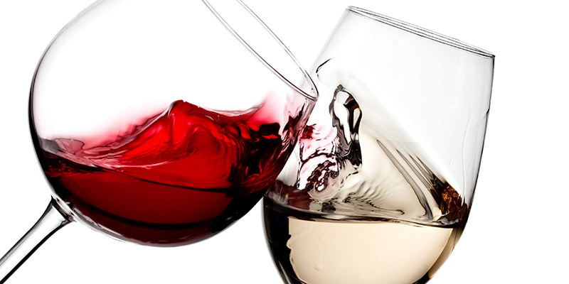

# Homework1: Wine Quality: Which wine is the best?

<ul>
  <li>Wines are all different because of their composition. A "good" wine is a very subjective definition as everyone has not the same knowledge about Viticulture. Some experts decided to rate different red/white wines in order to understand what makes a wine so good. We have access to the information about 6500 different wines. The purpose of this homework is to create a good model to predict wine quality.</li>
   
  <li>File: winequality.ipynb</li>
  <li>Difficulty: Easy</li>
  <li>Estimated Time: 1 day</li>
</ul>
 

