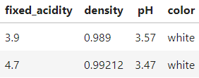
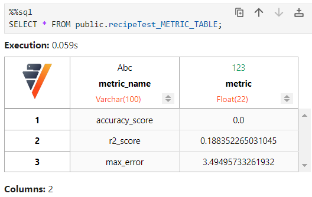

# HEADER
---
Vertica Pipelines is an open source platform for managing data scientists' machine learning pipelines. They are built on a human-readable data format: **YAML**.   

## GETTING STARTED  
This tutorial will be done in a Linux/Unix/Ubuntu environment.  
### Install Verticapy  
`$ pip install verticapy`  


### Create Your first YAML file
> **THE BASIC RULES OF ANY YAML FILE:**  
> - YAML is case sensitive
> - The files should have **.yaml** as the extension
> - YAML does not allow the use of tabs while creating YAML files; use spaces instead

The information in connect is the same you will use in Verticapy. An excellent tutorial of setting this up on the engdev machines can be found [**here**](https://confluence.verticacorp.com/pages/viewpage.action?pageId=140576924).  
`$ vim connection.yaml`
```yaml
# Replace with your information #
host: "10.20.50.86"
port: "32802"
database: "verticadb21455"
password: ""
user: "znowak"
```


`$ vim recipeGettingStarted.yaml`
```yaml
schema: "public"
recipe: "recipeGettingStarted"
table: public.example_table
# steps:
    # ingest: 
    # transform: 
    # train:
    # test:
```

### Run the Parser  
First you will need to clone the repo:  
`$git clone ssh://git@git.verticacorp.com:7999/mp/ml-pipelines-mvp.git`  
> **ssh: Could not resolve hostname git.verticacorp.com: Name or service not known**
> 1. Check to make sure you are connected to MF OpenVPN.
> 2. On the engdev machines `$ping git.verticacorp.com`
> 3. It should say something like `PING git.verticacorp.com (10.5.5.233) 56(84) bytes of data.`
> 4. Try `$git clone ssh://git@10.5.5.233:7999/mp/ml-pipelines-mvp.git`  

The parser follows the general format:  
`$python PARSER.py [connection_file] [input file] -o [output file]`  

Both of the following will generate a sql file: **recipeGettingStarted.sql**  
`$python PARSER.py connection.yaml recipeGettingStarted.yaml`  
`$python PARSER.py connection.yaml recipeGettingStarted.yaml -o recipeGettingStarted.sql`

### Dropping the Pipeline
If you are done with the pipeline and want to drop all ingestions, views, models, or stored procedures associated with it, you can do either of the following:  
**In a VSQL terminal:**  
`verticadb21455=> CALL drop_pipeline([schema name], [recipe name]);`  
**In VerticaPy cell**
```sql 
%%sql
CALL drop_pipeline([schema name], [recipe name]);
```
for the example above running the sql would drop the pipeline:  
`CALL drop_pipeline('public', 'recipeGettingStarted');`

Now you should be ready to quickly build new pipelines!


# Examples
## Ingestion
---
For more information on how to customize this step: [DataLoader](https://docs.vertica.com/23.4.x/en/sql-reference/statements/create-statements/create-data-loader/#arguments) and [COPY](https://docs.vertica.com/23.4.x/en/sql-reference/statements/copy/)  

```yaml
  ingest:
      from: '/scratch_b/znowak/repos/server/udx/supported/MachineLearning/SQLTest/data/bucket/*'
      delimiter: ','
      retry_limit: 'NONE'
      retention_interval: "'15 days'"
```
## Transform
---
[**transform functions documentation**](https://www.vertica.com/python/documentation_last/vdataframe/features.php)

`public.winequality`  
  


`example`
```yaml
transform:
    # 1. Existing Column
    col1:
        sql: fixed_acidity
    # 2. Column + Transform
    col2:
        sql: color
        transform_method:
            name: str_count
            params:
                pat: white
    # 3. Create a new column with Method
    # Note: Don't specify 'name' in params
    col3:
        transform_method:
            name: cummax
            params:
                column: fixed_acidity
    # 4. Complex Sql
    col4:
        sql: fixed_acidity * density
    # 5. Multiple Params
    col5:
        transform_method:
            name: regexp
            params:
                column: color
                pattern: "white"
                method: "replace"
                replacement: "NOT white"
    # 6. Multi-Stage Transforms
    col6:
        sql: color
        transform_method1:
            name: str_count
            params:
                pat: white
        transform_method2:
            name: add
            params:
                x: 0.5
    # 7. Using Previous Created Columns
    col7:
        sql: col2
        transform_method:
            name: add
            params:
                x: 0.5
```

## Train  
---
[**train functions documentation**](https://www.vertica.com/python/documentation_last/learn/index.php)   
If you want to train a model the default setting is use all the previously created **cols** as predictors to your method. If you wish to exclude some columns use `exclude: ` to subtract the specified columns from the default or use `include: ` strictly choose the subset. The previous transform example is the basis for this train example:  

`Example 1`
```yaml
  train:    
    method:
        name: RandomForestClassifier
        target: citric_acid
        params:
            n_estimators: 40
            max_depth: 4
```

`Example 2`
```yaml
  train:    
    method:
        name: LinearSVC
        target: col2
        exclude: ['col5', 'col2']
```

`Example 3`
```yaml
  train:    
    method:
        name: LinearSVC
        target: col2
        include: ['col1', 'col3', 'col4', 'col6', 'col7']
```

## Test
---
You may want to compute metrics for your newly created model. To see a list click [**here**](https://www.vertica.com/python/documentation_last/learn/metrics/index.php). And the results are stored in   
**`[schema].[recipe_name]_METRIC_TABLE`**

`Example 1`
```yaml
  test:
    metric1: 
        name: accuracy_score
        y_true: quality
        y_score: prediction
    metric2: 
        name: r2_score
        y_true: quality
        y_score: prediction
    metric3: 
        name: max_error
        y_true: quality
        y_score: prediction
```

  


### Scheduler
---
If you would the ingestion or train to contiously update on a set schedule use the `schedule` key. The schedule follows the **cron** format, for more information see: [wiki](https://en.wikipedia.org/wiki/Cron), [bitbucket **CronUtil.cpp**](https://git.verticacorp.com/projects/VER/repos/server/browse/vertica/Util/CronUtil.cpp), [documentation **Create-Schedule**](https://docs.vertica.com/23.4.x/en/sql-reference/statements/create-statements/create-schedule/).  

`Example 1`
```yaml
  train:
    method:
        name: RandomForestClassifier
        target: survived
        params:
            n_estimators: 40
            max_depth: 4
    schedule: "* * * * *"
```
`Example 2`
```yaml
  ingest:
      from: '/scratch_b/znowak/repos/server/udx/supported/MachineLearning/SQLTest/data/bucket/*'
      delimiter: ','
      schedule: "* * * * *"
```
